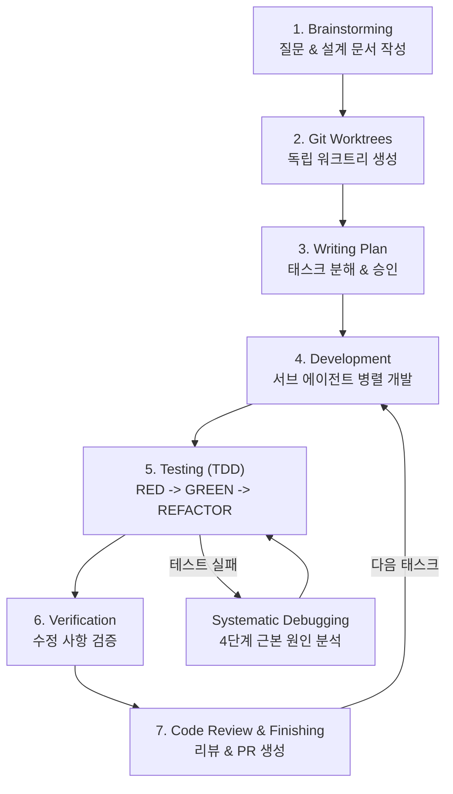

## 들어가며

> Red Bull gives you wiiings!
> **레드불, 날개를 펼쳐줘요!**
> -- 레드불 광고

완전히 처음에 아이디어를 테스트해보거나 바이브 코딩을 잠깐 '우와'하고 쓰고 말 것이 아니라면, 꽤 많은 경우 context를 구체화하고 정확한 프롬프트를 전달하고, Spec 문서를 먼저 작성하는 스펙 주도 개발 등 여러 방법을 사용한다.

그런데 어떤 방식으로 정의하고 전달해도, 자기가 마음대로 판단하고 의도하지 않은 방향으로 작업이 진행되는 경우가 잦다. 특히 프로젝트가 점점 복잡해지고 커지면서 더 그렇다. 그래서 내가 도입한 커맨드 하나는 interview 커맨드인데, 프론트매터 설명은 대략 이렇다.

```markdown
---
description: >
  프로젝트 요구사항이 불분명할 때, Claude가 직접 질문을 통해
  세부 정책, 구현 방법, 엣지 케이스를 명확히 하는 인터뷰 커맨드.
  "니가 판단하지 말고, 애매한 게 명확해질 때까지 나한테 계속 질문해라."
---
```

요약하면, "니가 판단하지 말고, 애매한 게 명확해질 때까지 나한테 계속 질문해라." 정도이다. 그러면 자기 마음대로 판단하지 않고 AskUserQuestions를 이용해서 세부 정책이나 현재 구현 방법 또는 요구사항에 대해서 명확하게 나를 대상으로 인터뷰가 진행된다. 특히 우리가 기획 내용이나 요구사항을 전달했을 때, "언어"라는 본질을 흐리는 표상의 원죄로 아무리 명확히 작성해도 AI는 잘못 이해한다. (사람도 마찬가지) 그리고 사실 내가 요구사항을 던지면서도 세부 정책은 생각하지 않고 막 던지는 경우도 많고.

그래서 Codex나 Claude Code에서 plan mode를 키고 인터뷰 커맨드를 실행하면 굉장히 구체화된 요구사항과 구현 계획이 세워지게 된다. 처음 기능을 구현할 때도, 버그를 고칠 때도 여러모로 전부 쓸모가 있다.

그리고 내 이전 글 [15년차 CTO가 바이브 코딩하는 법](https://flowkater.io/posts/2026-01-09-15-year-cto-vibe-coding/)에서 얘기한 TDD Planning을 마치고 작업을 들어가면, 아주 구체적이고 단계별로 나뉘어진 계획을 따르게 된다.

하지만 작업을 병렬적으로 하다 보면 이 커맨드 실행을 까먹을 때도 있고, TDD Planning 특성상 언어나 프레임워크마다 사용 포맷이 좀 다르다 보니 그때마다 맞춤형 스킬을 세팅하는 게 번거로워서 클라이언트에서는 스킵되는 경우가 많았다. 인터뷰 또한 구체적으로 물어보는 건 좋으나, 또 어느 정도는 알잘딱이 되었으면 했고.. (사람 마음이란..)

그럼에도 불구하고 잘 사용하던 와중에, 내가 직접 만들고 사용하고 있던 모든 커맨드와 스킬을 통합하고 **로버트 치알디니**의 **설득의 심리학**을 기반으로 LLM에 적용한 스킬 프레임워크를 발견했다. 이름 그대로 우리 코드 에이전트(Claude Code, Codex 등)에게 슈퍼파워를 달아주는 프레임워크, **Superpowers**다.

치알디니 본인이 참여한 연구에서 이 원칙이 LLM에도 먹힌다는 게 실제로 증명됐다. Superpowers는 치알디니의 6가지 설득 원칙 중 세 가지를 핵심적으로 적용한다.

**설득의 심리학 3가지 원칙 적용**

1. **권위의 원칙**: 스킬 파일에 해당 스킬이 필수임을 명시하여, Claude(또는 Codex)가 반드시 따라야 한다고 인식하게 한다.
2. **일관성의 원칙**: Claude(또는 Codex)에게 특정 스킬을 따르겠다고 선언하게 만들어, 선언한 내용을 지키도록 유도한다.
3. **사회적 증거**: 다른 스킬들도 모두 이 방식을 따른다고 알려주어, Claude(또는 Codex)가 이를 표준으로 인식하게 한다.

Claude Code에서는 설치도 간단하다. 마켓플레이스에서 플러그인을 바로 받아주면 된다. 난 간단한 작업이나 빠르게 치는 작업은 Claude Code, 프로덕션 레벨은 보통 Codex를 많이 쓰는데, Superpowers는 둘 다에서 아주 유용하게 사용된다.

특히 내가 적극 활용하는 인터뷰나 TDD 워크플로우 모두를 반영하면서도, 코드 리뷰나 검증 등의 추가 보완 스킬을 모두 포함한 프레임워크이니, 여기서 소개를 해보려고 한다.

---

## 설치 및 기본 사용법

### 설치

Superpowers는 Claude Code 2.0.13 이상에서 동작한다. 설치는 두 줄이면 끝난다.

```bash
# 1. 마켓플레이스 등록
/plugin marketplace add obra/superpowers-marketplace

# 2. Superpowers 설치
/plugin install superpowers@superpowers-marketplace
```

설치 후에도 작동하지 않는다면 Claude Code를 껐다가 다시 켜면 된다. 설치가 완료되면 **"I have Superpowers"**라는 메시지가 표시되며, Brainstorm, Write Plan, Execute Plan 등의 스킬을 사용할 수 있게 된다.

참고로 Claude Code뿐만 아니라 Codex나 OpenCode에서도 사용 가능하다. (GitHub 스타 4.7만 개를 받은 오픈소스 프로젝트(MIT License)이니 안심하고 써도 된다.)

### 핵심 변화: 바로 코딩하지 않는다

Superpowers를 설치하고 나면 가장 먼저 체감되는 변화가 있다. **Claude가 절대로 바로 코딩하지 않는다.** 일반 Claude Code에서 "만들어 줘"라고 하면 바로 코드부터 치기 시작하는데, Superpowers가 설치된 Claude는 무조건 질문부터 시작한다.

이게 핵심이다. 내가 만들었던 interview 커맨드가 자동으로 내장된 셈이다. 그것도 명령어 없이.

질문 -> 설계 -> 계획 -> TDD -> 서브 에이전트 위임 -> 코드 리뷰 -> 완성.

이 흐름이 **명령어 없이 자동으로** 시작된다는 점이 Superpowers의 가장 큰 장점이다.

---

## 개발 워크플로우: 7단계

Superpowers의 워크플로우는 7단계로 구성된다. 전체 흐름을 먼저 보자.



### 1단계: 브레인스토밍

프로젝트를 요청하면, Claude는 바로 코딩하지 않고 **질문부터 시작**한다.

> "무엇을 어떻게 만들 건가요?"
> "대표 문구는 어떻게 쓸까요?"
> "상황 입력은 자유 텍스트인가요, 카테고리 선택인가요?"

이런 식으로 대화를 통해 기능 목록, 기술 스택, 컴포넌트 구조 등을 포함한 **설계 문서**를 스스로 작성한다.

내가 이전에 만든 interview 커맨드와 비슷하지만, Superpowers는 이 과정이 별도 명령어 없이 자동으로 발동된다. 내가 까먹어도 Claude가 알아서 질문부터 한다. (이게 진짜 편하다.)

### 2단계: Git 워크트리 생성

설계가 승인되면, **git worktrees** 스킬을 이용해 독립된 워크트리를 생성한다.

왜 워크트리인가? AI 코딩 시 여러 작업을 동시에 진행하다 보면 Git이 꼬이는 경우가 잦다. (나도 Codex에서 병렬 작업하다 merge conflict 지옥을 겪은 적이 한두 번이 아니다.) 워크트리로 분리하면 실험 중 문제가 생겨도 메인 브랜치는 안전하고, 워크트리만 삭제하면 깔끔하게 원복된다.

### 3단계: 계획 작성 (Writing Plan)

Writing Plan 스킬이 설계 문서를 받아서 **구체적인 태스크(Task)로 쪼갠다.** 태스크는 사이즈별로 분해되고, Claude는 사용자에게 계획 승인을 요청한다.

내가 만든 TDD Planning과 비슷한 흐름인데, 언어나 프레임워크에 상관없이 자동으로 적절한 포맷으로 만들어준다. 그때마다 맞춤형 스킬을 세팅하던 번거로움이 사라진 셈이다.

### 4단계: 서브 에이전트 기반 개발

여기서부터가 Superpowers의 진가가 드러난다.

계획 실행 시 **서브 에이전트 드리븐 방식** 또는 **배치 실행 방식** 중 하나를 선택할 수 있다. 서브 에이전트 드리븐 방식이 더 효율적인데, 메인 Claude가 **PM 역할**을 하고 서브 에이전트들에게 개발을 시킨 후 결과물을 취합하는 구조다.

일종의 오케스트라 지휘자와 비슷하다. 메인 Claude가 지휘자로서 전체 흐름을 관장하고, 서브 에이전트들이 각자 맡은 파트(UI, API, 데이터 레이어 등)를 동시에 작업한다. **Dispatch Parallel Agent** 스킬로 병렬 작업이 가능하니, 단일 Claude로 작업할 때 발생하는 컨텍스트 오류도 줄어든다.

(단, Codex 는 아직 sub agent 를 지원하지 않기 때문에 사용이 불가하다.)

### 5단계: TDD 및 디버깅

Superpowers는 **TDD를 강제**한다. RED -> GREEN -> REFACTOR 사이클을 반복한다.

| 단계 | 설명 |
|------|------|
| **RED** | 테스트를 먼저 작성하고 실패를 확인 |
| **GREEN** | 최소한의 코드로 테스트를 통과시킴 |
| **REFACTOR** | 코드를 정리하고 품질을 개선 |

테스트 실패나 버그 발생 시에는 **Systematic Debugging** 스킬이 4단계 프로세스로 자동 발동된다.

1. **에러 메시지 분석** - 무엇이 잘못되었는지 파악
2. **관련 코드 범위 특정** - 어디서 문제가 발생했는지 좁히기
3. **가설 수립 및 검증** - 왜 발생했는지 추론하고 확인
4. **수정 및 테스트** - 고치고 다시 검증

내 이전 글에서 말한 TDD 사이클과 거의 동일한 철학이다. 다만 Superpowers는 이걸 별도 커맨드 없이, 어떤 언어/프레임워크에서든 자동으로 적용한다는 점이 다르다.

### 6단계: 검증 (Verification)

**Verification** 스킬이 모든 수정 사항을 확인한다. 테스트 재실행, 관련 기능 영향 확인, 엣지 케이스 체크 등을 수행한다.

솔직히 Claude가 "다 됐어요"라고 해놓고 실제로는 안 돌아가는 경우, 한두 번 겪은 게 아니다. 이 검증 단계가 있으니까 그런 상황이 크게 줄어든다.

### 7단계: 코드 리뷰 및 피니싱

태스크 하나가 끝날 때마다 **코드 리뷰**를 진행한다. 2단계 리뷰 구조다.

1. **스펙 준수 확인** - 요구사항대로 구현했는가
2. **코드 품질 확인** - 보안 취약점, 성능 이슈, 코드 스타일 등

리뷰 결과는 Critical, Major, Minor로 분류되고, 피드백에 따라 자동으로 코드를 수정한다.

모든 태스크가 완료되면 **Finishing** 스킬이 워크트리 정리, PR 생성까지 처리한다.

---

## Writing Skills: 메타 스킬의 힘

### 스킬 라이브러리

Superpowers에 내장된 스킬들을 정리하면 이렇다.

| 카테고리 | 스킬 | 설명 |
|----------|------|------|
| **Testing & Quality** | TDD | RED-GREEN-REFACTOR 사이클 |
| **Debugging** | Systematic Debugging | 4단계 근본 원인 분석 |
| **Debugging** | Verification | 완료 전 검증 |
| **Collaboration** | Brainstorming | 질문 기반 요구사항 정의 |
| **Collaboration** | Plan Composition/Execution | 계획 작성 및 실행 |
| **Collaboration** | Parallel Agent Dispatching | 서브 에이전트 병렬 작업 |
| **Collaboration** | Code Review | 2단계 코드 리뷰 |
| **Collaboration** | Git Worktree Management | 워크트리 생성/정리 |
| **Collaboration** | Subagent-Driven Development | PM-개발자 분업 |
| **Meta** | Writing Skills | 스킬 생성/수정 프레임워크 |
| **Meta** | Superpowers Introduction | 시스템 소개 |

모든 스킬은 **마크다운 파일 기반**이다. 절차, 모범 사례, 워크플로우를 문서화한 재사용 가능한 지식 모듈이라고 보면 된다.

### 커스텀 스킬 만들기

여기서 진짜 강력한 게 **Writing Skills** 메타 스킬이다. 기존 스킬을 업데이트하거나 **새로운 스킬을 직접 생성**할 수 있다.

사용법은 간단하다. Claude에게 이렇게 말하면 된다.

```
"우리 회사 코딩 컨벤션을 강제하는 스킬을 만들어 줘"
```

그러면 Claude가 알아서 스킬 파일을 생성한다. 새로운 스킬을 만들 때도 TDD, 서브 에이전트, 압박 시나리오 확인 등 기존 개발 프로세스를 동일하게 적용한다. 스킬을 만드는 것 자체가 Superpowers 워크플로우를 따르는 거다.

더 재밌는 건, **프로그래밍 책 PDF를 던져주고 "책 읽고 새로 배운 걸 스킬로 만들어"라고 요청**하는 것도 가능하다는 점이다. 클린 코드 원칙이든, 특정 아키텍처 패턴이든, 문서화된 지식이면 뭐든 스킬로 변환할 수 있다.

### 실전 사례들

Superpowers의 진가는 실전에서 드러난다. 몇 가지 사례를 살펴보자.

**1. [Next.js 16 마이그레이션](https://www.trevorlasn.com/blog/superpowers-claude-code-skills) — 500줄 계획이 자동 생성**

한 개발자가 자신의 서비스를 Next.js 16으로 업그레이드하면서 `cacheComponents` 기능을 활성화하는 작업을 Superpowers에 맡겼다. `/superpowers:write-plan`을 실행하자, **500줄짜리 마이그레이션 계획**이 생성되었다.

- 수정이 필요한 **23개 API 라우트 파일** 전체 목록
- `new Date()` 사용으로 프리렌더링이 깨질 **2개 컴포넌트** 식별
- Suspense 경계 설정이 필요한 **컨텍스트 프로바이더** 특정
- **4일 타임라인**과 각 단계별 테스트 체크포인트

사람이 코드베이스를 분석해서 이 목록을 만들었다면 하루 이상 걸렸을 작업이다.

**2. [Notion 클론](https://www.pasqualepillitteri.it/en/news/215/superpowers-claude-code-complete-guide) — 45분, 수동 코드 0줄**

Notion 스타일의 웹 앱(리치 텍스트 에디터, 인터랙티브 테이블, 드래그앤드롭 칸반보드)을 Superpowers로 개발한 사례다. 결과가 꽤 인상적이다.

| 항목 | 결과 |
|------|------|
| 개발 시간 | 45~60분 (대부분 자동) |
| 테스트 커버리지 | 87% (단위, 통합, E2E) |
| 수동 작성 코드 | **0줄** |
| 포함 기능 | CRUD 테이블, 칸반보드, 리치 텍스트, 인증 |

**3. [인증 시스템 스킬화](https://www.nathanonn.com/claude-skills-part-2-how-to-turn-your-battle-tested-code-into-a-reusable-superpower/) — 6개 프로젝트에 14시간 절감**

한 개발자가 여러 프로젝트에서 반복 구축하던 인증 시스템(OAuth, 세션 관리, 토큰 갱신 등)을 Writing Skills로 스킬화한 사례다. 기존 코드베이스를 분석해서 302줄의 구현 가이드를 생성하고, ASCII 와이어프레임으로 모든 화면을 매핑한 뒤, 약 **20분 만에 재사용 가능한 스킬을 완성**했다. 이후 새 프로젝트에서 `/authentication-setup` 한 줄로 전체 인증 시스템을 배포했고, **6개 프로젝트에 적용하면서 총 14시간을 절감**했다. 100% 일관성도 유지됐다.

**4. [채널톡 연동 스킬](https://www.youtube.com/watch?v=308zzinIVSA&t=210s) — 3일을 30분에**

채널톡 공식 문서 전체를 Claude에게 전달하고, Writing Skills로 채널톡 연동 스킬을 만든 사례다. 이 스킬을 설치하면 "채널톡 연동 해줘"라고만 요청해도 SDK 설치, 봇 설정, 웹훅 연결, ALF 태스크까지 모두 자동 처리된다. 원래 3일 걸릴 작업이 **30분**이면 끝난다.


결국 Superpowers의 진짜 가치는 **스킬을 쌓아갈수록 점점 강력해진다**는 점이다. 프로젝트별로, 팀별로, 회사별로 맞춤형 스킬을 축적하면, 그 자체가 팀의 개발 지식 베이스가 된다.

---

## 왜 잘 동작하나?: 설득의 심리학 + 압박 테스트

### 압박 시나리오로 단련된 스킬

Superpowers의 제작자는 단순히 스킬을 만들고 끝낸 게 아니다. **프로덕션 서버 다운, 분당 5,000달러 손실** 같은 극한 압박 시나리오를 사용해서 스킬을 테스트했다.

왜냐하면, 압박 상황에서 Claude가 스킬을 무시하고 바로 코딩하려는 경향이 있기 때문이다. 제작자는 이런 상황에서 Claude가 스킬을 사용하지 않고 바로 코딩하면, 테스트를 실패 처리하고 스킬을 더 강화하는 과정을 반복했다.

그래서 Superpowers의 스킬들은 단순한 프롬프트가 아니라, **실전에서 검증된 프레임워크**다. 급한 상황에서도 "일단 질문부터, 계획부터"라는 프로세스를 지킨다.

**Superpowers의 철학**

Superpowers가 지향하는 핵심 철학을 정리하면 이렇다.

- **Test-first development** - 테스트가 먼저, 구현은 그 다음
- **Systematic processes over intuition** - 직감보다 체계적 프로세스
- **Simplicity as primary objective** - 단순함이 최우선 목표
- **Empirical verification before success declarations** - "됐어요" 전에 실제 검증

결국 좋은 개발 습관을 AI에게 강제하는 거다.

---

## 실전 활용 팁

**토큰 사용량 참고**

Superpowers는 계획 단계에서 딥 이터레이션을 하기 때문에 토큰을 많이 사용한다. Claude Max 플랜을 추천한다. 간단한 기능 수정에는 오버킬일 수 있으니, 적합한 사용 시점을 잘 골라야 한다.

**이럴 때 쓰면 좋다**

| 상황 | 적합도 | 이유 |
|------|--------|------|
| 신규 MVP 프로젝트 시작 | 높음 | 설계부터 구현까지 전체 흐름 활용 |
| 복잡한 기능 추가 | 높음 | 서브 에이전트 병렬 개발 + TDD |
| 전체 코드 리팩토링 | 높음 | 체계적 계획 + 검증이 중요 |
| 간단한 버그 수정 | 낮음 | 오버킬, 직접 수정이 빠름 |
| 한 줄짜리 설정 변경 | 낮음 | Superpowers 없이 진행 |

**야간 자율 작업**

큰 플랜을 잡아 놓으면 몇 시간 동안 혼자서 자율 작업이 가능하다. 밤에 계획을 승인시키고 작업을 시키면, 아침에 PR이 와 있는 형태로 활용할 수 있다. 

---

## 나가며

Superpowers를 한 마디로 요약하면, **내가 하나하나 만들어 쓰던 interview 커맨드, TDD 스킬, 코드 리뷰 스킬을 하나로 통합하고, 거기에 서브 에이전트 병렬 개발과 Git 워크트리 관리까지 얹은 프레임워크**다. 게다가 설득의 심리학까지 적용해서 AI가 이 워크플로우를 확실하게 지키도록 만들었다.

| 핵심 기능 | 설명 |
|-----------|------|
| 자동 브레인스토밍 | 명령어 없이 질문부터 시작 |
| 7단계 워크플로우 | 설계 -> 계획 -> TDD -> 리뷰까지 자동 |
| 서브 에이전트 | PM-개발자 분업, 병렬 실행 |
| TDD 강제 | RED-GREEN-REFACTOR 사이클 |
| 검증 내장 | "됐어요" 사기 방지 |
| Writing Skills | 커스텀 스킬 자율 생성 |
| 심리학 기반 | 스킬 준수를 확실하게 강제 |

설치는 두 줄이면 끝나니, 일단 해보는 걸 추천한다. 처음부터 완벽하게 쓸 필요 없다. Superpowers를 깔고 평소처럼 작업을 시작하면, Claude가 알아서 질문부터 시작할 거다. 그 흐름을 따라가 보면서 자기한테 맞는 활용법을 찾아가면 된다.

그리고 Writing Skills로 자기만의 스킬을 하나씩 추가해 나가면, 점점 더 강력해진다. 나도 계속 스킬을 추가하면서 쓰고 있다.

> "a complete software development workflow for your coding agents, built on top of a set of composable 'skills.'"
> 조합 가능한 스킬 위에 구축된, 코딩 에이전트를 위한 완전한 소프트웨어 개발 워크플로우.
>
> -- Superpowers GitHub README

Claude Code 지금 바로 Superpowers 설치하고, 다음 프로젝트에서 한번 써봐라.

날개가 달린다.

## References

- [채널톡 사례 출처 포함 소개 영상](https://www.youtube.com/watch?v=308zzinIVSA&t=210s)
- [https://blog.fsck.com/2025/10/09/superpowers/](https://blog.fsck.com/2025/10/09/superpowers/)  
- [https://github.com/obra/superpowers](https://github.com/obra/superpowers)