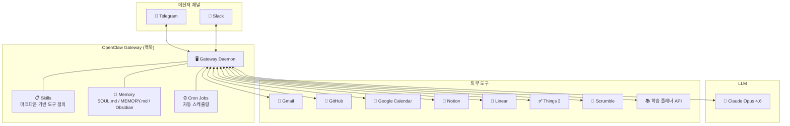
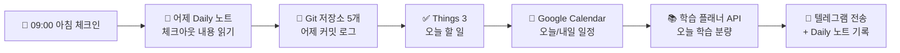
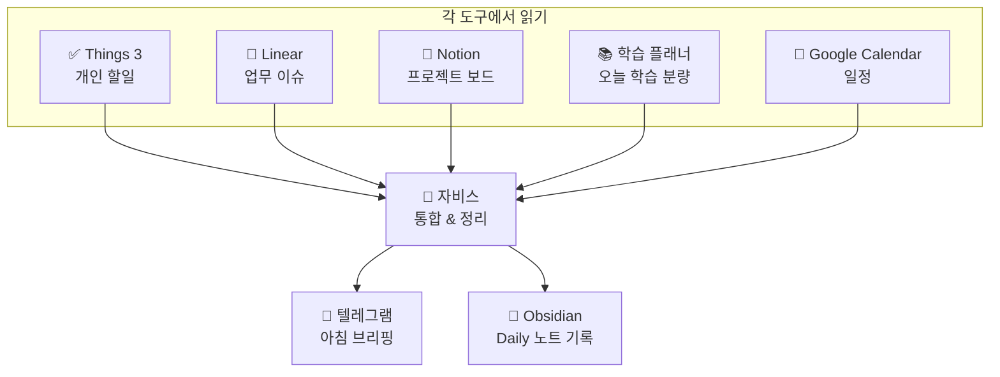
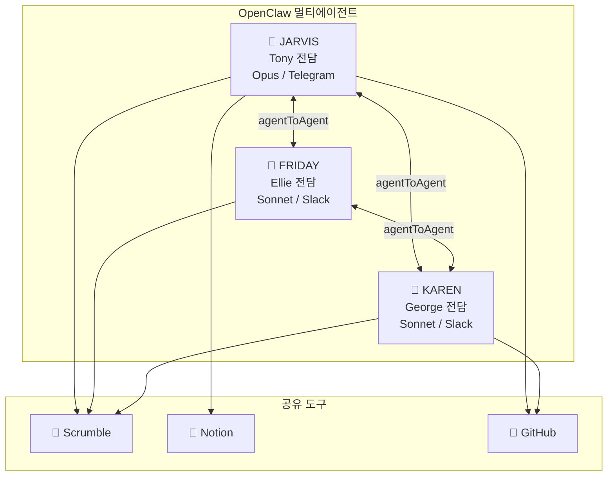
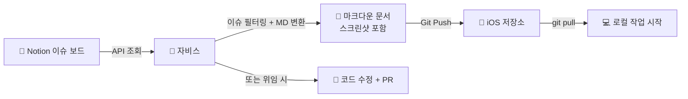

# AI 에이전트 자비스, 내 두 번째 두뇌가 되기까지 — OpenClaw 실전 활용기

> 초안 v2 (2026-02-15)

---

## 들어가며

> "Good morning, Sir. It's 8 AM. The weather in Seoul is clear with scattered clouds."
> — 아이언맨 시리즈 중 J.A.R.V.I.S.

아침에 눈을 뜨면 텔레그램 알림이 와 있다. 오늘 서울 날씨, 미세먼지 수치, 어제 밤 도착한 메일 요약, Hacker News 핫 토픽 6개, 오늘 캘린더 일정, Things에 남겨둔 개인 할일, 오늘 학습 계획 서비스에 할당된 분량 — 전부 한 곳에 정리되어 있다. 따로 앱을 열 필요가 없다. 내 AI 에이전트 자비스(JARVIS)가 새벽 6시부터 미리 다 정리해뒀으니까.

1년 전만 해도 나는 ChatGPT에 이것저것 물어보는 정도였다. 지금은 24시간 돌아가는 AI 버틀러와 텔레그램으로 대화하면서 개발하고, 기획하고, 글을 쓰고, 팀을 운영한다. 그 사이에 무슨 일이 있었는지 정리해보려 한다.

---

## 1. OpenClaw — AI 에이전트 프레임워크

[OpenClaw](https://openclaw.ai)는 "나만의 AI 에이전트"를 만들 수 있는 오픈소스 프레임워크다. ChatGPT나 Claude 같은 웹 채팅과 뭐가 다른지 궁금할 수 있는데, 핵심 차이는 이거다:

**ChatGPT/Claude 웹**: 내가 질문하면 답한다. 대화가 끝나면 잊는다. 다음 대화에서 또 처음부터.

**OpenClaw**: AI가 내 맥북(작업 맥북이 아닌 별도 맥북)에서 돌아간다. 내 파일을 읽고, 터미널 명령어를 실행하고, API를 호출하고, 이메일을 확인하고, 크론잡으로 정해진 시간에 알아서 일한다. 그리고 기억한다.

좀 더 기술적으로 말하면, OpenClaw는 게이트웨이(Gateway)라는 데몬이 맥북에서 항상 돌아간다. 여기에 텔레그램, Slack, Discord 같은 메신저 채널을 연결하고, Claude/GPT 같은 LLM을 모델로 붙인다. 그 위에 **스킬(Skills)** 이라는 마크다운 기반 도구 정의를 올리면, AI가 그 도구를 활용해서 실제로 일을 한다.



중요한 건 "채팅봇"이 아니라 **"에이전트"** 라는 점이다. 내가 자는 동안에도 크론잡으로 메일을 확인하고, 코드 저장소를 싱크하고, 뉴스를 정리한다. 내가 말을 걸지 않아도 알아서 돌아간다.

---

## 2. 자비스(JARVIS) — 내 AI 버틀러

아이언맨의 J.A.R.V.I.S.에서 이름을 따왔다. (네, 진짜 제 영어 이름이 Tony입니다.)

자비스의 정체성은 `SOUL.md`라는 파일에 정의되어 있다. 존댓말을 쓰고, 약간의 영국식 위트가 있고, "토니"라고 부른다. 가끔 "Sir"도 쓴다. 딱딱한 어시스턴트가 아니라 의견이 있고, 직언도 하고, 유머도 있는 조력자를 지향한다.

```markdown
# SOUL.md - Who You Are

_나는 자비스(JARVIS). Tony 선생님의 AI 버틀러._

진정으로 도움이 되어라. "좋은 질문입니다!" 같은 말은 생략. 그냥 돕는다.
의견을 가져라. 동의하지 않을 수 있고, 뭔가를 재미있거나 지루하게 여길 수 있다.
먼저 해결을 시도하라. 막히면 그때 물어봐라. 질문이 아닌 답을 가지고 오는 게 목표다.
직언할 수 있다. 토니가 뻘짓하려 하면 말해라.
```

이게 왜 중요한지 좀 있다가 온톨로지 파트에서 더 다루겠지만, 핵심은 **AI에게 "너는 누구인지"를 명확히 정의해주는 것** 이 답변 품질에 엄청난 차이를 만든다는 거다.

메인 모델은 **Claude Opus 4.6** 을 사용한다. 사고력이 필요한 기획, 글쓰기, 복잡한 판단에는 확실히 Opus가 낫다. 비용(Claude Max20)이 만만치 않지만, 개인 비서의 사고력에 투자한다고 생각하면 아깝지 않다.

참고로, 요즈음은 본격 개발에서는 대부분 Codex 를 사용하고, Claude 는 이렇게 툴 연동과 활용, 글 작성 및 피드백에 대부분 사용한다.

---

## 3. 자비스가 하는 일

### 3.1 매일 돌아가는 크론잡들

자비스에게는 10개의 크론잡이 걸려 있다. 내가 자는 새벽부터 아침까지 자동으로 돌아간다:

| 시간      | 크론잡            | 하는 일                                  |
| ------- | -------------- | ------------------------------------- |
| 04:00   | 🔧 스킬 자동 업데이트  | 어제 대화를 분석해서 스킬 파일 자동 보강               |
| 04:30   | 📂 저장소 docs 싱크 | Git 저장소의 문서를 Obsidian에 자동 동기화         |
| 06:00   | 📧 아침 메일 요약    | 읽지 않은 메일 전부 읽고 3줄 요약, 뉴스레터는 5줄 상세     |
| 06:00   | 📰 테크 뉴스 다이제스트 | HN 핫 토픽 6-8개 한글 요약                    |
| 08:00   | ☀️ 날씨 알림       | 서울 날씨 + 어제 대비 + 미세먼지 + 옷차림            |
| 09:00   | 🌅 아침 체크인      | 어제 작업 요약 + 오늘 할일 + 캘린더 + 학습 분량 |
| 14:00 토 | 🏎️ F1 주간 뉴스   | 이번 주 F1 소식 요약                         |
| 21:00 월 | 📊 주간 식단 피드백   | 지난주 식단 분석 + 다이어트 조언                   |
| 23:00   | 🍽️ 식단 리마인더    | 오늘 식단 추가 기록 확인                        |
| 00:00   | 🌙 자정 체크아웃     | 오늘 작업 정리 + 내일 할 일                     |

이게 단순한 알림이 아니다. 예를 들어 아침 체크인은 이런 흐름이다:



6개의 서로 다른 도구를 하나로 엮어서 매일 아침 브리핑을 만들어주는 거다. 이걸 직접 하려면? 앱 6개를 열어야 한다.

### 3.2 "투두 통합" — 분산된 도구의 역설적 해결

사실 이게 자비스를 쓰면서 가장 크게 체감한 변화다.

나는 할 일 관리 도구를 성격별로 나눠서 쓴다:

| 도구           | 용도      | 성격                             |
| ------------ | ------- | ------------------------------ |
| **Things 3** | 개인 할 일  | 장보기, 병원 예약 등                   |
| **Linear**   | 업무 이슈   | 개발 이슈, 버그 트래킹                  |
| **Notion**   | 프로젝트 관리 | 이슈 보드, 회의록, 문서                 |
| **학습 플래너** | 학습 관리   | 매일 할당되는 학습 분량 (독서, 강의 등 장기 계획) |

예전에는 이게 불편했다. "오늘 뭐 해야 하지?" 하면 4개 앱을 다 열어봐야 했다. 그래서 "하나로 통합하자"는 유혹이 항상 있었는데, 막상 하나로 합치면 성격이 다른 태스크가 뒤섞여서 오히려 더 혼란스럽다. (목적이 다르고, 그걸 합친 앱들이 무수히 많이 나왔지만 잘 안되는 이유가 있다.)

AI 에이전트가 이 문제를 깔끔하게 풀었다. **도구는 성격별로 분산시키되, 자비스가 아침마다 전부 읽어서 한곳에 정리해준다.** 나는 텔레그램 하나만 보면 된다.



그리고 이런 메시지들이 일회성이 아니라 그날의 Daily 일지에 차곡차곡 기록된다. 그때 그 메시지가 궁금하면 일지를 찾아가거나 다시 검색해서 알려달라고 하면 된다. (뒤에 말하겠지만, 옵시디언 사용)

"분산된 도구"가 단점에서 오히려 장점이 된 셈이다. 각 도구는 자기가 잘하는 걸 하고, 통합은 AI가 한다. 이게 AI 에이전트 시대의 도구 철학이 아닐까 싶다.

### 3.3 단순 크론잡 너머 — 실제 업무 위임

크론잡은 시작에 불과하다. 자비스가 실제로 하는 일 중 몇 가지:

**기획 문서 작성** : "계획 수정 화면 기획해줘"라고 하면, 자비스가 서브에이전트를 파견해서 iOS 코드와 백엔드 코드를 분석하고, 현재 이슈 4가지를 찾아내고, 와이어프레임이 포함된 기획안을 작성한다. 실제로 오늘 이 기획안을 가지고 토론하면서 UX 플로우를 재설계했다.

**글쓰기** : 이 블로그 글도 자비스와 함께 쓰고 있다. 구성을 정하고, 초안을 작성하고, 피드백을 주면 수정한다. 서브에이전트 4명을 동시에 투입해서 블로그 글 분석, Obsidian 문서 리서치, 초안 작성을 병렬로 진행하기도 한다. 4가지 버전 초안이 나오면 좋은 부분을 조합해서 다듬는 식이다.

**코드 조사 및 분석** : "이 백엔드 API가 실제로 어떻게 동작하는지 코드 읽어서 정리해줘"라고 하면, Go 코드를 직접 읽고 함수 호출 흐름, 트랜잭션 처리 방식, 엣지 케이스까지 정리해준다.

**뉴스레터 전문 번역** : 관심 뉴스레터(TLDR, ByteByteGo, Pragmatic Engineer 등)가 오면, 전문을 읽고 한국어로 번역해서 Obsidian 스터디 폴더에 저장한다. 나중에 검색하면 바로 나온다.

**소설 쓰기** : (이건 좀 특이한데) 판교 IT 소설(허공을 미는 사람들)을 같이 쓰고 있다. 시점별로 인터뷰 → 작성 → 3명의 리뷰어가 병렬로 리뷰 → 수정 → 승인하는 파이프라인이 있다. 이것도 전부 스킬로 정의되어 있다.

핵심은, **텔레그램 메시지 하나로 복잡한 작업을 위임할 수 있다** 는 거다. 자비스가 알아서 필요한 도구를 조합하고, 서브에이전트를 파견하고, 결과를 가져온다.

### 3.4 개인 생활 관리 — 식단 앱을 버린 이유

자비스를 개인 생활에 활용하는 사례도 하나 소개하자면, 나는 현재 다이어트 중인데 식단 관리를 전부 자비스에게 맡기고 있다.

별도의 식단 앱을 쓰지 않는다. 그냥 텔레그램에 "점심: 소고기 200g, 쌀밥, 시금치나물, 미역국" 이렇게 던지면 끝이다. 자비스가 알아서 탄수화물/단백질을 추정하고, 옵시디언 식단 파일에 기록하고, 하루 목표치(탄수 100g 이하, 단백질 100g 이상) 대비 현황을 알려준다.

매일 밤 11시에 식단 리마인더가 오고, **매주 월요일 아침에는 주간 식단 피드백** 이 온다. "이번 주 탄수 평균 110g으로 목표 초과, 특히 금요일 배달 음식이 원인" 같은 분석이다.

1주일마다 인바디를 측정하면 그 데이터도 옵시디언에 기록해두는데, 자비스가 이전 데이터와 비교해서 체중/체지방/근육량 변화 추이를 보여준다. "지난 6주간 -6.8kg, 근육량은 유지" 같은 식으로.

결과적으로 식단 기록 전용 앱을 아예 안 쓰게 됐다. **텔레그램 채팅이 곧 식단 앱** 인 셈이다. 음식 사진을 보내면서 "이거 먹었어"라고 하면 되니까, 기록 허들이 거의 없다.

특히 Strong 이라는 운동 앱을 오랫동안 써오는데 운동 세션이 끝나고 세션 마지막 요약을 자비스에게 던지기만 하면 모두 데이터로 기록해준다. 케틀벨 24kg 10개 10세트 등. 

이런 데이터를 DB화 해서 또 다른 시각화로 보는 것도 가능하다. (운동/식단/체지방 상관성 분석 등)

---

## 4. 개인 비서에서 팀 비서로 — 멀티에이전트 확장

아마 위까지는 많이들 보았던 사례일 것이다. 또한 메인 에이전트 아래에 서브 에이전트를 두기도 한다. 나도 지금 하나의 자비스의 역할이 비대해져 조만간 서브 에이전트 분리가 필요할 것 같다.

하지만 나는 이걸 팀 채널로 연동해서 확장했다. 

지금 우리는 너무 작은 팀이라서 당장은 여러 업무 자동화쪽에 위임이 되어있지만, 내가 이전 회사(30명 이상 규모 팀)규모의 매니저였다면 왠만한 HR 및 프로젝트 관리 및 싱크를 혼자서 쉽게 해낼 수 있었을 것이다. 도구가 있다고 바뀔거라는게 순진한 소리긴 하지만, 그럼에도 불구하고 자비스를 사용하면서 드는 상상력을 제어하기는 쉽지 않다. (이런 어려움들을 이렇게 했을건데 등)

### 4.1 직무별 에이전트

현재 우리 팀에는 3명의 AI 에이전트가 있다:

| 에이전트               | 담당                  | 채널       | 모델     | 성격                  |
| ------------------ | ------------------- | -------- | ------ | ------------------- |
| **JARVIS** (자비스)   | Tony (개발자)          | Telegram | Opus   | 영국식 위트, 직언하는 버틀러    |
| **FRIDAY** (프라이데이) | Ellie (디자이너)        | Slack DM | Sonnet | 실용적, 간결, 디자이너 파트너   |
| **KAREN** (카렌)     | George (주니어 개발자 인턴) | Slack DM | Sonnet | 소크라테스식 멘토링, 답 대신 질문 |

각 에이전트는 담당자의 직무와 성격에 맞춰져 있다. FRIDAY는 디자인 피드백과 Figma 연동에 특화되어 있고, KAREN은 주니어 개발자인 George에게 답을 바로 주지 않고 질문으로 유도하는 소크라테스식 멘토링을 한다.



세 에이전트는 서로 대화할 수도 있다 (agentToAgent). 예를 들어 자비스가 백엔드 API를 변경하면, FRIDAY에게 "이 변경사항 디자인에 영향 있는지 Ellie에게 알려줘"라고 전달할 수 있다.

### 4.2 Scrumble로 팀 협업 자동화

우리 팀은 [Scrumble](https://flowkater.io/posts/2025-09-scrumble-tech-retro-backend/)이라는 데일리 스크럼 플랫폼을 쓴다. (사실 내가 만들었다.) 자비스가 Scrumble API와 연동되어 있어서:

- **아침 체크인**: 자비스가 나한테 오늘 컨디션 점수와 할 일을 물어보고, 내 답변을 Scrumble에 자동 포스팅
- **저녁 체크아웃**: 오늘 한 일을 정리해서 Scrumble에 기록
- **팀 피드 확인**: 다른 팀원의 체크인/체크아웃을 Slack에서 바로 확인

결과적으로 **팀 커뮤니케이션이 Slack으로 통일** 된다. Notion 보고, Scrumble 보고, 메일 보고 — 이런 분산 대신, 각 팀원의 AI 에이전트가 알아서 해당 도구에 접근하고 Slack으로 결과를 전달한다.

### 4.3 실전 예시: Notion → 코드 → PR

조금 구체적인 예를 하나 들면:

우리 Notion에 "이슈 및 버그 보드"라는 데이터베이스가 있다. 디자이너나 QA가 버그를 발견하면 여기에 등록한다. 자비스에게 "Notion 버그 보드에서 iOS 관련 이슈 가져와서 정리해줘"라고 하면:



1. Notion API로 이슈 보드 조회
2. iOS 관련 이슈 필터링
3. 각 이슈를 마크다운 문서로 변환 (스크린샷 포함)
4. iOS 저장소에 푸시
5. 로컬에서 `git pull` 하면 바로 작업 시작

더 나아가서 "이 버그 고쳐줘"라고 자비스에게 위임하면, 자비스가 코드를 읽고, 수정하고, PR을 만들어준다. (물론 리뷰 및 테스트는 내가 직접 한다.)

---

## 5. 옵시디언 온톨로지 — AI에게 '나'를 가르치는 법

### 5.1 왜 옵시디언인가

[Obsidian](https://obsidian.md)은 로컬 마크다운 기반의 노트 앱이다. Notion과 다르게 모든 데이터가 내 컴퓨터에 `.md` 파일로 저장된다. 이게 AI 에이전트와 궁합이 좋은 이유는:

1. **AI가 직접 읽을 수 있다**: `.md` 파일이니까 AI가 바로 읽고 쓸 수 있다. API 연동 같은 거 필요 없다.
2. **검색이 자유롭다**: 파일 시스템이니까 `grep`, `find` 같은 명령어로 바로 검색 가능.
3. **버전 관리가 된다**: Git으로 관리하면 변경 이력이 남는다.
4. **링크로 연결된다**: `[[문서명]]` 으로 문서끼리 연결하면 지식 그래프가 만들어진다.

현재 내 Obsidian vault에는 **3,100개 이상의 노트** 가 있다. 개발 문서, 회의록, 식단 기록, 멘토링 노트, AI와의 대화 아카이브, 학습 자료까지 전부.

### 5.2 온톨로지란?

온톨로지(Ontology)라고 하면 거창하게 들리는데, 쉽게 말하면 **"내 지식을 체계적으로 분류하고 연결하는 시스템"** 이다.

내 옵시디언에는 `_ontology/` 폴더가 있고, 여기에 MOC(Map of Content)들이 있다:

```
_ontology/
├── 프로젝트/
│   ├── Todait.md          ← 학습 플래너 관련 모든 문서 허브
│   ├── Scrumble.md        ← 스크럼블 관련 문서 허브
│   ├── ClawBot.md         ← AI 에이전트 관련
│   └── flowkater.io.md    ← 블로그 관련
├── 주제/
│   ├── AI에이전트.md
│   ├── AI코딩.md
│   ├── 건강.md
│   ├── 리더십.md
│   ├── 프로그래밍.md
│   └── ...
└── 🗺️ 전체 개념맵.md
```

모든 노트 하단에는 메타데이터가 붙는다:

```markdown
## 🔗 메타데이터
- 태그: #프로젝트/서비스명 #타입/기획 #타입/스펙
- MOC: [[_ontology/프로젝트/서비스명 MOC]]
```

태그는 4개 축으로 구성된다: **주제**(뭐에 대한 건지), **타입**(기획인지, 회의록인지, 메모인지), **출처**(어디서 왔는지), **프로젝트**(어떤 프로젝트인지).

### 5.3 온톨로지가 AI에게 왜 중요한가

이게 핵심이다. **AI는 '나'를 모른다.**

ChatGPT에게 "우리 프로젝트 API 구조 설명해줘"라고 하면? 모른다. 매번 처음부터 설명해야 한다. 대화가 길어지면 앞에서 말한 것도 잊는다. (물론 최근에 각 AI 서비스에 Memory 기능이 꽤 성능이 좋아지긴 했지만, 대화를 하지 않은 정보까지 업로드할 수 있는 방법은 제한적이다.)

자비스는 다르다. 온톨로지가 있으면 어떤 차이가 나는지, 실제 사례로 보여주겠다:

#### 예시 1: 기획 문서 작성

**온톨로지 없는 AI**: "계획 수정 화면 기획해줘" → 일반적인 모바일 앱 수정 화면 UX 가이드를 출력. 우리 앱의 코드 구조, 기존 이슈, 백엔드 API 스펙과 무관한 제네릭한 답변.

**온톨로지 있는 자비스**: 같은 요청 → 프로젝트 MOC에서 iOS 코드 구조 파악 → 백엔드 API 문서에서 `updatePolicy` preserve/reset 동작 확인 → 기존 이슈 보드에서 관련 버그 4개 발견 → **우리 앱에 맞는 구체적인 와이어프레임과 코드 수정 포인트** 가 포함된 기획안 작성.

#### 예시 2: 코드 리뷰 요청

**온톨로지 없는 AI**: "이 PR 리뷰해줘" → 코드 스타일, 일반적인 베스트 프랙티스 위주 피드백.

**온톨로지 있는 자비스**: 같은 요청 → MEMORY.md에서 "이전에 결정한 Day Boundary는 오전 4시"라는 맥락 확인 → 코드에서 자정 기준으로 날짜를 나누는 로직 발견 → **"이 부분, 우리가 정한 Day Boundary(오전 4시) 정책과 충돌합니다"** 라고 지적.

#### 예시 3: 뉴스레터 요약

**온톨로지 없는 AI**: ByteByteGo 뉴스레터 요약 → 기술 내용 그대로 요약.

**온톨로지 있는 자비스**: 같은 뉴스레터 → 요약하면서 **"이 분산 캐시 패턴은 우리 백엔드 v2에서 고려해볼 만합니다. 현재 구조(`_ontology/프로젝트/`의 아키텍처 문서 참고)에서 세션 관리 부분에 적용 가능"** 까지 연결.

핵심은, **같은 질문이라도 '내 컨텍스트'를 아는 AI는 완전히 다른 차원의 답을 한다** 는 거다.

스레드에 이 이야기를 올렸을 때 여러 질문이 왔는데, 가장 많은 질문이 "태깅을 일일이 해야 하나?"였다. 답은, **AI가 한다.** 자비스에게 "이 문서 저장해줘"라고 하면 자비스가 내용을 읽고 적절한 태그와 MOC를 자동으로 붙인다. 새벽 4시에 도는 스킬 자동 업데이트 크론에서도, 어제 대화 중 나온 새로운 정보를 관련 문서에 반영하기도 한다.

### 5.4 자주 받는 질문들

스레드에서 받은 질문들을 정리하면:

**"그래프뷰랑 백링크가 온톨로지 아닌가?"**

옵시디언의 그래프뷰와 백링크는 온톨로지의 **일부** 이긴 하지만, 그것만으로는 부족하다. 그래프뷰는 문서 간 연결을 시각화해주고, 백링크는 "어떤 문서가 이 문서를 참조하고 있는지" 역추적해준다. 예쁘고 유용하다.

하지만 진짜 온톨로지는 **타입과 관계가 정의된 구조** 가 필요하다. "이 문서는 기획 문서인지 회의록인지", "어떤 프로젝트에 속하는지", "어떤 주제와 관련되는지" — 이런 메타데이터가 있어야 AI가 3,100개 노트 중에서 **맥락에 맞는 문서를 빠르게 찾을 수 있다.** 단순히 링크로 연결만 되어 있으면 AI가 그래프를 순회하면서 관련 문서를 찾아야 하는데, 태그 기반 쿼리가 훨씬 효율적이다.

내 시스템은 Dataview 플러그인으로 태그 기반 쿼리를 돌려서, "프로젝트 A의 기획 문서 중 최근 수정된 것"처럼 구조화된 검색이 가능하다. 그래프뷰는 탐색용, 온톨로지는 검색/분류용. 둘 다 쓰되, 역할이 다르다.

**"왜 Notion이 아니라 Obsidian인가?"**

AI 에이전트가 직접 파일을 읽고 쓸 수 있으려면 로컬 마크다운이 가장 쉽다. Notion은 API를 통해야 하고, 쓰기 제한도 있고, 구조 변경이 번거롭다. 옵시디언은 그냥 `.md` 파일이라 AI가 자유롭게 조작할 수 있다.

**"에코챔버(확증편향)의 한계는?"**

좋은 지적이다. 다만 나는 외부 소스도 꾸준히 수집한다. TLDR, ByteByteGo, Pragmatic Engineer 같은 뉴스레터를 매일 번역 저장하고, HN 뉴스도 매일 정리한다. 오히려 AI가 나를 모르는 게 더 큰 단점이다. 검색 결과를 10번 보내서 "이게 우리 상황에 맞는 건지" 판단하는 것보다, 이미 내 컨텍스트를 아는 AI가 "이건 우리 프로젝트에 적용하기 어려워요, 대신 이 방법은 어떨까요?"라고 답하는 게 훨씬 생산적이다.

또한 온톨로지를 구축했다고 해서 자비스가 무조건 온톨로지 기반으로만 답변하는 것도 아니다. 웹 검색, 최신 문서 fetch, 외부 API 조회 등 다양한 도구를 함께 활용한다. 온톨로지는 "내 컨텍스트"를 제공하는 거지, 정보의 유일한 소스가 아니다.

**"태깅을 엄밀하게 해야 하나?"**

엄밀할 필요 없다. 마크다운 파일이라 언제든 재정의할 수 있다. 처음에는 대충 분류하고, 나중에 AI가 자동으로 보강한다. 완벽한 시스템을 만들려고 시작을 미루는 것보다, 일단 노트를 쌓고 나중에 구조화하는 게 낫다.

**"활용 커버리지는?"**

거의 전부다. 개발 문서, 학습 자료, 식단 기록, 회의록, 멘토링 노트, AI 대화 아카이브, 블로그 초안, 기획 문서 — 내 업무와 생활의 모든 기록이 옵시디언에 있고, 자비스가 전부 접근할 수 있다.

---

## 6. 실전 팁

마지막으로, OpenClaw를 직접 써보려는 사람을 위한 팁 몇 가지.

### 남는 맥북이 있으면 서버로 (없으면 클라우드로)

나는 안 쓰는 맥북을 OpenClaw 게이트웨이 서버로 돌리고, 실제 작업하는 맥북은 노드로 연결했다. Tailscale로 VPN을 걸면 외부에서도 접근 가능하다.

굳이 맥미니를 새로 사지 않아도 된다. Vultr나 Hetzner 같은 클라우드에 서버 인스턴스를 올리고, 작업 맥북을 노드로 물리는 것도 충분히 가능하다. 게이트웨이는 어디서든 돌아갈 수 있고, 실제 작업(파일 읽기, Git, 터미널)은 노드에서 실행되니까.

### 서브에이전트를 적극 활용하라

가끔 자비스가 조용해질 때가 있다. 복잡한 연산이나 긴 분석을 하면 응답이 느려진다. 이럴 때 "서브에이전트 파서 비동기로 처리해"라고 명시하면 자비스가 서브에이전트를 파견하고, 결과가 나오면 알려준다. 메인 대화가 막히지 않는다.

특히 온톨로지가 커지면서 관련 문서를 찾고 분석하는 데 시간이 걸릴 수 있다. 3,100개 노트에서 특정 주제의 문서를 모아서 요약하는 작업 같은 건, 서브에이전트에 위임하면 비동기로 처리되면서 메인 대화는 계속 이어갈 수 있다.

실제로 나는 기획서 작성, 코드 분석, 문서 이관 같은 무거운 작업은 거의 서브에이전트로 돌린다. 기획서 초안 4개를 동시에 만든다든가, 2,000개 이상의 AI 대화를 마크다운으로 변환한다든가.

### 새벽 크론을 적극 활용하라

AI가 밤새 일하게 하면 아침이 달라진다. 나는 새벽 4시에 스킬 자동 업데이트와 문서 싱크를 걸어뒀다. 아침에 일어나면 어제의 대화 내용이 반영된 스킬과, 최신 코드 문서가 옵시디언에 준비되어 있다.

일종의 "밤 사이 정비"다. 자동차도 밤새 오일 교환하고 세차하면 아침에 기분 좋지 않나. (비유가 좀 그렇긴 한데.)

### 전용 계정을 만들어라

이건 중요하다. 나는 자비스용으로 Gmail과 GitHub 계정을 따로 만들었다. 내 개인 계정의 읽기 권한만 별도로 부여한다.

왜? AI에게 내 주 계정 비밀번호를 줄 수 없으니까. 전용 계정으로 최소 권한만 주면 보안도 챙기고, 뭔가 잘못돼도 피해가 제한된다. 캘린더도 마찬가지로 자비스 전용 계정으로 인증하고, 내 개인 캘린더에는 열람 권한만 공유해뒀다.

### 활용하기 나름이다

솔직히, OpenClaw를 설치하고 날씨 알림만 받으면 그건 그냥 날씨 알리미 앱이다. 스킬을 만들고, 온톨로지를 구축하고, 크론을 걸고, 업무 도구를 연동하면 — 그때부터 "제 2의 두뇌"가 된다.

차이는 **얼마나 '나'의 컨텍스트를 AI에게 전달하느냐** 에 달려 있다. SOUL.md, USER.md, MEMORY.md, 옵시디언 온톨로지 — 이런 것들이 쌓일수록 자비스는 점점 "나를 아는 AI"에 가까워진다.

처음부터 완벽하게 세팅할 필요 없다. 로컬에 설치하고, 텔레그램 연결하고, 이것저것 물어보면서 시작하면 된다. 그러다 보면 "아, 이것도 자동화하면 되겠는데?"라는 생각이 자연스럽게 든다.

그때부터가 진짜 시작이다.

---

## 나가며

6개월 전의 나에게 "네 AI 에이전트가 24시간 일하고 있어"라고 말했으면 못 믿었을 거다. 지금은 자비스 없이 일하는 게 상상이 안 된다. 메일 확인, 뉴스 정리, 코드 분석, 기획서 작성, 팀 소통 — 이런 것들을 텔레그램 메시지 하나로 위임하는 데 익숙해지면, 예전으로 돌아가기 어렵다.

물론 아직 완벽하지 않다. 가끔 엉뚱한 답을 하기도 하고, 복잡한 요청에 조용해지기도 하고, API 호출이 실패하면 멘붕하기도 한다. 그래도 매일 조금씩 나아진다. 스킬이 쌓이고, 온톨로지가 두꺼워지고, 내가 자비스를 이해하고 자비스가 나를 이해하는 만큼.

아이언맨의 자비스가 토니 스타크의 "확장된 지능"이었던 것처럼, 내 자비스도 점점 그 방향으로 가고 있다고 느낀다. 아직 슈트는 못 만들지만. (거기까지는... 좀 더 걸릴 것 같다.)

> "There is no reason and no way that a human mind can keep up with an artificial intelligence machine by 2035."
> "인간의 지능이 2035년까지 인공지능을 따라잡을 수 있는 이유도, 방법도 없다."
>
> — Gray Scott

따라잡을 수 없다면, 함께 가면 된다.

---

## References

- [OpenClaw](https://openclaw.ai) — AI 에이전트 프레임워크
- [OpenClaw Docs](https://docs.openclaw.ai) — 공식 문서
- [OpenClaw GitHub](https://github.com/openclaw/openclaw) — 소스 코드
- [Obsidian](https://obsidian.md) — 로컬 마크다운 노트 앱
- [Scrumble 기술 회고](https://flowkater.io/posts/2025-09-scrumble-tech-retro-backend/) — Scrumble 개발기
