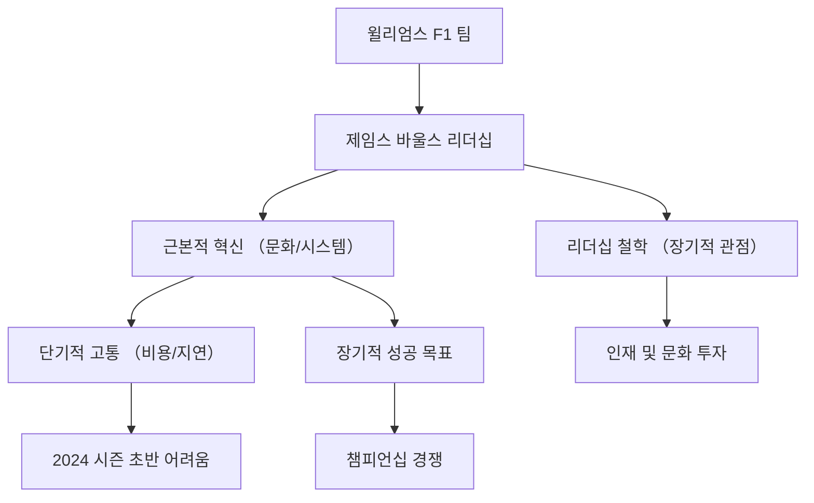

  

제공해주신 자료들은 포뮬러 1(F1) 팀 중 하나인 윌리엄스 레이싱(Williams Racing)의 팀 수장인 제임스 바울스(James Vowles)의 리더십 하에 진행되고 있는 팀의 혁신과 문화 변화에 대한 내용을 다루고 있습니다. 특히, 팀의 낙후된 시스템과 시설을 개선하는 과정에서 겪는 고통스러운 변화와 장기적인 성공을 위한 그의 리더십 철학에 초점을 맞추고 있습니다.

  

## 1. 개요

- 모든 자료는 윌리엄스 F1 팀의 수장인 제임스 바울스(James Vowles)가 주도하는 팀의 근본적인 혁신 과정을 다룹니다 .
    
- 이 혁신은 수십 년간 뒤처져 있던 윌리엄스의 낡은 시설과 문화, 그리고 비효율적인 시스템(예: Excel로 차량 부품 관리)을 뜯어고치는 데서 오는 단기적인 고통과 비용을 수반하고 있습니다 .
    
- 바울스는 단기적인 성과보다는 장기적인 성공을 위한 문화(실패를 포용하는 문화, 인재 육성)와 시스템 구축에 집중하고 있으며, 이는 F1뿐만 아니라 일반 비즈니스 리더십에도 적용될 수 있는 교훈을 제공합니다 .
    

  

  

## 2. 학습 로드맵

제공된 자료들은 윌리엄스 팀의 혁신 과정과 제임스 바울스의 리더십 철학을 다루고 있습니다. 팀이 겪는 구체적인 문제점(

, I)을 먼저 파악한 후, 바울스가 제시하는 해결책과 장기적인 비전(, B, E, F, K)을 순차적으로 학습하는 것을 추천합니다.

  

|   |   |   |
|---|---|---|
|**자료**|**주제**|**난이도**|
|,|윌리엄스 혁명의 고통스러운 현실 (시스템 문제)|중|
||바울스의 초기 윌리엄스 진단 및 문화 변화 노력|중|
||바울스가 보는 윌리엄스의 진전과 미래 방향|하|
|, ,|바울스의 리더십 철학 및 장기 비전|하|
|, , ,|(참고 자료)|하|

  

**추천 학습 순서:**

  

1. **&  (현실 파악):** 윌리엄스가 2024년 시즌 초반에 겪은 구체적인 문제점(Excel 사용, 부품 지연)을 이해하여 혁신의 필요성을 체감합니다.
    
2. **(문화 혁신):** 바울스가 팀에 도입한 '비난 없는 문화(No Blame Culture)'와 알렉스 알본의 리더 역할 등 초기 변화의 핵심을 파악합니다.
    
3. **(진행 상황):** 바울스가 외부의 시선과 달리 팀 내부에서 이루어지고 있는 긍정적인 변화와 인재 영입을 어떻게 평가하는지 확인합니다.
    
4. **, ,  (리더십 심화):** 바울스의 10가지 리더십 교훈과 장기적인 성공을 위한 철학을 깊이 있게 학습합니다.
    

  

  

## 3. 소스별 상세 분석

  

## 3.1 The shocking details behind an F1 team's painful revolution / F1 팀의 고통스러운 혁명 뒤에 숨겨진 충격적인 이야기

==윌리엄스 f1 팀====은 낡은 시스템과 문화 때문에 2024년 차량 제작에 큰 어려움을 겪었으며, 이는 단기적인 성과 저하를 초래했지만 장기적인== ==혁신====을 위한 필수적인 고통이었습니다.==

  

- **낙후된 시스템의 충격적인 현실:**
    
    - 윌리엄스는 2024년 차량(FW46) 제작까지도 부품 목록을 관리하는 데 Microsoft Excel을 사용했습니다 .
        
    - 팀 수장인 제임스 바울스는 약 20,000개의 개별 부품을 관리하는 Excel 목록이 "농담 수준"이었으며, 탐색과 업데이트가 불가능했다고 비판했습니다 .
        
    - 이 시스템은 부품의 비용, 제작 소요 시간, 재고 현황 등 핵심 데이터가 부족하여, 수백, 수천 개의 부품을 추적하는 현대 F1의 복잡성을 감당할 수 없었습니다 .
        
    

  

- **2024년 차량 제작의 고통:**
    
    - 바울스는 팀의 운영 방식을 근본적으로 바꾸기 위해 2024년 차량의 '기술 기반(technology base)'을 대폭 변경했습니다 .
        
        - 섀시를 구성하는 부품 수가 수백 개에서 수천 개로 증가했습니다 .
            
        
    - 낡은 시스템을 디지털 시스템으로 전환하는 작업과 차량 기술 기반을 동시에 바꾸면서 겨울 내내 엄청난 혼란이 발생했습니다 .
        
        - 이로 인해 직원들은 밤샘 작업을 해야 했고, 1월까지도 차량이 "부품 더미" 상태였다고 합니다 .
            
        
    - 이러한 비효율적인 과정은 "극도로 비쌌으며(viciously expensive)" 예산 상한제(Cost Cap) 시대에 귀중한 자원을 낭비했습니다 .
        
    

  

- **단기적 고통과 장기적 비전:**
    
    - 2024년 시즌 초반, 윌리엄스는 준비 부족으로 인해 테스트에서 신뢰성 문제를 겪었고, 성능 향상에 필요한 부품 우선순위 지정에 실패했습니다 .
        
    - 하지만 바울스는 이러한 고통이 필요한 경험이었다고 강조하며, 2025년 차량 제작에서는 문제가 해결될 것이라고 확신합니다 .
        
    - 그는 올바른 프로세스와 시스템을 갖추는 것만으로도 수백만 파운드의 예산 상한제 비용을 절약하고, 성능에서 수십 분의 1초(tenths of performance)를 얻을 수 있는 "엄청난 기회"가 있다고 믿습니다 .
        
    

  

## 3.2 Vowles takes Williams by the hand: Culture, the budget cap and Albon

==제임스 바울스는 윌리엄스의 성공을 위해 '비난 없는 문화'를 도입하고 알렉스 알본을 리더로 활용하며, F1의 예산 상한제(Budget Cap)가 낙후된 팀의 성장을 방해하는== ==구조적 문제====에 대해 목소리를 높이고 있습니다.==

  

- **문화 변화의 시작:**
    
    - 바울스는 윌리엄스에 합류한 지 6개월 만에 문화 변화의 시작을 보았으며, 이는 조직이 변화를 받아들일 준비가 되어 있었음을 의미합니다 .
        
    - 그는 직원들이 실수에 대한 두려움 때문에 혁신을 주저하는 것을 막기 위해 '비난 없는 문화(No Blame Culture)'를 도입했습니다 .
        
        - 이 문화는 실수를 숨기지 않고 공개적으로 논의하며, 그로부터 배우고 다른 사람들에게 가르치는 것을 목표로 합니다 .
            
        
    - 바울스는 성공은 사람을 강하게 만들지 않지만, 실패를 올바르게 다루는 것이 팀을 훨씬 더 강하게 만든다고 믿습니다 .
        
    

  

- **알렉스 알본의 리더 역할:**
    
    - 드라이버인 알렉스 알본은 팀 내에서 매우 중요한 리더 역할을 수행하고 있습니다 .
        
    - 알본은 차량 데이터만으로는 알 수 없는 운전의 한계와 문제점을 엔지니어와 디자이너에게 명확하게 전달하는 역할을 합니다 .
        
    

  

- **예산 상한제의 역설:**
    
    - 윌리엄스는 지난 20년간 필요한 투자가 부족하여 시설이 20~25년 뒤처져 있습니다 .
        
        - 예를 들어, 윌리엄스의 '에칭 머신'은 F1 패독만큼 크지만, 메르세데스의 것은 테이블 크기입니다 .
            
        
    - 바울스는 시설 투자에도 예산 상한제가 적용되어, 윌리엄스가 상위 팀의 격차를 따라잡기 어렵게 만드는 구조적인 불평등을 지적합니다 .
        
    - 그는 F1이 진정한 실력주의(meritocracy)가 되기 위해서는 이러한 규칙에 대한 변화가 필요하다고 강력히 주장하고 있습니다 .
        
    

  

## 3.3 “A different world” — James Vowles on Williams F1 gains

==제임스 바울스는 윌리엄스가 겉으로 보이는 성적(9위)에도 불구하고, 인프라, 문화, 인력 등 팀 내부적으로는 이미 "다른 세상"이 되었다고 강조하며 장기적인 성공을 확신하고 있습니다.==

  

- **내부 변화와 외부 성과의 괴리:**
    
    - 바울스는 윌리엄스가 지난 2년간 이룬 진전이 현재의 성적(컨스트럭터 챔피언십 9위)에 반영되지 않고 있다고 말합니다 .
        
    - 그는 팀이 겪은 인력 이탈(attrition)과 새로운 기술 도입으로 인한 차량 무게 문제 등이 성과를 가리는 요인이었다고 설명합니다 .
        
    
- **인재 영입과 인프라 개선:**
    
    - 윌리엄스는 패트 프라이(Pat Fry, 최고 기술 책임자)와 맷 하만(Matt Harman, 디자인 디렉터) 등 경험 많은 인재를 영입했습니다 .
        
    - 바울스는 이제 건물 주변을 걸어 다니면 "우승 경력을 가진 탁월함"을 볼 수 있으며, 인프라, 문화, 사람, 상업적인 면에서 "완전히 다른 세상"이 되었다고 표현합니다 .
        
    
- **장기적인 성공을 위한 통합 전략:**
    
    - 바울스는 성공을 위해서는 신뢰성, 디자인, 성능, 드라이버, 그리고 전체적인 전략이 올바른 속도로 함께 전진해야 한다고 믿습니다 .
        
    - 그는 단기적인 성과에 연연하지 않고, 윌리엄스라는 이름을 다시 그리드의 선두로 되돌리기 위해 장기적인 관점에서 노력하고 있습니다 .
        
    

  

## 3.4 What entrepreneurs can learn from F1: Racing boss James Vowles shares 10 leadership lessons

==제임스 바울스는 F1 팀을 이끌면서 얻은 경험을 바탕으로, 기업가들이 배울 수 있는 10가지 핵심 리더십 교훈을 제시하며, 장기적인 비전과 진정성 있는 인재 관리를 강조합니다.==

  

- **변화와 혁신에 대한 태도:**
    
    - **익숙한 것을 부수고 더 나은 것을 건설하라:** 최고의 결과를 얻기 위해서는 기존의 모든 것을 부숴야 했으며, 이는 짧은 시간 안에 팀의 사고방식을 변화시켰습니다 .
        
    - **실패를 과정의 일부로 포용하라:** 저조한 성과에 대처하는 방식이 리더를 정의하며, 실패로부터 배우고 이를 긍정적으로 재적용하는 것이 중요합니다 .
        
    - **현실에 안주하지 마라:** 과거의 역사는 미래의 승리를 보장하지 않으며, 항상 장기적으로 생각하고 더 높은 목표를 설정해야 합니다 .
        
    

  

- **인재 및 조직 관리:**
    
    - **당신보다 똑똑한 사람을 고용하라:** 리더의 역할은 세계적인 인재를 모으고, 그들에게 권한을 부여하며, 그들의 길을 비켜주는 것입니다 .
        
    - **다음 세대를 위한 공간을 창출하라:** 현재의 성공도 중요하지만, 팀의 미래 10~15년의 근간을 구축하기 위해 초기 경력자(early careers)에게 투자해야 합니다 .
        
    - **사람들을 진심으로 아끼라:** 직원들의 시간에 감사하고 그들을 진심으로 배려하는 것이 무한한 존경을 얻는 방법입니다 .
        
    

  

- **의사 결정 및 비전:**
    
    - **방향이 정답보다 중요할 때가 많다:** 잘못된 결정이라도 내리지 않는 것보다는 낫습니다. 주저함은 최악이며, 결정이 완벽하지 않더라도 함께 앞으로 나아가야 합니다 .
        
    - **장기적인 게임을 하라:** 단기적인 이익을 추구하는 것은 윌리엄스의 미래에 옳지 않으며, 팀을 더 나은 곳에 두고 다음 세대에 물려주는 것이 목표입니다 .
        
    - **압박 속에서도 진정성을 유지하라:** 자신이 하는 일을 진심으로 믿어야 하며, 어려움에 직면했을 때 진정한 성격이 드러나므로 가식은 결국 무너집니다 .
        
    - **가시성을 확보하고 끊임없이 소통하라:** 전 직원에게 주 3회 이메일을 보내고, 매 레이스 후 팀 미팅을 하며, 공장을 직접 걸어 다니며 소통하는 것이 중요합니다 .
        
    

  

## 3.5 James Vowles: Redefining Success At Williams / Williams F1 boss James Vowles on leadership and building a winning culture

==제임스 바울스는 윌리엄스에서의 성공을 속도뿐 아니라 전략, 회복력, 그리고 협업 문화를 통해 재정의하고 있으며, 그의 리더십은 F1을 넘어 모든 비즈니스에 적용되는 보편적인 원칙을 따릅니다.==

  

- **F1과 비즈니스의 공통점:**
    
    - F1 팀은 TV에 나오고 수백만 명 앞에서 경주하지만, 근본적으로는 다른 회사와 다르지 않습니다 .
        
    - 모든 비즈니스는 적절한 기반 구조, 시스템, 프로세스, 데이터, 그리고 가장 중요한 '사람'에 대한 투자가 필요합니다 .
        
    

  

- **문화 혁신과 장기적 목표:**
    
    - 바울스는 윌리엄스에 합류했을 때 사람들이 변화를 두려워하여 기존의 경계를 벗어나지 않으려 했다고 설명합니다 .
        
    - 그는 윌리엄스의 문화를 "안주하는 것에서 최고만을 추구하는 것"으로 바꾸기 위해 모든 것을 부숴야 했으며, 이는 단기간에 팀의 사고방식을 변화시켰습니다 .
        
    - 그의 목표는 5위나 6위가 아니라 세계 챔피언십을 위해 싸우는 것이며, 이는 1년이 아닌 매우 장기적인 전망을 요구합니다 .
        
    

  

- **리더십과 진정성:**
    
    - 바울스는 자신이 만난 훌륭한 리더들(로스 브라운, 토토 울프 등)로부터 배웠지만, 그들을 모방하지 않고 자신의 핵심인 진정성(authenticity)을 유지하는 것이 중요하다고 강조합니다 .
        
    - 그는 리더로서의 자신의 역할은 가장 똑똑한 사람들을 고용하고, 그들이 조직 내에서 마음껏 능력을 발휘할 수 있는 구조를 만드는 것이라고 정의합니다 .
        
    - **소통의 중요성:** 그는 전 직원에게 주 3회 이메일을 보내고, 레이스 후 팀 미팅을 하며, 무작위로 공장을 돌아다니며 사람들을 만나는 등 다양한 방식으로 팀원들과 소통합니다 .
        
    

  

- **카를로스 사인츠 영입의 비결:**
    
    - 바울스는 카를로스 사인츠를 영입하는 과정에서 6개월 동안 꾸준히 소통하며 윌리엄스의 나쁜 점까지 모두 솔직하게 공개했습니다 .
        
    - 그는 투자 계획과 미래 비전을 투명하게 제시했고, 사인츠는 이것이 허구가 아님을 확인했습니다 .
        
    - 사인츠는 단순히 빠른 드라이버가 아니라, 윌리엄스를 챔피언십 팀으로 만드는 데 필요한 것을 이해하고 그 변혁의 핵심이 되기를 원했기 때문에 바울스의 비전에 공감했습니다 .