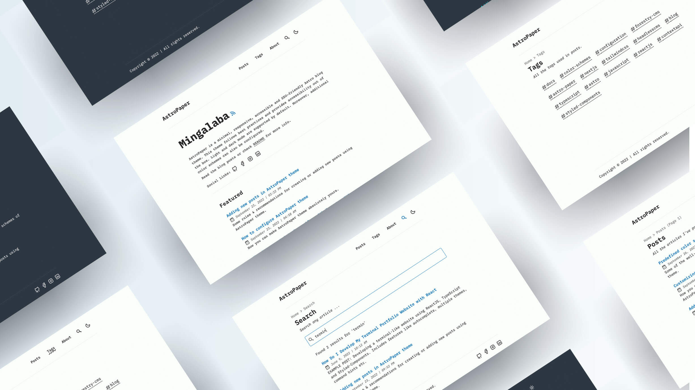

# AstroPaper 📄


[](https://www.figma.com/community/file/1356898632249991861)


[](https://conventionalcommits.org)
[](http://commitizen.github.io/cz-cli/)

AstroPaper is a minimal, responsive, accessible and SEO-friendly Astro blog theme. This theme is designed and crafted based on [my personal blog](https://satnaing.dev/blog).

Read [the blog posts](https://astro-paper.pages.dev/posts/) or check [the README Documentation Section](#-documentation) for more info.

## 🔥 Features

- [x] type-safe markdown
- [x] super fast performance
- [x] accessible (Keyboard/VoiceOver)
- [x] responsive (mobile ~ desktops)
- [x] SEO-friendly
- [x] light & dark mode
- [x] fuzzy search
- [x] draft posts & pagination
- [x] sitemap & rss feed
- [x] followed best practices
- [x] highly customizable
- [x] dynamic OG image generation for blog posts [#15](https://github.com/satnaing/astro-paper/pull/15) ([Blog Post](https://astro-paper.pages.dev/posts/dynamic-og-image-generation-in-astropaper-blog-posts/))

_Note: I've tested screen-reader accessibility of AstroPaper using **VoiceOver** on Mac and **TalkBack** on Android. I couldn't test all other screen-readers out there. However, accessibility enhancements in AstroPaper should be working fine on others as well._

## ✅ Lighthouse Score

<p align="center">
  <a href="https://pagespeed.web.dev/report?url=https%3A%2F%2Fastro-paper.pages.dev%2F&form_factor=desktop">
    
  <a>
</p>

## 🚀 Project Structure

Inside of AstroPaper, you'll see the following folders and files:

```bash
/
├── public/
│   ├── assets/
|   ├── pagefind/ # auto-generated when build
│   └── favicon.svg
│   └── astropaper-og.jpg
│   └── favicon.svg
│   └── toggle-theme.js
├── src/
│   ├── assets/
│   │   └── icons/
│   │   └── images/
│   ├── components/
│   ├── data/
│   │   └── blog/
│   │       └── some-blog-posts.md
│   ├── layouts/
│   └── pages/
│   └── styles/
│   └── utils/
│   └── config.ts
│   └── constants.ts
│   └── content.config.ts
└── astro.config.ts
```

Astro looks for `.astro` or `.md` files in the `src/pages/` directory. Each page is exposed as a route based on its file name.

Any static assets, like images, can be placed in the `public/` directory.

All blog posts are stored in `src/data/blog` directory.

## 📖 Documentation

Documentation can be read in two formats\_ _markdown_ & _blog post_.

- Configuration - [markdown](src/data/blog/how-to-configure-astropaper-theme.md) | [blog post](https://astro-paper.pages.dev/posts/how-to-configure-astropaper-theme/)
- Add Posts - [markdown](src/data/blog/adding-new-post.md) | [blog post](https://astro-paper.pages.dev/posts/adding-new-posts-in-astropaper-theme/)
- Customize Color Schemes - [markdown](src/data/blog/customizing-astropaper-theme-color-schemes.md) | [blog post](https://astro-paper.pages.dev/posts/customizing-astropaper-theme-color-schemes/)
- Predefined Color Schemes - [markdown](src/data/blog/predefined-color-schemes.md) | [blog post](https://astro-paper.pages.dev/posts/predefined-color-schemes/)

## 💻 Tech Stack

**Main Framework** - [Astro](https://astro.build/)  
**Type Checking** - [TypeScript](https://www.typescriptlang.org/)  
**Styling** - [TailwindCSS](https://tailwindcss.com/)  
**UI/UX** - [Figma Design File](https://www.figma.com/community/file/1356898632249991861)  
**Static Search** - [FuseJS](https://pagefind.app/)  
**Icons** - [Tablers](https://tabler-icons.io/)  
**Code Formatting** - [Prettier](https://prettier.io/)  
**Deployment** - [Cloudflare Pages](https://pages.cloudflare.com/)  
**Illustration in About Page** - [https://freesvgillustration.com](https://freesvgillustration.com/)  
**Linting** - [ESLint](https://eslint.org)

## 👨🏻‍💻 Running Locally

You can start using this project locally by running the following command in your desired directory:

```bash
# pnpm
pnpm create astro@latest --template satnaing/astro-paper

# pnpm
pnpm create astro@latest -- --template satnaing/astro-paper

# yarn
yarn create astro --template satnaing/astro-paper

# bun
bun create astro@latest -- --template satnaing/astro-paper
```

Then start the project by running the following commands:

```bash
# install dependencies if you haven't done so in the previous step.
pnpm install

# start running the project
pnpm run dev
```

As an alternative approach, if you have Docker installed, you can use Docker to run this project locally. Here's how:

```bash
# Build the Docker image
docker build -t astropaper .

# Run the Docker container
docker run -p 4321:80 astropaper
```

## Google Site Verification (optional)

You can easily add your [Google Site Verification HTML tag](https://support.google.com/webmasters/answer/9008080#meta_tag_verification&zippy=%2Chtml-tag) in AstroPaper using an environment variable. This step is optional. If you don't add the following environment variable, the google-site-verification tag won't appear in the HTML `<head>` section.

```bash
# in your environment variable file (.env)
PUBLIC_GOOGLE_SITE_VERIFICATION=your-google-site-verification-value
```

> See [this discussion](https://github.com/satnaing/astro-paper/discussions/334#discussioncomment-10139247) for adding AstroPaper to the Google Search Console.

## 🧞 Commands

All commands are run from the root of the project, from a terminal:

> **_Note!_** For `Docker` commands we must have it [installed](https://docs.docker.com/engine/install/) in your machine.

| Command                              | Action                                                                                                                           |
| :----------------------------------- | :------------------------------------------------------------------------------------------------------------------------------- |
| `pnpm install`                       | Installs dependencies                                                                                                            |
| `pnpm run dev`                       | Starts local dev server at `localhost:4321`                                                                                      |
| `pnpm run build`                     | Build your production site to `./dist/`                                                                                          |
| `pnpm run preview`                   | Preview your build locally, before deploying                                                                                     |
| `pnpm run format:check`              | Check code format with Prettier                                                                                                  |
| `pnpm run format`                    | Format codes with Prettier                                                                                                       |
| `pnpm run sync`                      | Generates TypeScript types for all Astro modules. [Learn more](https://docs.astro.build/en/reference/cli-reference/#astro-sync). |
| `pnpm run lint`                      | Lint with ESLint                                                                                                                 |
| `docker compose up -d`               | Run AstroPaper on docker, You can access with the same hostname and port informed on `dev` command.                              |
| `docker compose run app pnpm install` | You can run any command above into the docker container.                                                                         |
| `docker build -t astropaper .`       | Build Docker image for AstroPaper.                                                                                               |
| `docker run -p 4321:80 astropaper`   | Run AstroPaper on Docker. The website will be accessible at `http://localhost:4321`.                                             |

> **_Warning!_** Windows PowerShell users may need to install the [concurrently package](https://www.npmjs.com/package/concurrently) if they want to [run diagnostics](https://docs.astro.build/en/reference/cli-reference/#astro-check) during development (`astro check --watch & astro dev`). For more info, see [this issue](https://github.com/satnaing/astro-paper/issues/113).

## ✨ Feedback & Suggestions

If you have any suggestions/feedback, you can contact me via [my email](mailto:contact@satnaing.dev). Alternatively, feel free to open an issue if you find bugs or want to request new features.

## 📜 License

Licensed under the MIT License, Copyright © 2025

---

Made with 🤍 by [Sat Naing](https://satnaing.dev) 👨🏻‍💻 and [contributors](https://github.com/satnaing/astro-paper/graphs/contributors).

## ✍️ Decap CMS 없이 글 작성 (한국어)

1. **글 위치**
   - 프로젝트에 따라 `src/content/blog/` 또는 `src/data/blog/` 중 존재하는 폴더가 글 폴더입니다. 해당 위치에 마크다운 파일을 추가하세요.

2. **새 글 만들기 (수동)**
   - 파일명은 영어 슬러그에 날짜 프리픽스를 붙이는 형식을 권장합니다. 예: `2025-09-24-scrumble-backend-retro.md`
   - 아래 프론트매터 템플릿과 본문을 작성합니다.

```md
---
title: "Scrumble 백엔드 회고"
description: "Go + Next.js 전환에서 배운 점과 다음 액션"
pubDatetime: 2025-09-24T09:00:00+09:00
updatedDatetime: 2025-09-24T22:00:00+09:00
tags: ["회고","scrumble","golang"]
featured: false
draft: false
slug: "scrumble-backend-retro"
ogImage: "/assets/og/retro-backend.png"
---
여기에 본문을 작성합니다.
```

3. **이미지 넣기**
   - 정적 자산은 `public/` 아래에 두며, 예: `public/assets/uploads/retro-backend.png`
   - 본문에서는 ``처럼 경로를 `/assets/...`로 지정합니다.

4. **로컬 미리보기**
   - 개발 서버: `pnpm dev`
   - 프로덕션 프리뷰: `pnpm build && pnpm astro preview`

5. **Obsidian에서 가져온 글 붙이기**
   - Obsidian에서 export한 `.md` 파일을 글 폴더에 복사합니다.
   - 이미지와 첨부 파일은 `public/assets/uploads/`로 옮기고, 본문 경로를 `/assets/uploads/...`로 교체합니다.
   - 프론트매터에 `title`, `pubDatetime`, `draft` 등 필요한 최소 필드를 추가합니다.

6. **스크립트로 새 글 생성**
   - `scripts/new-post.mjs`를 통해 템플릿 파일을 자동 생성할 수 있습니다. (`package.json`의 `new:post` 스크립트 사용)
   - 사용법: `pnpm run new:post "Scrumble 백엔드 회고"`
   - 실행하면 `src/content/blog/` 또는 `src/data/blog/` 중 존재하는 폴더에 `YYYY-MM-DD-슬러그.md` 파일을 드래프트 상태로 생성합니다.

7. **체크리스트**
   - 글이 보이지 않으면 `draft: true`인지 확인하세요.
   - 스타일/이미지 404가 나면 경로가 `/assets/...`인지, 파일이 `public/` 아래 있는지 점검하세요.
   - Featured 섹션은 `featured: true` 글만 노출됩니다.
