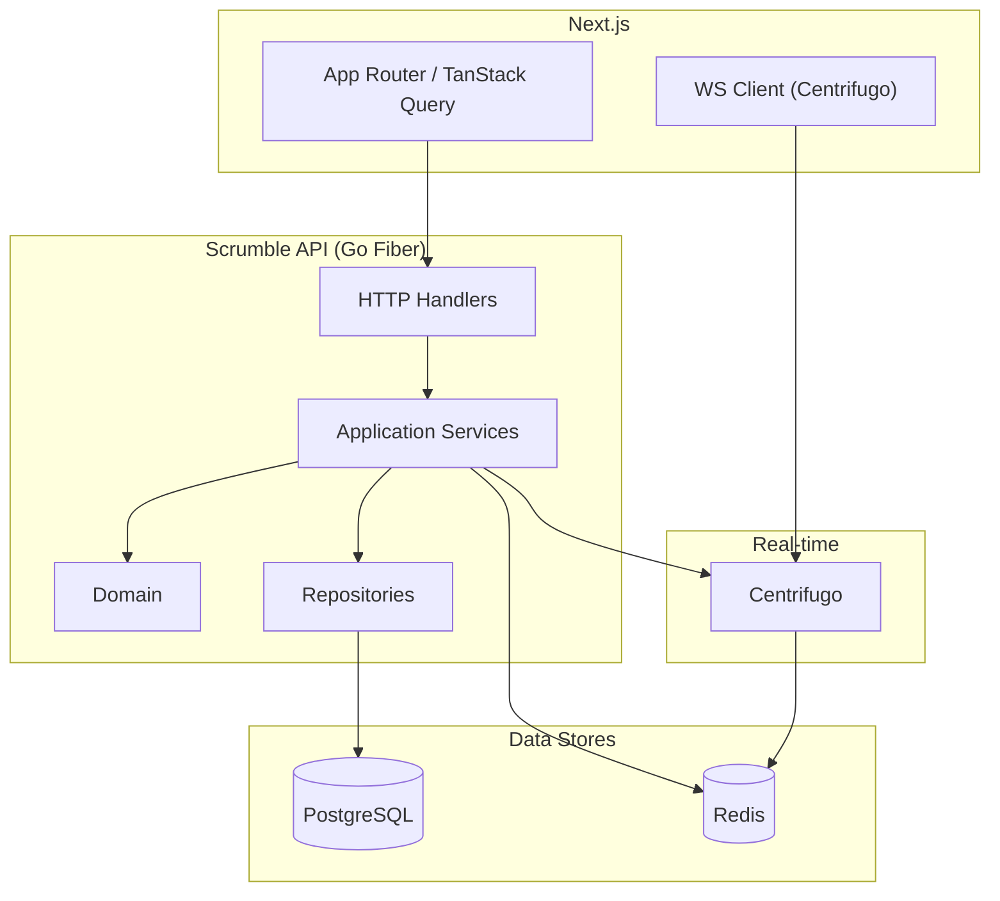
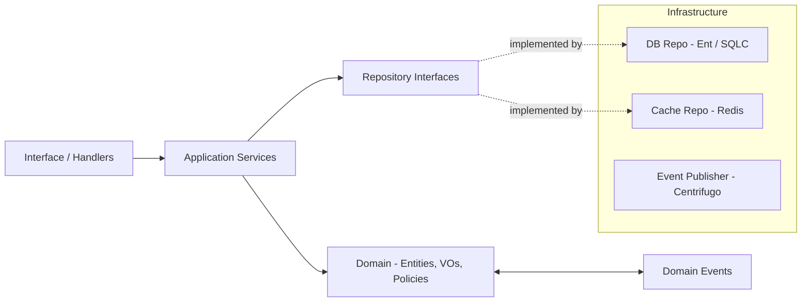
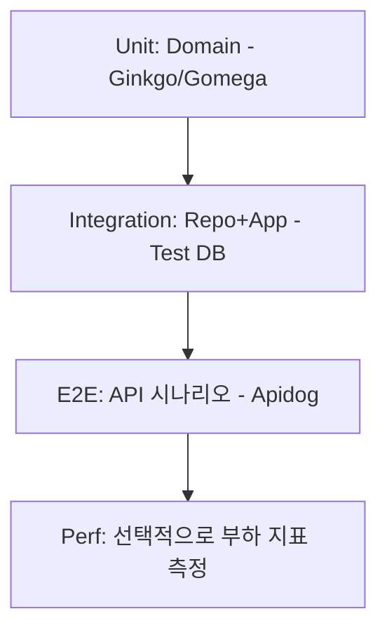
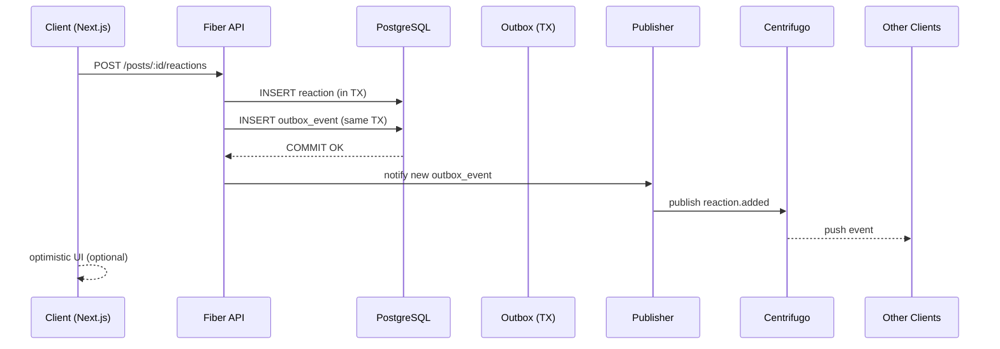
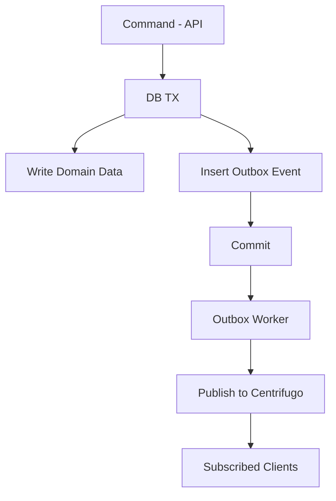
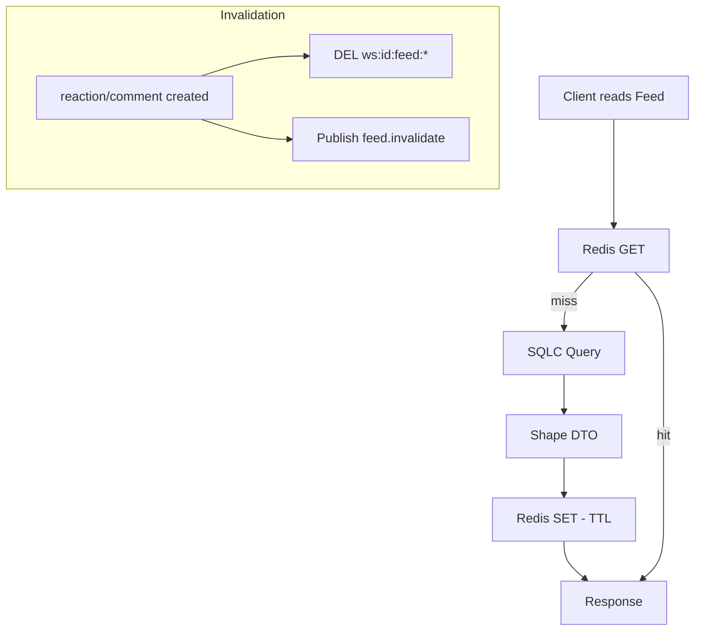
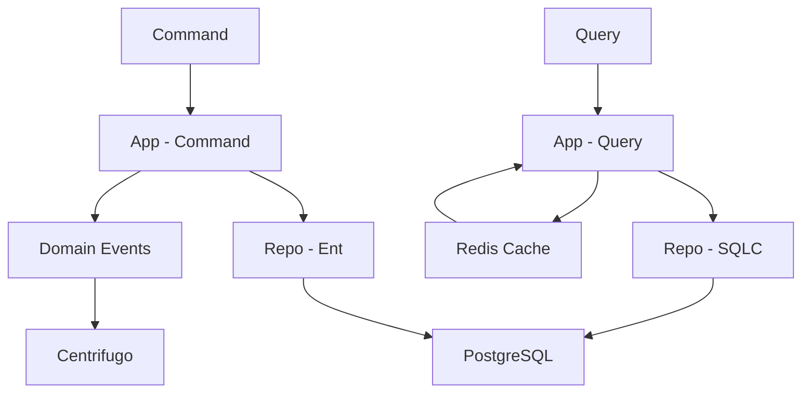
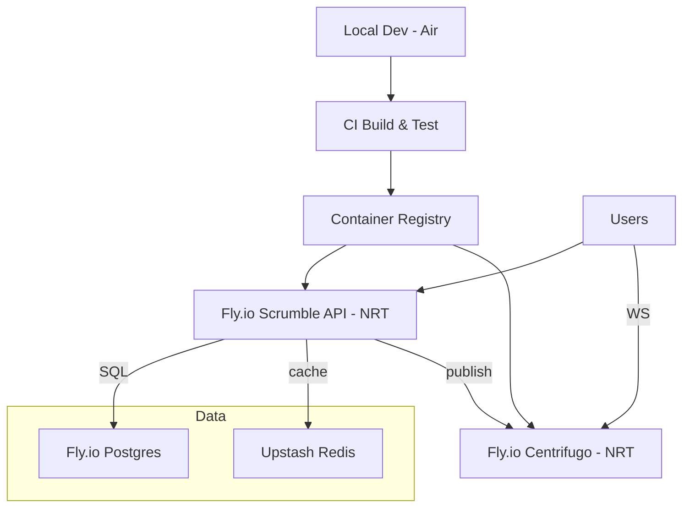

# 백엔드 기술 회고

> AI 시대에 잃어가는 인간적 연결을 업무 환경에서 되찾자.
> **Scrumble**은 팀원 간의 감정적 유대와 상호 지지를 형성하는 daily scrum 기반 팀 커뮤니케이션 플랫폼입니다.

이게 초기에 프로젝트 방향성이다. 기술 외적인 프로젝트에 대한 자세한 사항은 [Scrumble 프로젝트 회고 (2025년 6월~8월)](/posts/2025-09-scrumble-project-retro)에서 읽어보면 된다.

여러가지 요구사항이 있었는데, 기본적으로 구현된 기능은 다음과 같다.

- 워크스페이스/멤버 관리 (생성, 초대 등)
- 체크인/체크아웃 포스트 (데일리 스크럼)
- 피드 리스트
- 실시간 포스트-댓글 및 리액션 이모지
- 투두 리스트
- 알림 시스템

추가로 통계/리포트나 서드파티 인티그레이션, 봇 연동 등은 현재 WIP 이고, 구현된 리스트는 위와 같다.
지금 팀에서도 매일 업무 시작과 끝에 이걸로 업무를 하고 있고 매일 체크인 점수와 체크인 포스트, 댓글 등을 활발하게 쓰고 있다.

도메인 요구사항 안을 들여다보면, 백엔드 관점에서 몇가지 기술적 아젠다가 있는데, 대표적으로 다음 세 개가 메인일 것 이다.

- 워크스페이스, 멤버, 포스트, 댓글, 리액션, 투두리스트 에 이르는 도메인/스키마 관계
- 피드 리스트
- 실시간 업데이트 (Seamless UX)

전형적인 SNS 구조와 SaaS 플랫폼 형태의 요구사항이다.

막상 써놓고 보니 몇 개 안되지만.. 아래에서 각 사항들을 구현하면서 고민했던 사항들을 공유해보겠다.

## 기술 회고

### 프로젝트 기본 기술 스택

- **언어**: Go 1.23+
- **웹 프레임워크**: Fiber v2
- **데이터베이스**: PostgreSQL 15
- **ORM**: EntGo + Atlas 마이그레이션
- **캐시**: Redis 7 (실시간 상태 관리)
- **인증**: JWT + Google OAuth (Goth)
- **WebSocket**: Centrifugo (실시간 리액션/댓글)
- **의존성 주입**: Wire (Google)
- **로깅**: Zap (구조화된 로깅)
- **개발 도구**: Air (Hot Reload)

#### Fiber

아마 제일 일반적인 Golang 웹 프레임워크는 Gin 일 것이고 나는 기존에 Echo로 작업을 했는데 당분간은 계속 Fiber 로 작업을 할 예정이다. 가장 큰 차이점이라면 Gin/Echo 는 net/http 기반으로 Golang 서버 표준을 따른다면, Fiber 는 fasthttp 로 표준이 아니다. 또한, Gin 에 비교하면 상대적으로 표준화된 기본 라이브러리도 적은 편이다. 다만, 필수적인 건 다 있고, express inspired 다 보니 초기 설정이 간단하다. 성능이 더 빠르다고 광고는 하는데 그건 DB를 붙이고 상황과 환경에 따라 다르고 Gin/Echo 도 충분히 빨라서 그게 이유는 아니다. (그런 트래픽을 낼만한 서비스를 아직 못만들어서..) fasthttp 이기 때문에 실시간 등의 지원도 라이브러리가 표준과 차이가 좀 있지만, 직접 구현에 부족한 것도 아니고 어차피 Centrifugo를 쓰고 있어서 크게 문제도 없다.
처음 Golang 으로 한다면 왠만하면 Gin 을 추천하겠지만, nodejs/ts 로 Express 사용하면서 편한 부분이 있었다면 Fiber 도 나쁘지 않다.
어차피 Go 에서는 웹프레임워크가 해주는 역할이 바깥 부분에 있기 때문에 핸들러 레이어 구분을 잘해놓았다면 다른 프레임워크 교체도 엄청 어려운 일은 아닐수도 있다. 그냥 괜히 메이저가 아닌걸 선택하고 싶은 내 취향이니 감안해주시길.

#### Entgo + Atlas 마이그레이션

정확히는 Entgo + SQLC 이다. 프로젝트 중반 이후에 Entgo 가 Join 으로 쿼리를 날리지 않는 걸 알았고 Entgo가 어떤 ORM의 성격보다는 타입 세이프 쿼리 빌더의 성격이 강하다는 걸 알게되면서 어차피 도메인 엔티티, Entgo 스키마 엔티티도 분리되어있는 아키텍처에서 프로젝트 후반부로 갈수록 Entgo의 모든 부분이 골칫덩어리였다. 원래 gorm 을 썼는데, Entgo 가 뭔가 표준인가 싶어서 큰 고민없이 도입했었고 그 결과는 낭패였다. 일단 불편한 점이 몇 가지가 있는데..

- Join 하지 않음
  - 기본적으로 N+1 Query Pattern 이다. 코드에서 client.User.Query().withPosts() 라고 하면, Join 하는게 아닌 users 를 Select 하고 그 결과 ID들을 가지고 다시 posts 를 Select 하는 방식이다.
  - 이런 이유가 여러 개 있는데 알고보니 Entgo는 내가 잘못하는(?) graphql 과 호환성이 좋고 그래프 방식으로 쿼리 빌더를 짜게끔 설계되어 있었다. 이러한 설계에는 엔티티 매핑도 깔끔해지고 lazy/eager loading 제어가 쉬워진다는 장점도 있겠지만, 결국 쿼리 한번이면 될 것을 n 번 내보내야하는 성능 이슈가 생긴다. 이걸 entgo 문법으로 맞추려고 하다보면 아니 raw query 면 한줄로 될 것을 왜 이 짓을 하고 있지라는 생각이 들면서.. 결국 CQRS 를 적용해서 Query repository 에서는 SQLC 를 쓰게 되었다.
- Code First Schema Migration
  - 말그대로 DB 테이블을 코드를 중심으로 제어한다는 건데, 문제는 psql 은 되게 많은 기능을 제공하고 그러한 기능들을 내가 직접 코드로 설정해야할때가 있다. 그리고 이왕 마이그레이션 파일을 관리하는 김에 그걸 다 기록을 남기고 싶은데, Code First 이다 보니 atlas 로 내가 마이그레이션 파일을 코드로 읽어서 생성하면 sync 가 되면서 내가 직접 작성한 sql 마이그레이션이 초기화가 된다.
  - JSON column 의 GIN Index 생성 등을 Entgo에서 어떻게 지원하는지 직접 최신 라이브러리를 뒤져서 찾아봐야했고 Claude 도 최신 정보가 없어 계속 엉뚱한 스키마 정의 코드를 만들어서 소위 개삽질을 꽤 했었다.
- 어마어마한 보일러플레이트 생성
  - Type Safe, Code First 이다 보니 entgo 스키마로 정의 후 generate 하면 디폴트 파일을 어마어마하게 만들어낸다. 나는 내가 직접 작성한 코드가 아닌 코드 베이스가 검색되는 걸 지양하다보니 계속 검색에 걸리는 남의(?) 소스 코드가 거슬리긴 한다.

타 언어 ORM 처럼(like JPA, ActiveRecord, Django ORM..) 꽤 많은 편의 기능을 제공해주거나 표준이 아닌 이상 결국 객체화된 스키마를 조금 코드에서 쉽게 다루기 위해 ORM 을 쓰는데, 그 정도 기능에 비해 Entgo 는 나에게 너무 많은 단점이 느껴지는 라이브러리이고 이런 초기 프로젝트에서 굳이 CQRS 같은 복잡한 아키텍처가 필요없음에도 결국 기본적인 쿼리 성능 최적화 때문에 도입하게 만들었다.
만약 내가 아주 간단한 Entity 를 가지고 있는 마이크로서비스이고 그게 Graphql 을 결합시키고 복잡한 레이어를 가지고 있지 않은 서버라면 고려해볼만할 것 같은데.. 아주 간단한 서버인데 굳이 ? 라는 느낌도 든다. 하여튼 처음부터 선택해서 끌고 왔기 때문에 이 프로젝트에서는 계속 사용하겠지만 앞으로는 굳이 선택하지 않을 것 같은 라이브러리였다.
Golang 을 선호하는 내 작업 성향상 마이그레이션은 Schema first 로 깔끔하게 sql 로 관리하고 ORM 은 Join 쿼리를 기본적으로 실행하는 녀석을 선택할 것이다. 초반에 굳이 Command Repository, Query Repository 이렇게 나누고 싶지 않다. (참고로, 현재 진행하는 프로젝트에선 Bun ORM과 golang-migrate 을 사용한다.)

#### 기타

데이터베이스는 psql 을 표준으로 계속 사용하고 있었고, 실시간, 캐시에서는 Redis (뒤에서 후술), 소셜 인증은 Goth (Supabase 급은 아니지만 꽤 간단하다. api만 연결시켜주고 키만 연결해주면 됨) 의존성 주입은 컴파일 타입에 가능한 Wire 를 썼다. 이것도 그냥 golang DI에서는 국밥 픽이고.. 로깅은 Zap 마찬가지고 국밥 픽, 로깅 구조화가 잘된다는 장점이 있다. 개발 서버는 Air 를 썼는데, Golang 이 컴파일 언어라는 점을 감안했을때 뭐 코드 변경마다 자동으로 컴파일되서 Hot Reload 되는 경험은 거의 스크립트 언어로 서버 개발을 하는 DX를 제공해준다. Spring 으로 내가 개발할때 힘든게 워낙 Ruby, Python 서버 실행속도에 절여져있다보니 너무 느려저서 뭔가 개발 flow 를 유지하기 힘들었다는 경험이 있었는데 (지금은 빨라졌겠지? Spring 최근에 안해서 잘 모름.) 확실히 Golang 의 가볍고 빠른 경험은 훌륭하다.

### 아키텍처 (DDD/Clean Architecture layering)

기본적으로 Scrumble은 워크스페이스 기반의 SNS 에 가까워서 추후 확장성을 위한 아키텍처를 구축할 필요가 있었다. 초기보다는 중반부터 빛을 발하는 아키텍처를 지향했고 초반 구현에서도 여러번 개선을 거쳤다.
아키텍처는 기본적으로 Domain Driven 을 따르고 Interface(handler) \<- Application \<- Domain \<- Infrastructure (repository+) 레이어를 가져간다.
Interface Handler 함수와 Application 의 Service 함수는 1:1 매핑이며, 비지니스 로직의 핵심은 Application 에서 Domain 엔티티와 함수를 조합해서 구현한다. Domain 의 별도 구조체(OOP에서는 class)로 서비스를 구현하는건 지양하고, 패키지 기반의 Golang 프로젝트 특성을 살려서 그냥 패키지 내에서 전역 함수를 만들어서 쓰게 하였고, Repository 또한 Domain 레이어에서 Interface 로 구현되니 실질적으로 Application 에서는 Domain Entity + Domain 패키지 함수 + Repository 함수 (인터페이스) 로 비지니스 로직을 모두 구현한다.
Domain Driven Design 을 지향하니 항상 개발 설계는 Domain 엔티티와 VO (값객체)로 시작해서 Repository 인터페이스 정의와 유즈케이스 구현(Application)을 하고 그에 대응되고 조합되는 Infrastructure 스키마 (entgo schema 구조체)를 별도로 구현하고 Repository 구현체에서 스키마 구조체로 불러온걸 Application 레이어에 도메인 구조체로 변환하여 올려준다.
처음에는 Application 에서도 도메인 객체를 리턴하기도 했는데, 중간 즈음부터는 구조를 다시 잡고, Handler 의 Request, Response 뿐만 아니라 Application 에서도 별도 DTO 를 도입해서 레이어 간 최대한 디커플링을 했다.

당연히 아주 간단한 마이크로서비스라면 그냥 핸들러에다가 직접 쿼리 짜서 던져도 된다고 생각한다. 특히, 각 레이어간 매핑 코드는 굉장히 번거로운데 (특히 Go 에서 slices 를 다룰때) samber/lo 패키지로 코드를 많이 줄였다.

### 테스트

#### 테스트 코드

테스트 코드는 기본적으로 ginkgo/gomega 로 BDD 방식으로 구성을 하고 있다. 아무래도 RSpec 으로 TDD를 배운 입장으로 기본 Golang 테스트 코드가 약간 나에게 직관적이지 않은게 크다. 내가 가지고 있는 TDD 기본 전략은 DB 연동 테스트 즉, repository 나 application 은 최대한 테스트 db 로 통합테스트를 하자는 주의고, Oauth 나 요즈음은 GPT 같은 외부 API 정도만 mocking 을 하는 전략을 가지고 있다. Docker 로 개발하는 대컨테이너 시대에 굳이 DB까지 모킹하는게 나에게는 정말 시간 낭비로 느껴지는 부분이다.
물론 도메인 레이어는 모두 순수 함수니 순수 테스트 함수 구성을 쉽게 할 수 있고, repository 로 전부는 아니지만 복잡한 쿼리나 요구사항 검증이 필요할때는 통합 테스트 DB로 테스트 구성을, Application 비지니스 로직도 마찬가지로 통합 테스트 DB로 테스트 구성을 하였다.
그런데, 내가 한번은 Claude Code 에게 누락된 여러 테스트 코드를 만들어서 테스트 커버리지를 올리라고 무지성하게 명령한 적이 있는데, 내가 명시해놓은 것을 무시하고 Mocking DB 테스트를 뭉텅이로 만들어놔서 어쩌다보니 지금 테스트 코드에 Mocking DB 테스트 코드가 일부 섞여있어서 기존 repository 를 추가할때마다 굉장히 번거로워졌다. 이건 지워야하는데 아직 작업을 못했다.

#### Apidog

API 테스트는 Apidog 을 사용하고 있다. postman, insomnia, bruno 까지 api client 를 여러개 써보면서 왔는데, Apidog 이 postman 의 대부분의 핵심 기능을 잘 구현하면서 자동화된 문서화와 시나리오 테스트까지 툴 단위에서 아주 잘 지원한다. 심지어 무료 정책이 좋아서 혼자 개발한다면 무료로 쓰기에 좋다. Swagger 를 AI에게 자동 생성하게 하고 그걸 Apidog 에 바로 싱크해서 import 하면 바로 api 요청을 테스트해볼 수 있고, Request, Response 스키마 검증까지 가능하다. 강추
(아 postman 을 안쓰는 이유는 너무 기능이 많고 너무 무겁다. UI도 뭔가 깔끔하지 않아서 나는 insomnia 를 선호했는데, 뭔가 insomnia 가 기능이 이상하게 업데이트가 되면서 오픈소스 api client 인 bruno 를 썼지만, 너무 기능이 부족해서 아쉬워하던 중에 Apidog 을 발견했다.)

#### 성능 테스트

일반적인 부하테스트를 진행하지는 않았고, 기존 repository 와 query 용 repository 로 최적화했을때 성능 비교를 진행했었다. 다만, query 용 repository 를 도입하려면 클라이언트 구조를 모두 바꿔야해서 사용하지 않았고 기존 레거시 repository 쿼리를 후에 더 최적화해서 쓰고 있어서 지금은 deprecated 된 테스트가 되어버렸다.

### 실시간 처리

Scrumble 은 체크인/체크아웃 Post 를 작성하면 일반 SNS처럼 reaction 및 comment 를 작성할 수 있다. 하지만 단순히 댓글을 다는 것이 나닌 조금 더 대화가 활발한 공간의 특성을 살리고 이모지를 달거나 댓글을 달때 실시간성으로 seamless 하게 커뮤니케이션을 하는 UX를 구현하고자 실시간 처리가 기본 요구사항이었다.
그래서 처음에는 웹소켓 서버를 golang fiber 위에 직접 구현해서 구현을 했다가 https://centrifugal.dev/ 라는 어마어마한 놈을 발견하면서 코드 다 버리고 전부 마이그레이션 해버렸다.
웹소켓 서버를 직접 구현하면, 다음을 다 직접 구현해야하는데,

- 메시지 유실/재연결 문제
- 추후 수평 확장 대응
- 온라인 상태(presence), 권한, 네임스페이스 관리
- 서버 통신 프로토콜
- 운영 가시성
- 기타 등등

간단한 프로토 타입에서야 직접 구현이 전혀 문제없지만 나중을 생각했을때 프로덕션 레벨의 실시간 서버 기능을 모두 구현하기는 생각보다 많은 비용이 들 것 이다. 즉 실시간 시스템의 **진짜 어려운 부분(손실 없이 복구, 대규모 팬아웃, 프레즌스·권한, 관측·운영, 멀티노드 스케일링)** 을 **프레임워크 레벨**로 제공한다.

그냥 Centrifugo 서버를 하나 띄우고 Redis 만 연결하고 실제 서버에서는 핸들러만 구현해주고 로직에 집중하면 되니, 차후 확장성이나 구현 편의성 모두 너무 뛰어나서 Centrifugo 를 사용하지 않을 이유가 없다.

#### 문제점

Centrifugo 를 사용하면 실시간 서버 관리는 모두 행복할 것 같았는데, 가장 큰 문제가 있었다. Centrifugo 의 최신 기능 일부가 Redis v7, v7.2, v7.4 에서 제공하고 있었고, 특히, presence, history, ttl 등의 기능은 모두 v7 최신 버전에서 지원하고 있었다. 정확히는 채널 히스토리(메시지 보존 및 복구) 기능(위에서 기본으로 제공한다고 했던)인데, 현재 배포 인프라인 Upstash Redis 는 v6.2 까지 밖에 지원을 하지 않아서 처음엔 해당 설정들을 0으로 설정하고 recover 기능을 꺼야하는 것을 모르고 배포 설정을 그냥 했다가 프로덕션에서 실시간 기능이 아예 작동하지 않아서 꽤나 삽질을 했다. Upstash 가 비용면에서 굉장히 경제적이라 당장은 Off 해서 쓰더라도 큰 문제가 없지만 아쉬운 부분인 건 맞다.

그래도 Centrifugo 적용 이후 프로덕션에서 실시간 서버가 문제되는 경우는 한번도 없었고 대부분 프론트엔트 핸들러 구독 및 재연결 로직 이슈로 연결을 잃는 문제로만 실시간 이슈가 발생했다.

#### 이벤트 드리븐

Centrifugo/Redis 를 백엔드로 해서 도메인 기반 이벤트 드리븐을 구현했다. 이벤트 메시지는 대부분 각 도메인 레이어에서 정의되고 이벤트 발생은 각 비지니스 로직 애플리케이션 로직에서 구현했다. 이걸 도메인 레이어에서 구현하는 방법도 있지만 난 코드 흐름의 직관성, 프로젝트 초기에 발생하는 이벤트가 거의다 1대1 매핑이 된다는 점 및 디버깅 용이성 등으로 비지니스 로직 애플리케이션 로직 코드로 가져갔다. 인터페이스 레이어에서 http 말고 events 를 두고 마찬가지로 Handler 를 구현하고 이 handler 들은 도메인 이벤트를 Handle 하게 등록하고 http handler 와 마찬가지로 application 레이어의 함수를 호출하여 구성하였다.

### 기타

#### 캐싱

나머지는 Redis 로 기본적인 캐싱을 적용하였고 피드 요약이나 내 작성 상태, 내 가입 스페이스 등 TTL을 길게 가져갈 수 있는 기본적인 계산 쿼리들이다. Cache-aside 전략 기본으로 다른 이벤트 발생시 Invalidation 하는 정책을 이벤트 핸들러마다 구현을 한다. 직관적이긴 한데, 확실히 Invalidation 을 각 mutation 이벤트 발생시 마다 일일이 핸들러 등록하는 과정이 조금 번거롭긴 했다.

#### CQRS (Query Repository 위주/SQLC)

CQRS 패턴이라고 해서 Query DB까지 분리하는 정도는 아니었고 앞서 얘기했던 Entgo 의 쿼리 성능 이슈로 raw query 에 가까운 SQLC 를 도입하여 Query Repository 를 나누었고, Query Repository 는 Domain 인터페이스를 생략하고 읽기 전용으로 Application 에서 바로 Repository 를 찔러서 Application 레이어 구조체를 반환해오는 형태로 구성했다. 나는 DDD가 개인적으로 Command 에 잘맞는 설계라고 생각하고 있으며 대부분 Endpoint 또는 화면에서 요구하는 특정 값들은 도메인 구조체의 구조화된 설계보다는 직관적으로 그리고 성능적으로 DB 쿼리를 날려 화면에서 요구하는 값을 바로 보내는게 Query 인터페이스에 더 맞다고 생각한다.
물론 Entgo 때문에 어쩔수없이 도입했고, 초기 프로젝트에서 무슨 CQRS 까지 가냐고 말하겠지만, 앞서 [Scrumble 프로젝트 회고 (2025년 6월~8월)](/posts/2025-09-scrumble-project-retro)의 목적을 살리고자 그냥 무식하게 하고 싶은 거 다 해보자 하는 심정으로 진행했다.
그리고 SNS 가 우리가 매일 사용하다 보니 쉽게 보이는데 이러한 서비스 특성상 생각보다 생각해야하는 성능상 이슈들이 꽤 있어서 조금 더 화면에 맞게 직관적으로 API Endpoint 를 구성하는게 나쁜 판단은 아니었다고 생각한다. Entgo 로 몇번씩 쿼리 날라가던게 SQLC 로 raw sql 로 아주 깔끔하게 Join 해버리니 아주 빨라졌다.
Entgo 에서도 raw sql 쓸 수 있지만, 생각보다 post, reaction, comment, mediafile 등의 여러 테이블을 조인하는 상황에서 raw sql을 타입 세이프하게 구현하고 객체 매핑하는게 까다로웠고 SQLC 는 sql 파일 작성 후 go 파일을 generate 하여 type safe 하게 매핑을 시켜버려서 성능도 챙기고 타입도 챙기는 식으로 안전하게 개발할 수 있었다.

#### 배포 인프라

최종 배포 인프라는 fly.io 에서 DB 와 Server 를 둘다 이용하고 upstash redis 를 이용했다. fly.io 에서 백엔드 서버와 centrifugo 서버 둘다 배포를 했다. 현재 내부에서만 사용하지만 인프라 비용은 거의 0원이다.
지금까지 읽었다면 초기 서비스 치고 최적화가 좀 과한거 아냐? (캐싱이나 Query 등) 라고 생각할 수 있는데, 그게 초반 인프라 DB 가 Neon 이었다. 서버리스라는 얘기만 듣고 Neon 을 도입했는데, Neon 이 가지고 있는 여러가지 특성들이 또 있었고 fly.io 서버는 NRT(일본), Neon 은 아시아쪽은 싱가포르 단일 region 이라 서버 - DB 간 latency 도 상당했다. (평균 200ms 이상이 붙어버리니 Post 와 댓글이 많으면 로드할때 2초씩 걸리기도 했다.) 그래서 덕분에 React Query 로 Optimistic UI 처리와 서버에서 쿼리 최적화나 캐싱 등 최대한 이 인프라를 살려보려고 최적화를 많이 했었다.
결국 neon 에서 비용이 발생하는 걸 보고 fly.io 로 마이그레이션 했고 둘다 NRT(일본)로 통일하였다. 최적화는 그대로니 훨씬 쾌적하게 서비스가 돌아가게 되었다.
다만, 앞으로 정식 릴리즈를 하게 되었을때 fly.io 를 쓸 것 인가는 좀 의문이다. 배포도 너무 쉽고 이래저래 직관적이고 초기에는 비용도 싸서 좋은데.. 굉장히 자주 status page 가 노란색이거나 일부 리전에서 셧다운이 발생한다. 내 서비스는 살아있지만 웹 콘솔페이지 서버가 다운되어서 페이지가 안뜨는 경우도 자주 발생해서 AWS에서는 있을 수 없는 일들이 자주 발생하여 추후에는 결국 신뢰가능한 서버 인프라를 재구축해야할 것이다.

### 백엔드에서 바이브 코딩?

#### 유저 -> 멤버 마이그레이션

초반에 속도를 내고자 유저 스키마 기반으로 대부분의 엔티티를 설계해서 가져갔다. 워크 스페이스 마다 프로필이 다르고 워크 스페이스로 로그인하는 이러한 워크 스페이스 기반 SaaS (like slack)에서 유저 엔티티가 아닌 멤버 엔티티(유저 - 워크 스페이스 관계 스키마)로 대부분의 도메인/스키마 엔티티와 인증 구조까지 모두 마이그레이션 하는 작업이 있었다. 사실 중간에 바꿔야한다고 생각하고 뒤로 미뤄두고 계속 기능을 확장해나가다가 프로젝트 종반부에 이러한 마이그레이션 작업이 여러 도메인과 엮여 Dependency 때문에 비용이 좀 증가한 상태였다. 다만, 상위 엔티티 관계를 마이그레이션 하는 작업 자체가 난이도가 있는 작업은 아니었는데 기계적이고 반복적인 작업이라서 당시에 갓 출시한 Kiro 로 스펙과 Plan 을 문서화하고 Claude Code 에게 던졌는데, Claude Code 의 엄청난 삽질로 (기존 아키텍처 무시, 기존 코드 무시, 중복 도메인/코드 생성 등) 한 3일은 이걸 다시 내 손으로 작업을 했다. 그래서 백엔드 편에서는 딱히 바이브 코딩에 대한 할 얘기가 많이 없다. 나중에 API 구조가 간단한 설정 정도만 코드 작성 자동화 정도만 하고 대부분은 내 손으로 구현하였다. 그에 비해 프론트엔드는 Claude Code 손을 많이 빌렸기에 프론트 편에서 조금 더 얘기를 다뤄보겠다.

## 정리

원래 프로젝트의 목적 중 하나였던 "감 좀 살려보자"의 관점에서 감을 제대로 살릴 수 있는 경험이 되었고, 이제 프로덕션 릴리즈를 목표로 하는 현재 프로젝트에서 조금 더 깔끔하고 명확한 아키텍처 기반에서 현재 구현 작업을 하고 있다. 정리를 하면,

#### Keep

- DDD/Clean Architecture 에서 CQRS, 이벤트 드리븐까지. 중요한건 모든 레이어에 포트를 두고 확실한 분리를 할 것. 분리를 해야 도메인 구현의 자유도 올라간다. (그리고 전부 도메인 참조)
  - 물론 이중 코드 발생하는 부분에서 트레이드 오프 발생
- Centrifugo
- Redis 캐싱 다루기
- 좀 더 명확해진 테스트 코드 전략

#### Problem

- ORM 을 충분히 검토하지 못하고 선택 (Entgo). 덕분에 복잡해진 설계 구조 (+CRQS, SQLC)
- Entgo 를 사용한 마이그레이션 (Code First)
- 배포시 리전 분리 배치(Neon SG ↔ Fly NRT). Neon 때문에 시간 많이 잡아먹음
- 바이브 코딩으로 잘못 생산된 코드들 정리 못함
- Centrifugo 나 기타 솔루션 도입시 개발 단계에서 리서치 미흡 (해당 개발이 다 끝나고 프로덕션 릴리즈때 버전 이슈 알게되어 시간 비용을 많이 지출)

#### Try

- 마이그레이션은 Code First 보다 Schema First 로
- 장기적으로 프로덕션 배포 인프라 변경 필요
- 운영 가시성 확보 필요
- Mock DB 테스트 제거 및 잘못 생산된 코드 정리 필요

정도 될 것 같다.

사실 내용을 다 읽어본 사람은 이해하겠지만, 이러한 설계 구조의 핵심은 Golang 이 아니더라도 모든 언어, 프레임워크에 적용이 될 수 있다.

Golang 쓰면서 한가지 아쉬운 점은 함수형 프로그래밍인 것 같다. 자바 람다나 코틀린, JS/TS 에서 즐겨하던 프로그래밍 방식을 Golang 에서는 좀 재미가 없어진 느낌. samber/lo 를 사용하긴 하지만 제네릭이 뒤늦게 생긴 언어 답게 뭔가 코드가 직관적이지가 않다. (물론 lo 를 이용하면 코드가 훨씬 깔끔해짐.)

아마 다음 번에 Spring 을 하게 된다면 그건 아마도 Kotlin 때문일 것이다. 그래도 Golang 의 직관성이 처음에 비용을 조금 투자하면 같이 협업하기에도 용이하고 운영 관점에서 편한 게 확실히 많아서 내가 주도로 개발하는 프로덕트에서는 Primary 하게 사용할 것이다. 대한민국에 Golang을 쓰는 개발자들이 많아지길 기원하며...

다음 프론트엔드 편에 계속..

---

- 이전 글
  - [Scrumble 기술 회고 (부제 - 풀스택 개발과 바이브 코딩의 실패. Golang 과 Nextjs) - 0. 들어가며](/posts/2025-09-scrumble-tech-retro-intro)
