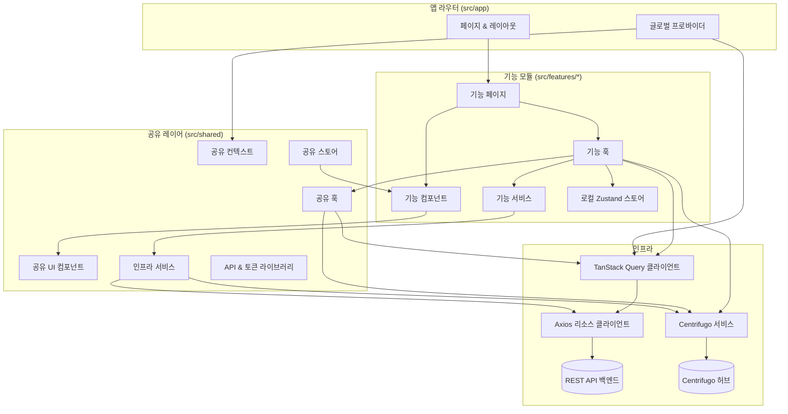

# Scrumble 프론트엔드 구현 사항 요약

- 기본적으로 SNS 이기 때문에, 글도 쓰고 그 글에 반응(이모지), 댓글, 그리고 콘텐츠에는 이미지 첨부도 필수적으로 들어간다.
- 유저 인증을 한 이후에 다시 워크스페이스 내에서 멤버로 인증을 하기 때문에 기본적으로는 멤버 인증 기반이다.
- 백엔드 편에서도 말했듯이 실시간 처리 (알림, 이모지, 댓글 모두 실시간 처리가 필요했다.)
- 투두 리스트는 최대한 심리스하게 작성하기 위해 키보드 단축키 매핑 처리가 필요했다.

# 기술 스택

- **프레임워크**: Next.js 15.1.8(App Router) + React 19, 개발 서버는 Turbopack
- **언어**: TypeScript 5(엄격 모드)
- **스타일링**: Tailwind CSS 3.4, tailwind-merge, class-variance-authority, Pretendard 폰트, PostCSS/Autoprefixer
- **상태·데이터**: 클라이언트 상태는 Zustand 5, 서버 통신은 TanStack Query 5 + Axios 1.9
- **실시간**: `centrifuge` 클라이언트로 Centrifugo 연동(자동 재연결·채널 유지)
- **파일·미디어**: Cloudflare R2 프리사인드 업로드, HEIC → 웹 포맷 변환 유틸리티(`heic2any`, `libheif-js`)
- **UI/UX**: Framer Motion 12, Emoji Mart, Lucide/Remix 아이콘 세트, React Day Picker, React Window 가상화
- **PWA**: next-pwa 5.6.0 서비스 워커 + 매니페스트 설정

# 아키텍처

## 개요

- Next.js 15 App Router가 라우팅/레이아웃, 그리고 서버·클라이언트 컴포넌트 경계를 책임진다. 전역 프로바이더는 `src/app/providers.tsx` 하나로 묶어서 관리했다.

- 페이지 컴포넌트는 화면 보여주기와 인터랙션만 맡긴다. 조회/변경/실시간 동기화 같은 건 전용 훅으로 빼서 화면을 최대한 얇게 유지했다.

- 제품 기능은 `src/features/*` 안에 UI·훅·서비스·로컬 Zustand 스토어를 한 덩어리(수직 슬라이스)로 묶어 도메인 단위로 구성했다.

- 공유되는 UI/컨텍스트/서비스/유틸은 전부 `src/shared`에 모아, 각 도메인 모듈이 핵심 로직에만 집중할 수 있게 했다.

## 애플리케이션 셸 (`src/app`)

- App Router 디렉터리(`page.tsx`, `layout.tsx`, `loading.tsx` 등)에서 라우트 표면, 지연 로딩, 메타데이터를 정의했다.

- `providers.tsx`에 `QueryClientProvider`와 인증/시간대/글로벌 로딩 컨텍스트를 한 데 묶어 등록했다. 전역 훅들이 같은 쿼리 클라이언트를 바라보게 하려는 의도다.

- `spaces`, `auth`, 동적 세그먼트(`[spaceSlug]`) 같은 라우트 그룹은 기능 도메인과 1:1로 매핑했고, 말단 페이지는 보통 `src/features/**/pages` 진입점을 호출해 로직을 위임한다.

- `src/app/api/*`의 API 라우트는 필요할 때만 서버 사이드 브리지로 백엔드와 통신한다.

## 기능 모듈 (`src/features/*`)

- `components`, `pages`, `hooks`, `services`, `stores`, `types`, `utils`, `data`를 한 폴더 안에 묶는 수직 슬라이스 레이아웃을 따른다. 도메인별 UI와 로직을 한곳에 둔다.
- 기능 페이지는 공유 레이아웃과 도메인 컴포넌트를 조합하는 얇은 래퍼 역할만 한다.
- 훅이 조회/변경 로직과 부수효과를 감싸고, `src/shared/hooks/queries`의 TanStack Query 헬퍼와 도메인 서비스를 끌어다 쓴다.
- 로컬 Zustand 스토어(`stores`)에는 외부로 새지 않는 일시적 UI 상태만 넣었다.
- 기능 서비스는 공유 API 클라이언트를 가져다 써서 도메인별 포매팅, 낙관적 업데이트, 파생 모델을 구현한다.

## 공유 레이어 (`src/shared`)

- `components`: Tailwind + class-variance-authority 기반 디자인 시스템 컴포넌트(피드백, 내비게이션, 입력 등).

- `hooks`: 재사용 가능한 쿼리 훅(`queries/*`), 인증 도우미, 실시간 구독 훅으로 데이터 패칭/상태 오케스트레이션을 숨긴다.

- `services`: `centrifugo.service.ts` 같은 인프라 서비스, 파일 업로드 도우미, 분석 로거 등 공통 기능을 제공한다.

- `contexts`: 애플리케이션 셸이 쓰는 인증·시간대·전역 로딩 컨텍스트를 제공한다.

- `stores`: 인증 상태, 토스트, 시간 유틸리티 등을 위한 전역 Zustand 스토어다.

- `lib`: 리소스별 Axios API 클라이언트, 토큰 매니저, 폰트, API 헬퍼 등 저수준 통합을 담당한다.

- `types`와 `schemas`: 기능과 API 계층에서 공유하는 타입 정의와 검증 스키마 조각.

- `utils`: 포매팅, 에러 처리, 범용 헬퍼를 제공.

## 데이터 및 상태 흐름

- `src/shared/lib/api/*.ts`에 Axios 클라이언트를 모아두고, 기본 URL·인터셉터·토큰 갱신 로직을 중앙에서 처리한다.

- `src/shared/hooks/queries`의 쿼리/뮤테이션 훅으로 TanStack Query 키와 캐싱 정책을 표준화해, 기능 모듈이 안전하게 조합할 수 있게 했다.

- 전역 상태는 `shared/stores`의 가벼운 Zustand 스토어에, 기능별 상태는 해당 기능 폴더 안의 로컬 스토어에 둔다.

- 폼은 대부분 React Hook Form + Zod를 쓰고, 필요하면 공유 Resolver 유틸을 참고한다.

## 실시간 동기화

- `CentrifugoService`가 단일 Centrifuge 클라이언트를 유지하면서 재연결, 채널 영속화, 이벤트 디스패치를 맡는다.

- 실시간 훅은 새 소켓을 열지 않고 중앙 Centrifugo 레이어를 확장해, 모든 기능이 같은 연결/이벤트 버스를 재사용한다.

- 이벤트를 받으면 훅이 TanStack Query 캐시나 로컬 스토어를 즉시 갱신해, 추가 리페치 없이 UI를 맞춘다.

## UI 구성과 스타일링

- 스타일링은 Tailwind CSS + PostCSS가 베이스고, class-variance-authority와 tailwind-merge로 변형 클래스를 안정적으로 조합한다.

- 애니메이션/마이크로 인터랙션은 Framer Motion, 아이콘/이모지는 Lucide·Remix Icons·Emoji Mart 같은 공유 라이브러리를 쓴다.

- 반응형 동작과 가상 스크롤(React Window)은 재사용 컴포넌트로 분리해, 페이지 코드는 선언적으로 유지했다.

## 테스트와 개발 경험

- Jest + React Testing Library로 훅/컴포넌트 단위, Playwright로 E2E 회귀 시나리오를 검증한다.
- TypeScript 엄격 모드, ESLint, `npm run build`(Next.js + SWC/Turbopack)로 커밋 전 타입·린트·빌드 안정성을 챙겼다.
- `shared/utils/debug`, 토큰 매니저 등 공용 도구로 환경 전반에서 일관된 디버깅과 저장 전략을 유지한다.

## 하이레벨 모듈 상호작용

# 구현 상세

## 스타일

Tailwind CSS를 대부분 사용했는데, Claude Code 를 적극 이용해서 직접 스타일 작업을 거의 줄였다. 바이브 코딩에 관련한 영상을 찾아보면 대부분 디자인 시안 기반이라기 보다는 내가 벤치마킹하고 싶은 사이트에서 가져오는 팁들이 많은데, 실제 프로덕트 디자이너(Ellie)와 협업하는 내 입장에서는 그러한 팁들은 쓸모가 없었다.

### CSS Vibe

4, 5월즈음 MCP 가 유행처럼 붐을 일으켰는데, 특히 Figma MCP 를 이용해서 MCP만 연결하면 마치 Cursor 나 Claude Code 로 거의 자동으로 구현할 수 있을 것 처럼 얘기를 하는데, 이게 실제로 해보면 절대 그렇지가 않다. AI 가 어느정도 이미지 인식 기능을 지원하지만 정확도가 아주 떨어지고 Figma MCP를 읽어와도 내부적으로는 Figma 의 이미지 객체의 속성들을 읽어와서 처리하는데 결국 LLM이 텍스트 기반 모델이기 때문에 100% 구현을 하지 못하고 해메는 경우가 많다.

작업을 하는 디자이너에게 Figma 디자인을 네이밍부터 레이아웃까지 디테일하게 잡아달라고 요청하면 좋지만, 실제로 디자이너가 그걸 한땀한땀 구성하는 것보다 내가 대략적인 스타일 속성을 하나씩 가져와서 프롬프트로 넘기는게 훨씬 효율적이다. 즉, MCP 는 처음 몇 번 말고 유용하게 쓰지 않고 있다. 추후 내가 AI로 코딩하는 방법에서도 언급하겠지만, 지금 시점에서 playwright 이나 context7 등 여러 MCP 를 나는 쓰고 있지 않다.

MCP 에 대한 얘기도 요즈음 잘 없는 것 보면 "연동이 된다"는 것과 실제로 "동작을 한다"는 다르고 "연동이 된다"라는 초기 얘기는 많았지만 MCP를 토이 프로젝트나 MVP, 프로토타입 프로젝트가 아닌 정말 실무 프로덕션 레벨이나 협업 레벨에서 정말 잘 쓰고 있다는 후기는 거의 찾아보기 힘들다.
물론 이건 내가 잘 몰라서 하는 소리다. 그런데 나는 MCP를 연구하는 시간에 내가 조금 더 부지런해지기로 택했다.

다시 구현으로 돌아와서, 나는 결국 Figma Dev mode 에 나오는 스타일 값들을 텍스트로 직접 가져와서 해당 컴포넌트마다 구현하는 방법을 택했고 이렇게 진행하면 처음이 조금 귀찮긴 하지만 90% 정도는 구현이 되어서 약간만 손을 보면 된다. MCP 로는 30%만 구현이 되고 프롬프트로 씨름하는 일이 많았다보니 지금은 이게 내 작업 흐름을 유지하는데 더 편한 것 같다.

다른 얘기인데, 몇 가지 화면을 테스트로 디자인 없이 Claude 가 제시해주는 디자인만 가지고 구현해보려고 했으나 뭔가 Claude 자체가 만드는 디자인은 워낙 구리기도 하고 결국 내가 프롬프트에 엄청 심혈을 기울여야 하는데 도대체가 완성의 기준을 모르겠어서 포기했다. 나는 실력있는 프로덕트 디자이너 파트너가 있다는 것이 전제이니 혼자서 개발하거나 디자인 리소스가 없는 사람에게는 여전히 MCP 나 벤치 마킹을 통한 바이브 코딩이 유효할 것이다. 다만, 완성에 대한 기준을 항상 가지고 접근하라.

## 상태 관리

상태관리는 zustand 를 일부 쓰긴 하지만, UI 전역 처리를 위한 일부(최근 선택한 날짜 저장 등)에서만 사용을 하고 대부분은 Tanstack Query(a.k.a React-query) 로 관리를 한다.

### React-query

React-query는 자체 캐싱부터 UI 상태 업데이트를 위한 여러가지 기능들이 제공되는데 확실히 초반 러닝 커브가 상당하다. 특히, 단순 API가 아닌 인증 미들웨어를 끼우고 작업을 하면 access token 만료시 마다 자동으로 refresh 로직 동작을 해줘야 하는데 10년 넘게 해온 이 작업을 react-query 와 axios api 요청 레이어에서 혼동을 일으켜서 (사실은 claude code 가 코드를 중복 생성했는데 발견을 못했다.) 초반에 access token 만료 후 무한 리다이렉션 현상이 일어나서 다시 처음부터 claude 가 만든 react-query 코드 하나하나 리뷰하며 문제를 해결했다. 코드를 읽었으면 5분이면 해결될 문제였는데 react-query 코드를 읽기 싫어서 딸깍으로 해결하려했더니 1시간은 넘게 날렸다.

MVP가 아닌 이상 바이브 코딩으로만 접근하면 얼마나 깨지기 쉬운 소프트웨어가 만들어지는지 그 뒤에도 숱하게 겪었지만 이 경험이 그 첫번째 경험이었다. 코드를 읽을 줄 안다면, 코드를 읽어라. 그게 더 빠르다. (아직은)

React-query 는 자체 캐싱 관리를 해주는데, gql-apollo 에서도 캐싱 등의 기능을 제공해주기도 하고 개발 경험이 있지만, 그것보다 조금 더 더 심화되어 있고 풍부한 기능을 제공해준다. 서버에서도 캐싱(redis)을 제공해주다보니 뭔가 복잡해지면 캐싱 설정이 굉장히 어려울수도 있겠다 싶었다. 지금이야 풀스택 개발이니까 큰 문제없지만(내가 모든 정책을 알고 있으니) 백/프론트가 나뉜 상황에서 캐싱이 적용되면 잘못된 정책으로 버그 아닌 버그 현상이 발생할 수 있는 위험도 있을 것이다. 백엔드 파트 아키텍처에서 인터페이스 레이어를 가지고 있고 API라는게 클라이언트 유즈케이스에 맞추어져 있다보니 이 부분을 잘 설계해야한다고 생각한다. 캐싱은 잘하면 그만큼 유저 경험(속도), 부하도 줄여줄 수 있지만 잘못하면 유저가 기대하지 않은 값을 보여줄 수도 있으니 말이다.

### Optimistic UI

백엔드 파트에서도 언급했듯이 초기 인프라 리전 딜레이 이슈 때문에 API 딜레이가 초기에 굉장히 길었다. (피드 화면은 2초 이상..) 그렇다보니 인프라 변경을 하지 않은 상태에서 (최대한 살려보려고 했으니) 가장 먼저 접근했던 방법은 Optimistic UI 이다.

Optimistic UI 의 핵심은 일단 React-query 의 내부 상태에 먼저 해당 업데이트를 반영하면 UI에 즉각 반영이 됨으로 사용자는 딜레이 없는 UX를 경험할 수 있고, 백그라운드로는 해당 api request 가 진행되어 response 를 받아와서 만약 상태가 다르거나, 서버에서 오류를 반환하면 다시 클라이언트 UI 상태를 롤백하는 방식이다.

해당 방식을 처음 적용했을때는 자잘한 UI 이슈가 존재했었고 대표적으로 처음 UI 상태를 바꾸고, 뒤에 response 를 받아와서 다시 깜빡이는 이슈였다. 이건, 서버에서 응답받아 온 값을 한번 더 UI에 업데이트 치는 작업이었고 이게 항상 최신 서버 상태를 보장하긴 하지만, UX적으로 깜빡이는 이슈가 생겨서 응답을 받아왔을때 문제가 없으면 따로 추가로 업데이트하지 않도록 변경하였다.

### 실시간

체크인이나 체크아웃에 리액션으로 이모지를 달거나 댓글을 달면 실시간으로 업데이트가 된다. 즉, 내가 접속해있는 space 에서 이러한 피드백 액션이 일어나면 실시간으로 업데이트 되어야하는데, go, Centrifugo(redis) 로 웹소켓을 잘 구현해놓은 상태에서 계속 실시간 업데이트가 씹히는 경우가 발생하여 초반에 굉장히 애를 먹었다. 초반에는 서버 웹소켓 이슈인가 했는데 만약 Centrifugo 이슈였다면 같이 달아놓은 ClickUp 연동 실시간 트리거도 동작을 하지 않았어야 했는데, 아주 잘 동작하는 걸 봐서는 클라이언트 이슈였다.

웹소켓 채널을 효율화하고 성능을 분산하기 위해서 피드에는 포스트가 여러 개이고 여러 개의 포스트를 ID로 채널로 구독을 하게 했는데, 스크롤을 해서 해당 포스트가 화면에서 벗어나거나 다시 인식하면 다시 핸들러가 포스트 ID 웹소켓 채널을 구독하는 방식이었다.

이 방법은 매번 모든 Post ID 채널을 구독하고 있는 방식이 아니니까 효율적이라고 생각을 했는데..
확실히 UI로 핸들러의 접속 유무를 판단하니까 가끔 연결이 유실이 되어서 실시간으로 댓글이 오지 않는 이슈가 종종 발생한다. 이후 꽤 시간을 들여 오류를 수정했으나 그냥 Space 와 날짜를 채널 ID로 해서 피드 전체를 구독하게끔 하는게 더 간단할 것이다. 물론 엄청나게 많은 이벤트가 발생하거나 피드가 많다면 좀 성능 최적화를 고민해봐야겠지만 초반에 너무 정교하게 들어가려다가 시간을 많이 쓰고 삽질을 했던 케이스다.

## 파일 저장

Nextjs 의 장점(?)은 자체 서버를 가질 수 있고, 파일 저장을 golang 서버에서 구현하지 않고 Nextjs 에서 직접 구현하고 파일 업로드한 메타 데이터와 파일 주소만 백엔드에 업데이트 하는 방식으로 구현했다.

### R2

탈 AWS 의 일환으로 R2 저장소를 이용하였다. R2는 CloudFlare 의 S3 라고 생각하면 된다. S3 못지않게 사용이 아주 심플하기 때문에 주소 연동하고 인증키를 Vercel 또는 로컬 개발환경 secret 으로 등록하고 바로 업로드를 하면 된다.
내가 개발하는 파일 저장소가 필요하다면, R2를 추천한다. 다음은 현재 Free Tier(무료)에 대한 S3, R2 비교표다. 특히 가장 매력적인게 Egress 가 무제한이라는 건데 파일 업로드도 중요하지만 많은 웹사이트에 우리 이미지가 노출이 많이 된다면, R2도 고려하기에 나쁘지 않은 옵션이다.

| 항목             | AWS S3 Free Tier (첫 12개월)            | Cloudflare R2 Free Tier (영구) |
| ---------------- | --------------------------------------- | ------------------------------ |
| **스토리지**     | 5 GB                                    | 10 GB-month                    |
| **Class A 작업** | 2,000 PUT/COPY/POST/LIST 요청           | 1백만 요청                     |
| **Class B 작업** | 20,000 GET/SELECT 요청                  | 1천만 요청                     |
| **Egress**       | 100 GB                                  | 무료 (무제한)                  |
| **기타**         | 신규 계정 $100 크레딧 포함 (30+ 서비스) | 영구 무료, 계정당 적용         |

파일 업로드보다 오히려 드래그앤드롭으로 바로 파일을 올리는 UI나 업로드 progress 표시 같은 작업이 더 공수가 많이 드는 작업이었다. 그리고 무조건 원본을 올리기 보다 약간의 리사이징을 클라이언트 로직을 통해 진행을 했다. 체크인 하면서 포스트나 댓글에 사진을 가끔 올리던 이전 사용 경험을 바탕으로 만든 기능이고, 실제로 추후 tiptap 구현으로 확장한다면 tiptap 안에서 이미지를 임베드할 수 있기 때문에 기능 기획에 고민을 했지만 결국 체크인/체크아웃 목적에 맞게 사진은 별도로 업로드하는 형식으로 구현을 하였다.

### HEIC Converter

이게 사실 대부분의 이미지 업로드 기능에서 잘 지원하지 않는 기능인데, 엘리랑 내가 아이폰 유저이다 보니 아이폰 이미지가 대부분 HEIC 확장자로 저장이 된다. 보통 이미지를 업로드하는 jpg, png, gif 정도로 제한하는데 HEIC 확장자는 지원을 하지 않는다. 그런데 우리가 이미지 업로드 테스트나 이미지를 올릴때 맥북 사진 앱을 켜서 그냥 드래그앤드롭을 하고 싶은 사용성을 살리고 싶어서 어떻게든 HEIC 를 이미지를 올리도록 컨버터를 작업을 했다. 단순히 라이브러리 하나를 적용해서 바로 변환할 수 있다고 생각했는데, 생각보다 그렇게 단순하지가 않았다.

**폴백 로직**

- 실제 바이트 시그니처를 검사해 이미 JPEG로 변환된 파일은 이름만 .jpg로 바꿔 그대로 반환
- conversionMethods 배열에 정의된 다섯 가지 전략을 순차적으로 실행하며, 성공 시 즉시 반환하고 각 시도에 대해 성공/실패 로그와 통계를 기록
- 모든 방법이 실패하면 누적된 오류 목록을 요약해 로그로 남긴 뒤 예외를 던지는 대신 원본 파일을 그대로 돌려주어 업로드 플로우가 중단되지 않도록 처리
- 지원 정보와 디버깅 용도로 getHeicConversionInfo, debugHeicFile을 제공해 현재 환경에서 가능한 전략 목록, 파일 헤더, ftyp 브랜드 등을 확인가능

**변환 방법 & 라이브러리**

- heic2any: 기본 전략으로 세 가지 출력 옵션(JPEG 90%, PNG, JPEG 100%)을 순차 시도하며 Blob이 비어있으면 실패로 간주
- heic-decode: heic-decode로 HEIF 비트스트림을 직접 디코드한 뒤 다양한 데이터 구조(Uint8Array, 객체 등)를 정규화해 ImageData로 캔버스에 그린 후 JPEG로 직렬화
- FileReader: 외부 라이브러리 없이 Base64 URL을 읽어 에 로드한 뒤 캔버스로 그리고 JPEG Blob을 생성하는 브라우저 기본 API 폴백
- heic-convert: Node 기반 heic-convert 모듈을 브라우저 번들에서 동적 임포트해 Buffer → JPEG 변환을 시도하고, 출력버퍼가 비어있으면 오류로 처리
- 브라우저 네이티브: 마지막 수단으로 URL.createObjectURL과 <canvas>만 이용해 이미지를 다시 그려 JPEG Blob을 만드는 전략

Claude Code 의 도움을 많이 받긴 했지만 결론적으로 꽤 복잡한 변환기가 되었고 이 정도로 구현하니까 예외없이 모든 HEIC 이미지가 변환이 되게 되었다.

덕분에 아주 신나게 아무 사진이나 막 뒤져서 올리는게 습관이 되었다.

# 마무리 하며

## 바이브 코딩!?

백엔드에 이어 프론트엔드까지 아주 심플하게 기술 회고를 진행해보았다. 프론트엔드는 훨씬 더 많은 부분을 Claude Code 에 의존하면서 개발했고 아이러니하게도 AI 의존도가 높아질 수록 생산성이 더 떨어지는 경험을 하게 되었다. 특히, 코드 이해가 떨어지는 상태에서 특정 이슈를 디버깅하거나 수정해야 할때 Claude Code가 간단한 해당 이슈 원인을 해결하지 못하거나 너무 지엽적인 시각으로 해당 이슈를 파악하고 무한의 늪으로 빠지는 경우가 있었다. 대부분 이런 경우에 내가 직접 코드를 읽고 손을 대면 대부분 간단하게 수정이 되었다.

AI로 코드 자체 작성이 빠른 것과 별개로 정책의 변경이나 여러 이슈로 콘텍스트를 제대로 담지 못하는 경우가 현실에서는 다반사이기 때문에 오히려 AI만 믿고 코딩했다가 발목이 잡히는 경우가 많다.

SDD나 PRD 문서, 스펙 정의를 먼저하는게 그나마 유일한 대안인데, 요구사항이 복잡해지고 구현이 복잡해지면 대부분 "구현해봐야" 아는 경우도 꽤 있다는 것이다. 코딩을 마치 수학처럼 수식을 넣고 정답이 하나만 나오는 문제로 인식하는 경우가 많은데, 실제로 그렇지가 않다. 요구사항이 시시각각 변하는 실무에서는 물론 이렇게 혼자 개발할때도 맥락이 유실되는 경우가 많기 때문이다.

지금은 Codex 만 이용해서 요구사항 문서화 -> 구현 스텝 문서화 -> 스텝별 끊어서 개발이라는 나름 방법을 찾아서 이전보다 훨씬 효율적으로 AI를 이용하고 있다. 이것도 점점 나아지는 것 같다. 지금 진행하는 프로젝트가 얼추 마무리되면 또 바이브 코딩에 대한 전반적인 경험과 얘기를 작성해보겠다.

## 프로젝트 마무리

1차 릴리즈를 끝낸지 벌써 한달이 넘게 지났다. 내부 업무에서 사용하다보니 개선하고 싶은 부분이 많이 보인다. 해당 프로젝트를 외부에 오픈하려고 진행한 건 아니지만 가까운 시일 내에 베타 버전으로 라도 한번 릴리즈를 했으면 좋겠다. 프론트엔드는 Claude 덕분에 안좋은 코드가 많이 쌓였다. 지금 진행하는 프로젝트 릴리즈를 하고 나서 조금씩 정리하고 기능 개발을 진행하는 것이 목표이다.

이전 회사에서 거의 프론트엔드를 직접 코딩하는 경우가 많이 없었는데 이번 기회에 아주 딥다이브해서 제대로 공부도 하고 구현을 했다. 프론트엔드가 어려운 건 그 자체로 어렵다기보다 결국 유저에게 직접 닿는 부분이라서 그런 것 같다. 내가 손으로 만졌을때 내가 구현한 결과물에서 나는 그 구린내 때문에 고치고 고치다가 시간이 훌쩍 지나가기 일쑤인 것 같다. 그래도 UI를 구현하고 돌아가는 걸 직접 봤을때는 또 백엔드와 또다르게 도파민이 돈다.

백엔드 편에서도 그랬지만 이번 프로젝트를 하면서 프론트엔드를 다음 프로젝트에서 쓴다면 어떻게 또 진행해야할지 명확히 정리가 되었다.

미루고 미루었던 프론트엔드 편까지 완성했으니 이제 또 개발에 집중하다가 조만간 또 새로운 주제로 돌아오겠다.

---

- Scrumble 관련 포스트
  - [Scrumble 프로젝트 회고 (2025년 6월~8월)](/posts/2025-09-scrumble-project-retro)
  - [Scrumble 팀 1차 릴리즈 인터뷰](/posts/2025-09-25-scrumble-project-team-interview)
  - [Scrumble 기술 회고 - 0. 들어가며 (Why Golang?)](/posts/2025-09-scrumble-tech-retro-intro)
  - [Scrumble 기술 회고 - 1. 백엔드 (Golang, DDD, Entgo, Event, Centrifugo)](/posts/2025-09-scrumble-tech-retro-backend)
  - [Scrumble 기술 회고 - 2. 프론트엔드, 그리고 바이브 코딩을 곁들인](/posts/2025-10-03-scrumble-tech-retro-frontend-with-vibe-coding)
