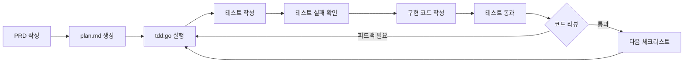
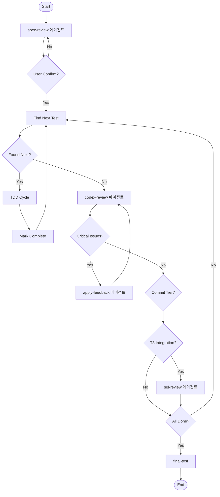

_2026-02-08 추가_

tdd:go 는 스텝 바이 스텝으로 들어간다. 만약 조금 더 자동화된 방법을 원한다면 다음 글을 참고해라.

- [Claude Code에 날개를 달아줘라! - Superpowers 소개](https://flowkater.io/posts/2026-02-08-superpowers-introduction/)

## 들어가며

> 먼저 어그로 끌어서 미안하다. 나는 15년차 CTO가 아니다. (15년째 개발을 하고 있는 건 맞음) 그 다음 현재 CTO도 아니다. (작년에 퇴사함.)

OpenCode (+oh-my-opencode) 열풍이 한번 지나갔다. 최근에 OpenCode는 ToS 이슈나 여러 이슈들로 아주 불태운 시기였다. 오늘 날짜로 막혔는데 개인적으로 우회하는 방법이 있긴 하나 지금 남은 작업들은 Claude Code만으로도 큰 문제가 없을 것 같아 그냥 Claude Code를 당분간은 쓰기로 결정했다.

요즘 AI 코딩 도구들이 쏟아져 나오고 있다. Cursor, Windsurf, Copilot, 그리고 Claude Code까지. 어느 도구가 더 좋은지 비교하는 글도 많고, 각자 자기만의 워크플로우를 공유하는 글도 넘쳐난다. 모두가 "바이브 코딩"을 외치고, 프롬프트 몇 줄에 앱이 뚝딱 나오는 영상들이 유튜브와 트위터를 장식한다. "한 달 걸릴 일을 3시간 만에 끝냈어요!" 같은 이야기가 매일 들린다.

그런데 정작 나는 이 흐름 속에서 묘한 불안감을 느꼈다. 분명 생산성은 올랐는데, 뭔가 놓치고 있다는 느낌. 코드가 돌아가긴 하는데, 내가 이 코드를 진짜 이해하고 있는 건가? AI가 만들어준 코드를 그냥 복붙하면서 '개발'이라고 부를 수 있나? 이런 질문들이 머릿속을 맴돌았다. 문제는 이 불안감을 무시하려 해도 흐름이 끊겨서 오히려 생산성이 떨어졌다는 것이다. 재미가 없으니 그냥 안하고 싶어진달까.

이런 고민을 하던 중 켄트 백의 글을 접했고, 거기서 영감을 받아 나만의 워크플로우를 만들게 됐다. 이 글에서 공유하고 싶은 건 단순히 "어떤 도구를 쓰느냐"나 "하위 에이전트를 어떻게 구성하느냐" 같은 기술적인 이야기가 아니다. 오히려 그런 건 요즘 워낙 많이 공유되고 있으니까. 내가 이야기하고 싶은 건 **tdd-go-loop**라는 이름의 **워크플로우 오케스트레이터**다. 단순히 커맨드 하나를 실행하는 게 아니라, 여러 하위 에이전트들이 협업하여 TDD 사이클을 자동화하고 코드 리뷰까지 수행하는 시스템이다.

---

## 켄트 백의 증강형 코딩

해당 워크플로우는 [켄트 백의 증강형 코딩(Augmented Coding)](https://tidyfirst.substack.com/p/augmented-coding-beyond-the-vibes) 에서 영감을 받았다.

국내에 번역된 글도 많으니 한번 검색해서 읽어보면 좋을 것 같다. AI 코딩 시대에 6개월 전 글은 너무 오래된 감이 없지 않아 있지만, 지금 내가 개발할 때 아주 유용하게 쓰는 워크플로우가 여기서 출발했다.

켄트 백이 말하는 증강형 코딩의 핵심은 명확하다. **AI가 코드를 작성하더라도, 인간이 통제력을 유지해야 한다는 것이다.** 단순히 프롬프트를 던지고 결과물을 받아보는 게 아니라, 작은 단위로 쪼개서 검증하고, 이해하면서 진행하는 방식이다. TDD(Test-Driven Development)가 그 도구가 된다.

TDD라고 하면 많은 개발자들이 "아, 테스트 먼저 짜는 거?" 정도로 알고 있다. 맞는 말이다. 그런데 AI 시대의 TDD는 조금 다르다. 전통적인 TDD에서는 테스트도 내가 짜고 구현도 내가 했다. 증강형 코딩에서는 **테스트는 내가 설계하고, 구현은 AI가 한다**. 이게 핵심이다. 테스트를 먼저 설계한다는 건 곧 "내가 뭘 원하는지"를 명확하게 정의한다는 의미고, AI는 그 정의에 맞춰서 코드를 생성한다. 테스트가 통과하면 구현이 맞는 거고, 실패하면 틀린 거다. 단순하지만 강력하다.

여기서 중요한 건 "작은 단위"라는 점이다. AI에게 "회원가입 기능 만들어줘"라고 던지는 게 아니라, "이메일 유효성 검증 로직의 실패 케이스 테스트 작성해줘"처럼 쪼개서 요청한다. 테스트가 실패하는 걸 확인하고, 최소한의 코드로 통과시키고, 내가 직접 리뷰한다. 이 사이클을 반복하는 거다. 마치 레고 블록을 하나씩 쌓듯이, 작은 조각들을 검증하면서 쌓아올린다.

컨셉은 아주 심플하다. 다들 잘 알다시피 PRD를 먼저 작성하고, PRD 문서를 바탕으로 Phase와 체크리스트로 구성된 plan.md 파일을 생성한다. Spec-kit이라는 툴도 있지만, 내가 사용해봤을 때 너무 정석적으로 만드느라 일을 키우는 감이 없지 않아 있어서 직접 planning 스킬을 만들어서 쓴다. TDD 단위이다 보니 최대한 잘게 쪼개야 하고, Phase별로 작업을 하는 것을 확인할 수 있게 하는 게 핵심이다.

그리고 `/tdd:go`라는 커맨드를 이용해서 Phase 단위로 또는 더 하위 체크리스트 단위로 하나씩 실행하고 내가 직접 리뷰하는 방법이다.

---

## 딱히 바이브하지 않다

여기서 들으면 알겠지만 딱히 바이브하지 않다.

모든 체크리스트를 하나하나 실행해보고 코드를 확인해보고, 코드에서 아쉬운 점이나 개선해야 할 점, 확장되어야 할 점이 있으면 피드백한다. 그리고 문제가 없으면 다음 체크리스트로 넘어간다. 코딩을 내가 직접 안 하는 건 맞지만 거의 다름없다.

일종의 **페어 프로그래밍**이랄까. AI가 키보드를 잡고, 나는 옆에서 "어, 거기 그렇게 하면 안 돼" 하면서 방향을 잡아주는 느낌이다. 드라이버(AI)와 네비게이터(나)로 역할이 나뉜 셈이다. 다만 일반적인 페어 프로그래밍과 다른 점이 있다면, AI는 지치지 않고, 불평하지 않고, 내가 피드백하면 바로 수정한다는 거다. (물론 가끔 같은 실수를 반복하면 답답할 때도 있다.)



실제로 이 방식으로 개발하면, 한 사이클이 5분에서 10분 정도 걸린다. 테스트 하나 작성하고, 실패 확인하고, 최소한의 코드 작성하고, 테스트 통과시키고, 내가 리뷰한다. 이게 반복된다. 바이브? 없다. 대신 코드 한 줄 한 줄을 내가 이해하면서 진행한다.

솔직히 말하면 이 방식이 "힙"하지 않다는 건 나도 안다. 요즘 트렌드는 AI에게 전부 맡기고 결과물만 확인하는 거니까. 중요한 건 자기한테 맞는 방식을 찾으면 된다.

만약 본인이 주니어 개발자이고 코드를 조금 더 학습하고자 한다면, 해당 방법을 강력히 추천한다. 특히 프로젝트에서 코드 베이스를 내가 직접 파악하고 있어야 하거나 완전 처음 프로젝트 코드를 작성할 때는 이 방식으로 한 땀 한 땀 진행한다. AI가 작성한 코드를 그냥 복붙하는 것과, 내가 리뷰하면서 이해한 코드를 쌓아가는 건 완전히 다른 경험이다. 전자는 "코드가 있다"는 상태고, 후자는 "내 코드다"라는 감각이 생긴다. 이 차이가 크다.

---

## 명세만으로는 부족했다

처음엔 나도 명세만 잘 쓰면 될 줄 알았다. 디자인 패턴이니 DDD니 클린 아키텍처니 하는 것들을 한번 잘 정리해두면 Claude Code(또는 Codex)가 알아서 다 코딩해줄 거라고. 실제로 간단한 CRUD 앱 정도는 그렇게 만들 수 있었다. 근데 현실은 그렇게 단순하지 않았다.

주니어들과 협업해본 경험이 있는 사람이라면 알 것이다. 정말 간단한 요구사항이 아닌 이상 코드를 작성하면서 아키텍처 구현에 대한 판단이 계속 바뀔 수 있는 부분이 생긴다. 함수 하나를 어떻게 쪼개고, 어댑터와 프로토콜을 어느 레이어에 어떤 방식으로 하고, 객체와 서비스 범위를 어디까지 재활용하고 어디까지 범위로 묶고 등등.

아무리 좋은 명세서를 써도 실제 코드를 작성하면서 "이건 아닌데?" 싶은 순간들이 온다. 그때 AI가 혼자서 올바른 판단을 내릴 수 있을까? 내 경험상 아니다. AI는 명세에 적힌 대로 열심히 코드를 작성하지만, 맥락을 완전히 이해하진 못한다. "이 함수는 나중에 확장될 가능성이 있으니까 미리 인터페이스로 빼놓자"라든가, "여기는 지금은 간단하지만 도메인 특성상 복잡해질 거니까 별도 서비스로 분리하자"라든가. 이런 판단은 아직 인간의 영역이다.

엔터프라이즈급 대규모 SaaS를 1년 반 동안 레거시에서 마이그레이션하고 운영하면서 느낀 게 있다. 코드에서 손을 떼는 순간 아무리 개념적으로 가이드를 만들어도 실제 코드는 항상 작성자의 판단이 필요한 순간이 생긴다. 특히 초기 설계가 현실의 복잡한(+자꾸 변경되는) 요구사항과 부딪히면서 조금씩 변형되는 그 과정. 그걸 AI에게 온전히 맡기기엔 아직 이르다.

물론 바이브 코딩 시대에 모든 코드를 다 팔로업할 필요는 없다. 중요한 부분만 파악해도 충분할 수 있다. 이건 각자가 판단할 부분이다. 비전공자거나 코드 모르고 제품만 만들고 싶다면 코드를 안 봐도 된다. 코드 모르고 바이브 코딩을 하시는 분들을 나는 응원한다. 단일 컨트롤러에 raw sql 남발하는 3000줄짜리 api 코드가 있는 회사가 이미 시리즈 B를 받았다. 고객 가치가 목적이지 코드는 수단이다. 나는 개발자이기 때문에 코드를 보는 걸 선택했을 뿐이다.

---

## 바이브 코딩의 불안감

여튼 각설하고, 내가 이 방식을 정착하게 된 진짜 이유가 있다.

너무 코드 자체를 인지하지 못하고 진행하다 보니 내가 제대로 프로젝트를 매니징하는 느낌이 들지 않았다. AI에게 맡겨놓고 쉬기에는 애매하고, 돌아가는 걸 기다리며 집중력은 깨지면서 Thread를 기웃거리는 건 비단 나만의 문제는 아닐 것이다.

이런 경험 다들 있을 것이다. AI가 열심히 코드를 생성하는 동안 뭘 해야 할지 모르겠는 그 애매한 시간. 다른 일을 하자니 곧 결과가 나올 것 같고, 그냥 기다리자니 시간이 아깝다. 그래서 Thread나 유튜브를 보게 되고, 막상 결과가 나왔을 때 집중력은 이미 바닥이다. 결과를 확인하고 피드백을 해야하는데 마음이 이미 다른 데 가 있다. 이게 반복되면서 프로젝트 전체를 조망하는 감각이 점점 흐려졌다.

심리학적으로도 이건 설명이 된다. 인간은 자신이 통제하고 있다는 느낌이 없으면 불안해한다. 특히 본인의 전문 영역에서 그렇다. 개발자가 코드를 모른다는 건 마치 운전사가 핸들을 안 잡고 있는 것과 비슷하다. 차가 알아서 잘 가고 있어도, 불안하다. 심지어 목적지에 제대로 가고 있는지도 확신이 안 선다. 자율주행 기술이 아무리 발전해도 운전대를 완전히 놓는 게 불안한 것처럼, AI 코딩도 마찬가지다.

결국 AI agent는 인간이 하는 일 중에서 시간이 많이 드는 일을 자동화해주는 것이다. 다만 모든 걸 AI에게 넘기니 디버깅이 어려워졌다. '내가 이 코드를 모른다'는 인식이 커지면서 오히려 생산성이 떨어졌다. "이 코드 어디서 뭘 하는 거지?"라는 질문에 스스로 답할 수 없을 때 오는 그 막막함. 그래서 어느 정도는 컨트롤 하에 두기 위해 결국 이런 방법을 정착했다.

그리고 무엇보다 중요한 건 **몰입**이다. 심리학자 미하이 칙센트미하이가 말한 Flow 상태 (내 닉네임 *Flow*kater). 적당히 어렵고, 적당히 쉽고, 피드백이 즉각적일 때 인간은 몰입 상태에 들어간다. 바이브 코딩은 이 조건을 충족하지 못한다. 프롬프트 던지고 기다리고, 결과 확인하고, 또 프롬프트 던지고... 이 루프에서 몰입이 생기기 어렵다. 반면 체크리스트 하나씩 클리어하는 TDD 방식은 정확히 몰입의 조건을 충족한다. 작업이 너무 크지 않아서 부담이 없고, 테스트 결과가 바로 나오니까 피드백이 즉각적이다. 그래서 재밌다.

하지만 큰 단점이 있다. 느리다.

---

## 그래서 나만의 방법을 만들었다

앞서 말한 불안감을 해소하면서도, AI 시대의 생산성을 포기하고 싶진 않았다. 그래서 중간 지점을 찾았다. 켄트 백의 증강형 코딩 컨셉을 가져오되, 내 상황에 맞게 커스텀한 거다. 그 결과물이 **tdd-go-loop**다.

이건 단순한 커맨드가 아니라 **워크플로우 오케스트레이터**다. `/tdd:go`를 반복 실행하는 것 이상이다. spec-review, codex-review, sql-review, apply-feedback 같은 **여러 하위 에이전트들을 조율**하면서 전체 TDD 사이클을 관리한다. 마치 오케스트라 지휘자처럼, 각 악기(에이전트)가 언제 어떤 역할을 해야 하는지 정의해둔 거다.

내가 파악해야 하는 핵심 엔진 코드나 로직이 들어가는 API 코드, 처음 프로젝트 구조를 잡아갈 때는 무조건 `/tdd:go` 방식으로 진행한다. 하다 보면 느낀다. 인간과 똑같이 처음 세운 가이드라인을 오해하거나 지레짐작해서 잘못 코드를 짜는 경우가 많다. 그런 걸 잡아가면서 내가 만들고 나면, 이제 다음은 비슷한 방식의 API를 반복 개발하거나 로직을 개발하는 경우가 대부분일 것이다.

켄트 백의 증강형 코딩은 무조건 TDD 방식으로 개발하는 것을 강제하고 있기 때문에, 내가 이미 만들어놓은 코드 구조가 있으면(어떤 아키텍처나 구조든) 그 구조를 베이스로 하기 때문에 전체 코드 리뷰도 쉬워진다. 예를 들어 나는 Go에서 Usecase를 처음 구축할 때 mock 테스트로 아웃라인을 잡고, Usecase 레이어에서 도메인 모델, 함수, Repository 인터페이스를 조합해서 로직을 구현한다. mutation은 함수 최상단에 정의하고 private 함수는 최대한 순수 함수로 구성하게 지시를 하면 굉장히 human readable code가 생성되기 때문에 코드 리뷰를 편하게 할 수 있다.

**이미 한번 tdd:go로 개발한 같은 패턴과 구조를 가진 API**는 빠르게 진행할 수 있다. 처음 보는 패턴이나 복잡한 비즈니스 로직이 들어가는 부분만 꼼꼼하게 진행하고, 나머지는 신뢰하는 거다.

---

## 실제 내가 쓰는 구조

Claude Code에서는 `.claude/` 폴더에 마크다운 파일로 커맨드와 스킬을 정의한다. 내 프로젝트의 구조를 보면:

```
.claude/
├── commands/                      # 단일 실행 커맨드
│   ├── tdd/
│   │   ├── go.md                 # /tdd:go - 체크리스트 하나씩 실행
│   │   ├── batch.md              # /tdd:batch - Tier 단위 배치 실행
│   │   ├── fast.md               # /tdd:fast - 전체 자동화
│   │   └── status.md             # /tdd:status - 진행 상황 확인
│   ├── tdd-go-loop.md            # 워크플로우 오케스트레이터 (핵심!)
│   ├── spec-review.md            # 스펙 리뷰
│   ├── codex-review.md           # 코드 리뷰
│   ├── sql-review.md             # SQL 리뷰
│   └── final-test.md             # 최종 테스트
│
├── skills/                        # 복합 스킬 (에이전트 포함)
│   ├── go-gin-ddd-bun/           # Go 프로젝트 아키텍처 가이드
│   │   ├── SKILL.md
│   │   ├── ARCHITECTURE.md
│   │   └── TESTING.md
│   └── api-final-review/         # 최종 리뷰 스킬 (4개 병렬 에이전트)
│       ├── SKILL.md              # 6단계 리뷰 워크플로우 정의
│       ├── AGENTS.md             # 4개 병렬 에이전트 상세 구성
│       └── templates/
│           └── test_script_template.sh
│
├── templates/                     # 문서 템플릿
│   ├── plan-template-v2.md       # plan.md 템플릿
│   └── api-review-guide.md       # 코드 리뷰 가이드
│
└── agents/                        # 하위 에이전트 정의
    ├── codex-review.md           # Codex 리뷰 에이전트
    ├── sql-review.md             # SQL 리뷰 에이전트
    └── apply-feedback.md         # 피드백 적용 에이전트
```

여기서 핵심은 두 가지다:

1. **tdd-go-loop.md**: 단순한 커맨드가 아니라 **워크플로우 오케스트레이터**. 여러 하위 에이전트들(codex-review, sql-review, apply-feedback 등)을 조율하면서 전체 TDD 사이클을 자동화한다.

2. **api-final-review/**: API 개발 완료 후 최종 리뷰를 수행하는 스킬. 4개의 전문 에이전트가 **병렬로** 리뷰를 실행한다.

---

## /tdd:go 커맨드 예시

실제 `/tdd:go` 커맨드의 내용을 보면 이렇다:

```markdown
# TDD: Go (다음 테스트 실행)

Read plan.md and find the first test marked with `[ ]` (not yet implemented).

## Execution Steps

1. **Identify**: Find the first `[ ]` test in plan.md
2. **Announce**: Tell me which test you're about to implement
3. **Red Phase**:
   - Create or update `*_test.go` file
   - Write a failing test for that specific behavior
   - Run `go test -v ./...` to confirm the test fails
4. **Green Phase**:
   - Write the minimum code to make the test pass
   - Run `go test -v ./...` to confirm ALL tests pass
5. **Update**: Mark the test as `[x]` in plan.md
6. **Report**: Summarize what was done

## Critical Rules

- Write ONLY enough code to pass the current test
- Do NOT implement features for future tests
- Always run `go fmt` on new files
- If tests fail unexpectedly, STOP and report before proceeding
```

심플하다. plan.md에서 `[ ]`로 표시된 체크리스트를 하나 찾고, Red-Green 사이클을 실행하고, 완료되면 `[x]`로 체크한다. 이게 전부다.

---

## plan.md 실제 예시

Plan 생성 API(`POST /plans`)를 구현할 때 사용한 plan.md의 일부:

```markdown
# Test Plan: Plan 생성 API (POST /plans)

**의존성**: plan_00_common.md (도메인 레이어 완료)

---

## Phase 1: Application Layer - Input 구조체 <!-- T1:auto -->

파일: `api/internal/application/plan/create.go`

### [x] 1.1 CreatePlanInput 정의

- CreatePlanInput 구조체가 모든 필수 필드를 포함한다
- ScheduleInput 구조체가 Type과 Days 필드를 포함한다
- CreateItemInput 구조체가 Name과 Quantity 필드를 포함한다

### [x] 1.2 Input 변환 메서드

- ScheduleInput.ToWeeklySchedule() 유효한 입력을 WeeklySchedule로 변환한다
- ScheduleInput.ToWeeklySchedule() 활성일 없으면 ErrNoActiveDays 반환한다

---

## Phase 5: UseCase Layer - Create Service <!-- T2:deep -->

파일: `api/internal/application/plan/create.go`

### [x] 5.1 Service 구조체

- createService 구조체가 Logger, TransactionManager, PlanWriter 의존성을 갖는다
- NewCreateService() 생성자가 의존성을 주입받는다

### [x] 5.2 Create - 검증 로직

- Create() 유효한 입력으로 Plan을 생성한다
- Create() 지원하지 않는 TemplateID에 ErrInvalidTemplate 반환한다
- Create() StartDate >= EndDate에 ErrInvalidDateRange 반환한다
```

각 Phase에 `<!-- T1:auto -->`, `<!-- T2:deep -->` 같은 Tier 마커가 붙어있다. 이게 중요하다. Tier별로 리뷰 강도가 다르다:

| Tier | 의미                     | 실행 방식   | 리뷰 강도 |
| ---- | ------------------------ | ----------- | --------- |
| T1   | Scaffold (구조 정의)     | 자동 진행   | Light     |
| T2   | Core (비즈니스 로직)     | 세밀한 리뷰 | **Deep**  |
| T3   | Integration (Repository) | 자동 진행   | Medium    |
| T4   | Surface (Handler/E2E)    | 자동 진행   | Light     |

T2(비즈니스 로직)에서만 Deep Review를 하고, 나머지는 자동으로 넘긴다. 모든 코드를 같은 강도로 리뷰하는 건 비효율적이다. 핵심 로직에 집중하고, 나머지는 테스트가 통과하면 신뢰하는 거다.

---

## tdd-go-loop 워크플로우 오케스트레이터

tdd-go-loop의 전체 플로우다. 단순히 `/tdd:go`를 반복하는 게 아니라, **여러 하위 에이전트들을 조율하는 워크플로우 오케스트레이터**임을 주목하자:



핵심은 **Tier가 끝날 때마다 codex-review 에이전트가 자동으로 돌아간다**는 것이다. Codex가 Critical/Major 이슈를 찾으면 apply-feedback 에이전트가 자동으로 피드백을 적용하고, Minor 이슈는 로깅만 한다. 리뷰가 3회 이상 반복되면 강제로 다음으로 넘어간다 (무한 루프 방지).

T3(Integration) 단계에서는 sql-review 에이전트가 추가로 돌아가서 N+1 쿼리나 인덱스 누락 같은 성능 이슈를 체크한다.

---

## api-final-review: 4개의 병렬 에이전트

API 개발이 완료되면 최종 리뷰 워크플로우가 돈다. 이것도 4개의 전문 에이전트가 **병렬로** 리뷰를 수행한다:

```
┌─────────────────────────────────────────────────────────────┐
│                    api-final-review                          │
└─────────────────────────────────────────────────────────────┘
                              │
          ┌───────────────────┼───────────────────┐
          │                   │                   │
          ▼                   ▼                   ▼
┌─────────────────┐  ┌─────────────────┐  ┌─────────────────┐
│ 1. Checklist    │  │ 2. Shell/Fixture│  │ 3. Codex Agent  │
│    Agent        │  │    Agent        │  │                 │
└─────────────────┘  └─────────────────┘  └─────────────────┘
                              │
                              ▼
                    ┌─────────────────┐
                    │ 4. SQL Agent    │
                    └─────────────────┘
```

### AGENTS.md의 실제 구성

```markdown
# 병렬 에이전트 구성

API 최종 리뷰에서 사용하는 4개의 전문 에이전트 상세 구성입니다.

## 1. Checklist Agent

plan 문서의 체크박스 완료 상태를 검증합니다.

출력 형식:

- 완료율: X/Y (Z%)
- 미완료 항목: (있다면 목록)
- 판정: ✅ 완료 / ❌ 미완료 항목 있음

## 2. Shell/Fixture Agent

통합 테스트 실행에 필요한 스크립트와 픽스처 파일을 확인합니다.

확인 경로:
tests/
├── scripts/{feature}/test\_{api_name}.sh
└── fixtures/{feature}/{api_name}/
├── valid_request.json
└── invalid_request.json

## 3. Codex Agent

Tier 기반 리뷰:
| Tier | 대상 | 리뷰 깊이 |
|------|------|----------|
| T1 | Domain Entity | 가장 엄격 |
| T2 | Application Service | 엄격 |
| T3 | Infrastructure | 표준 |
| T4 | Handler | 표준 |

## 4. SQL Agent

데이터베이스 쿼리 성능 및 최적화를 검토합니다.

| 항목        | 설명                           |
| ----------- | ------------------------------ |
| N+1 쿼리    | 루프 내 개별 쿼리 실행         |
| 누락 인덱스 | WHERE, JOIN 절에 필요한 인덱스 |
| 과다 조회   | SELECT \* 사용, 불필요한 컬럼  |
| 트랜잭션    | 적절한 범위 설정               |
```

이 4개가 **병렬로** 실행되기 때문에 시간이 크게 단축된다. 하나씩 순차적으로 돌리면 10분 걸릴 일이 병렬로 돌리면 3분이면 끝난다.

### 배포 판정 기준

| Critical | Major | Minor | 판정                  |
| -------- | ----- | ----- | --------------------- |
| 0        | 0     | 0-2   | ✅ 배포 가능          |
| 0        | 0     | 3+    | ⚠️ Minor 정리 권장    |
| 0        | 1+    | -     | ❌ Major 수정 필요    |
| 1+       | -     | -     | ❌ Critical 수정 필수 |

---

## 코드 리뷰 가이드

가끔 코드 리뷰 자체가 어려울 때가 있는데, 그것도 가이드라인을 만들어서 어떤 순서로 어떻게 코드를 보면 좋을지를 정리해뒀다.

실제 내가 쓰는 T2 (Core) 리뷰 체크리스트:

```markdown
## T2 (Core) Review Checklist

### UseCase Implementation

| Check                  | Question                                     |
| ---------------------- | -------------------------------------------- |
| Pure Functions         | Are helper functions pure (no side effects)? |
| Explicit Mutations     | Are all mutations visible in main method?    |
| Error Wrapping         | Are errors wrapped with context?             |
| No Business in Helpers | Is business logic in Execute, not helpers?   |

### Pure Function Verification

// GOOD: Pure function (data in, data out)
func buildListOptions(input \*ListPlansInput) plan.ListOptions {
return plan.ListOptions{
Limit: input.Limit,
Status: input.Status,
}
}

// BAD: Impure (modifies input)
func buildListOptions(input *ListPlansInput, opts *plan.ListOptions) {
opts.Limit = input.Limit // mutates!
}
```

이런 가이드가 있으면 Claude가 리뷰할 때도 이 기준에 맞춰서 체크하고, 나도 코드를 볼 때 어디를 집중해서 봐야 하는지 명확해진다.

---

## 시작하는 방법

요즘 Claude Code 설정이나 하위 에이전트를 어떻게 사용한다, 저렇게 사용한다 하고 사람들이 팔로업도 하고 물어도 보고 하는데, 그런데서 FOMO 느끼면서 이리저리 휘둘리지 말고 **Claude Code 지금 바로 설치하고 그냥 물어봐라**. 어떤 걸 할 수 있는지. 그리고 내가 하고 싶은 일들을 물어가면서 스스로 시스템을 구축하길 바란다. 그 과정 자체가 급변하는 AI 시대에 생존 스킬을 만들어줄 것이라고 생각한다.

시작하려면:

1. **`.claude/` 폴더 만들기** - 프로젝트 루트에 폴더 하나 만들면 된다
2. **`commands/` 폴더에 간단한 커맨드 만들기** - 마크다운 파일 하나가 커맨드 하나다
3. **`/커맨드이름`으로 실행해보기** - Claude Code에서 바로 실행된다
4. **필요에 따라 확장하기** - 에이전트, 스킬, 템플릿 등으로 점점 키워가면 된다

위에 것도 그냥 Claude Code 에게 요청하면 된다.

내가 만든 워크플로우, Command, Agent 다수도 사용하면서 Claude Code에게 요청해서 만든 게 대부분이다. 처음부터 완벽한 시스템을 만들려고 하지 말고 작게 시작해서 필요할 때마다 붙여나가면 된다. 이 블로그 글 또한 여러 Agent 워크플로우로 내가 막 쓴 원 글을 잘 다듬는 플로우를 만들었다.

---

## 나가며

CTO 시절에 익힌 감각이 있다. **위임하되 품질을 챙기고, 전체를 파악하되 세부는 신뢰하는 그 균형**. 모든 코드를 다 볼 수는 없으니 중요한 부분에 집중하고, 나머지는 팀원들에게 맡기는 방식. 지금 AI와 일할 때도 똑같이 적용된다. AI를 유능한 주니어 개발자처럼 대하면 된다. 명확하게 지시하고, 결과물을 검토하고, 필요하면 피드백하고, 잘하면 다음 일을 맡긴다.

생각해보면 이건 리더의 역량이다. 복잡한 요구사항을 정리해서 전달하고, 핵심 의사결정에 집중하며, 세부 실행은 위임하는 것. AI 시대에는 우리 모두가 이런 방식으로 일하게 될 것 같다. 직접 코드를 치든, AI에게 맡기든, 결국 **무엇을 만들지 정의하고 품질을 책임지는 건 나**다. 그 감각을 익히는 게 지금 가장 중요한 스킬이 아닐까.

솔직히 작년에 퇴사하고 개인 프로젝트를 하면서 이런 실험을 할 수 있었다. 회사에서는 회의하고, 기획 조율하고, 팀원 코드 리뷰하느라 이런 걸 살펴볼 여유가 없었다. 혼자 개발하니까 눈치 볼 것 없이 이것저것 시도해볼 수 있었다. OpenCode가 막혀서 조금 아쉽지만, 26년은 또 어떻게 AI가 발전할지 걱정보다 기대가 앞선다.

결국 중요한 건 **본인만의 방식**을 찾는 것이다. 바이브 코딩이든, 증강형 코딩이든, 어떤 방식이든 상관없다. 다만 그 과정에서 **즐거움**을 잃지 않았으면 한다. 생산성만 쫓다가 코딩의 재미를 잃으면, 그게 진짜 손해다. 내가 코드를 만드는 이 일이 여전히 재밌다면, 어떤 도구가 나와도 결국 적응하게 되어 있다.
