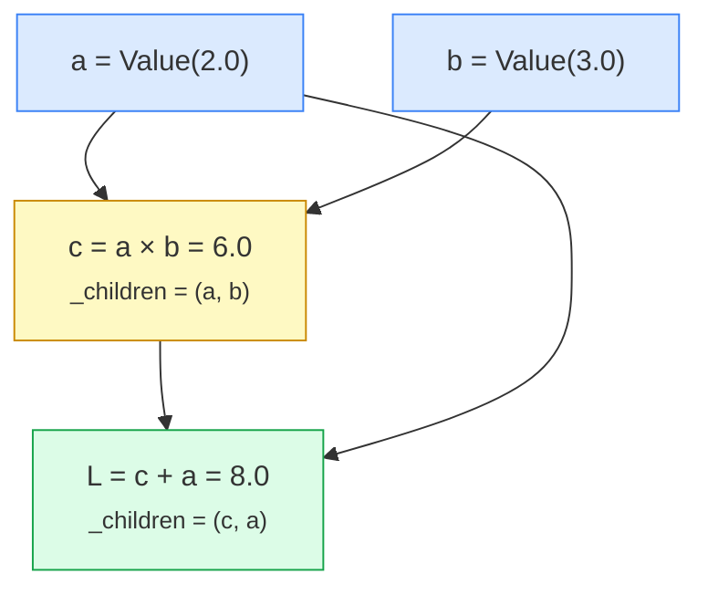
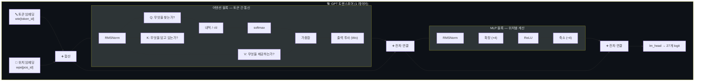

---

## 들어가며: "학습"이라는 단어가 주는 착각

대규모 언어 모델이 "학습한다"고 하면, 우리는 무의식적으로 인간의 학습을 떠올린다. 이해하고, 추론하고, 통찰하는 그 과정. 하지만 LLM 내부에서 일어나는 일은 전혀 다르다. 수조 개의 숫자(매개변수)를 수십억 번 미세하게 조정하면서, 텍스트에 존재하는 통계적 패턴을 정교하게 모방하는 것이다.

이 구분은 생각보다 중요하다. LLM의 출력을 언제 신뢰하고 언제 의심해야 하는지, 왜 모르는 주제에 대해서도 설득력 있는 글을 쓰면서 간단한 논리 퍼즐에서 무너지는지를 이해하려면, 이 기계가 실제로 무엇을 하는지 알아야 한다.

Karpathy는 이 본질을 200줄 순수 파이썬 코드에 담았다. **microgpt** — 의존성 제로, GPU 없이 맥북에서 1분이면 돌아가는 완전한 GPT. 데이터셋, 토크나이저, 자동미분 엔진, 트랜스포머 아키텍처, Adam 옵티마이저, 학습 루프, 추론 루프가 전부 들어 있다. 그는 이렇게 말한다: _"이 이상 단순화할 수 없다. 나머지는 전부 효율성의 문제일 뿐."_

이 글에서는 ByteByteGo가 설명한 세 가지 핵심 개념 — 손실 함수, 경사 하강법, 다음 토큰 예측 — 을 Karpathy의 실제 코드와 교차시키며 따라간다. 개념을 읽고, 바로 그 개념이 코드에서 어떤 모습인지 확인하는 방식이다.

---

## 데이터: LLM의 연료

모든 것은 텍스트 데이터에서 시작된다. 프로덕션 LLM은 수조 개의 토큰 — 웹 페이지, 책, 코드, 기사 — 으로 학습한다. microgpt는 32,000개의 영어 이름 데이터셋을 쓴다.

```python
docs = [l.strip() for l in open('input.txt').read().strip().split('\n') if l.strip()]
# emma, olivia, ava, isabella, sophia, charlotte, ...
```

각 이름이 하나의 "문서"다. GPT-5.3이나 Claude Opus 관점에서 당신과의 대화도 그냥 좀 특이하게 생긴 "문서"에 불과하다. 모델이 하는 일은 문서의 통계적 완성(completion)이다. 프롬프트가 문서의 시작이고, 응답은 그 문서의 나머지를 채우는 것.

microgpt가 학습을 마치면 이런 이름을 "환각(hallucinate)"한다:

```
kamon, ann, karai, jaire, vialan, karia, yeran, anna, areli, kaina
```

그럴듯하지만 실제로 존재하지 않는 이름들. 최신 LLM이 사실이 아닌 내용을 자신 있게 말하는 것과 정확히 같은 현상이다 — 통계적으로 그럴듯한 완성이 실재(reality)와 일치하지 않을 뿐.

---

## 토크나이저: 텍스트를 숫자로

신경망은 문자가 아닌 숫자로 작동한다. 텍스트를 정수 토큰 ID의 시퀀스로 변환하는 장치가 토크나이저다.

GPT-5.3이나 Claude Opus 4.6이 쓰는 프로덕션 토크나이저는 BPE(Byte Pair Encoding)를 사용해 자주 같이 나타나는 문자열을 하나의 토큰으로 묶는다. "the"는 단일 토큰, 희귀 단어는 여러 조각으로 분해된다. 어휘 크기 ~100K. 위치당 더 많은 정보를 담을 수 있어 효율적이다.

microgpt는 가장 단순한 방식을 택한다. 각 고유 문자에 정수 하나씩:

```python
uchars = sorted(set(''.join(docs)))  # a-z의 26글자
BOS = len(uchars)  # 문서 시작/끝을 나타내는 특수 토큰
vocab_size = 27     # 26 + BOS
```

"emma"는 `[BOS, e, m, m, a, BOS]`로 인코딩된다. BOS가 양쪽을 감싸 "여기서 새 이름이 시작/끝난다"고 알려준다. 정수 값 자체에는 의미가 없다. 0, 1, 2든 🍎, 🍊, 🍇든 상관없다 — 각각이 구별되는 이산적 기호(discrete symbol)일 뿐.

### 왜 BOS가 양쪽에 붙는가

`BOS`는 "Beginning of Sequence"의 약자지만 microgpt에서는 시작과 끝 모두에 쓰인다. 이유가 있다.

```
학습 데이터: [BOS, e, m, m, a, BOS, o, l, i, v, i, a, BOS, ...]
                ↑                  ↑
           이름 시작           이름 끝 = 다음 이름 시작
```

모델은 항상 "현재 토큰이 주어졌을 때 다음 토큰은?"을 예측한다. 앞쪽 BOS는 "아무것도 없는 상태에서 첫 글자"를 예측하는 맥락을 제공하고, 뒤쪽 BOS는 "마지막 글자 다음에 이름이 끝난다"는 신호다. 하나의 토큰이 두 역할을 하는 셈이다.

### 문자 토크나이저 vs BPE: 트레이드오프

|                | 문자 단위(microgpt) | BPE(프로덕션)    |
| -------------- | ------------------- | ---------------- |
| 어휘 크기      | 27개                | ~100,000개       |
| "emma" 토큰 수 | 6개                 | 1~2개            |
| 구현 복잡도    | 매우 단순           | 복잡 (학습 필요) |
| 장거리 의존성  | 어려움              | 유리             |

문자 단위는 어휘가 작아서 구현이 쉽지만, 단어 하나가 많은 토큰으로 쪼개진다. "understanding"은 13개 토큰이다. 모델 입장에서 긴 시퀀스 내 먼 위치끼리의 관계를 학습하는 게 그만큼 어려워진다. BPE는 어휘 학습이라는 복잡성을 추가하는 대신, 의미 단위에 가까운 토큰으로 압축해 효율을 얻는다.

### 토크나이저가 LLM의 동작 방식을 결정한다

토크나이저는 단순한 전처리 도구가 아니다. 어휘 설계가 모델의 특성을 결정한다.

한국어, 일본어 같은 언어는 BPE에서 영어보다 훨씬 많은 토큰으로 분해된다. 같은 내용이라도 한국어 입력은 영어 입력보다 토큰 수가 2~3배 많을 수 있다. 이는 비용(토큰당 과금)과 컨텍스트 윈도우 활용률에 직접 영향을 준다. "한국어로 말하면 더 비싸다"는 말이 토크나이저 수준에서 시작된다.

---

## 손실 함수: "얼마나 틀렸는가"를 숫자 하나로

### 개념

LLM이 학습하려면, 먼저 "현재 얼마나 못하고 있는가"를 측정할 방법이 필요하다. 이것이 **손실 함수(loss function)**다. 모델의 오답 정도를 하나의 숫자로 표현한다. 높을수록 나쁘다. 학습의 목표는 이 숫자를 최소화하는 것.

좋은 손실 함수의 세 가지 요건:

1. **구체적(specific)이어야 한다.** "지능적인 컴퓨터를 만들어라"는 너무 모호하다. "시퀀스에서 다음 토큰을 정확히 예측하라"는 구체적이고 측정 가능하다.

2. **계산 가능(computable)해야 한다.** "창의성"이나 "노력" 같은 추상적 특성은 수량화할 수 없다. 하지만 예측한 토큰이 실제 다음 토큰과 일치하는지는 단순 비교로 측정할 수 있다.

3. **매끄러워야(smooth) 한다.** 완만한 경사 vs 계단의 차이다. 학습 알고리즘은 "어느 방향으로 매개변수를 조정해야 하나?"를 판단해야 하는데, 손실이 불규칙하게 요동치면 방향을 알 수 없다. 정확도(맞힌 개수)는 47개 또는 48개이지 47.3개가 될 수 없으므로 매끄럽지 않다. 그래서 LLM은 수학적으로 매끄러운 **교차 엔트로피 손실(cross-entropy loss)**을 사용한다.

**핵심 포인트: LLM은 "진실한가"가 아니라 "학습 데이터의 패턴과 일치하는가"로 점수가 매겨진다.** 학습 데이터에 거짓 정보가 있으면 그것을 재현하는 것으로 보상받는다. LLM이 완전히 틀린 내용을 자신 있게 말할 수 있는 근본 원인이 여기에 있다.

### 코드

microgpt에서 손실은 정확히 이렇게 계산된다:

```python
logits = gpt(token_id, pos_id, keys, values)  # 27개 점수(logit)
probs = softmax(logits)                        # 확률 분포로 변환
loss_t = -probs[target_id].log()               # 정답 토큰의 음의 로그 확률
```

모델이 정답 토큰에 확률 1.0을 부여하면 `-log(1.0) = 0` → 손실 0 (완벽). 확률 0에 가까우면 `-log(0) → ∞` → 손실 폭증 (완전히 틀림). 전체 문서에 대해 평균을 낸다:

```python
loss = (1 / n) * sum(losses)  # May yours be low.
```

Karpathy의 주석이 인상적이다 — _"May yours be low"_. 학습이 시작되면 손실은 ~3.3 (27개 토큰 중 무작위 추측: `-log(1/27) ≈ 3.3`)에서 시작해 ~2.37까지 내려간다. 완벽은 0이니 아직 갈 길이 멀지만, 모델이 분명히 패턴을 학습하고 있다는 증거다.

### logit과 softmax: 점수를 확률로

코드에서 `logits`와 `softmax`가 등장하는데, 이 둘의 역할을 짚고 넘어갈 필요가 있다.

**logit** 은 모델이 각 토큰에 부여한 날 점수(raw score)다. "a는 17.3점, b는 4.1점, m은 22.8점"처럼 임의의 실수 값이다. 음수도 될 수 있고, 합이 1이 아니어도 된다. 그 자체로는 확률이 아니다.

**softmax** 는 이 점수들을 확률 분포로 변환한다:

```
softmax(x_i) = exp(x_i) / Σ exp(x_j)
```

지수 함수(`exp`)를 씌워 모든 값을 양수로 만들고, 합으로 나눠 전체 합이 1이 되도록 정규화한다. 가장 높은 점수를 받은 토큰이 가장 높은 확률을 갖게 되고, 점수 차이가 클수록 확률 차이도 극적으로 벌어진다.

```
logit: [m=22.8, a=17.3, b=4.1, ...]
         ↓ softmax
prob:  [m=0.72, a=0.23, b=0.001, ...]
```

"m" 다음에 "m"이 올 확률 72%, "a"가 올 확률 23%. 이렇게 해서 모델의 출력이 확률로 해석 가능해진다.

### 교차 엔트로피 손실의 직관

수식이 복잡해 보이지만 핵심은 단순하다: **정답 토큰의 확률이 높을수록 손실이 낮다.**

```
loss = -log(정답 토큰의 확률)
```

| 정답 토큰 확률 | 손실 값 |
| -------------- | ------- |
| 1.0 (완벽)     | 0.0     |
| 0.5            | 0.69    |
| 0.1            | 2.30    |
| 0.01           | 4.61    |
| 0.001          | 6.91    |

손실이 확률에 반비례해 증가하는 것을 볼 수 있다. 그리고 확률이 0에 가까워질수록 손실이 기하급수적으로 커진다 — 완전히 틀렸을 때 모델을 강하게 벌주는 구조다.

`-log`를 쓰는 이유는 또 있다. 여러 토큰의 손실을 합산할 때, 로그의 성질 덕분에 곱셈(`×`)이 덧셈(`+`)으로 바뀐다. 전체 시퀀스의 확률을 다루기 훨씬 수치적으로 안정적이다 — 아주 작은 확률들을 계속 곱하면 컴퓨터가 0으로 처리해버리는 언더플로우가 발생하기 때문이다.

### 초기 손실 3.3의 의미

"학습 전 무작위 추측"이 왜 정확히 3.3인지는 계산해볼 수 있다.

어휘가 27개이고 모델이 아무것도 모른다면, 각 토큰에 동일한 확률 `1/27 ≈ 0.037`을 부여한다. 이때 손실은:

```
-log(1/27) = log(27) ≈ 3.296 ≈ 3.3
```

이 값이 "학습 전 기준선"이다. 학습 후 손실이 2.37까지 내려갔다면, 모델이 무작위보다 훨씬 정확하게 다음 토큰을 예측하고 있다는 뜻이다. 자연어의 통계적 패턴을 배운 것.

---

## 자동미분(Autograd): 그래디언트를 계산하는 엔진

### 왜 그래디언트가 필요한가

손실을 줄이려면 "각 매개변수를 어느 방향으로 조정해야 하는가?"를 알아야 한다. 이것이 그래디언트(gradient) — 손실에 대한 각 매개변수의 변화율이다.

비유하면 이렇다. 자동차가 자전거보다 2배 빠르고, 자전거가 걸어가는 사람보다 4배 빠르면, 자동차는 사람보다 2×4 = 8배 빠르다. **연쇄 법칙(chain rule)**이 정확히 이것이다 — 경로를 따라 변화율을 곱하는 것.

### 코드: Value 클래스

microgpt는 `Value`라는 클래스 하나로 자동미분을 구현한다. PyTorch의 `.backward()`와 알고리즘적으로 동일하되, 텐서가 아닌 스칼라 단위로 동작한다.

```python
class Value:
    def __init__(self, data, children=(), local_grads=()):
        self.data = data          # 순전파에서 계산된 스칼라 값
        self.grad = 0             # 이 노드에 대한 손실의 미분 (역전파에서 채워짐)
        self._children = children
        self._local_grads = local_grads
```

연산할 때마다 "입력이 뭐였고, 각 입력에 대한 국소 미분이 얼마인지"를 기록한다:

| 연산      | 순전파   | 국소 그래디언트    |
| --------- | -------- | ------------------ |
| `a + b`   | a + b    | ∂/∂a = 1, ∂/∂b = 1 |
| `a * b`   | a · b    | ∂/∂a = b, ∂/∂b = a |
| `a ** n`  | aⁿ       | ∂/∂a = n·aⁿ⁻¹      |
| `log(a)`  | ln(a)    | ∂/∂a = 1/a         |
| `exp(a)`  | eᵃ       | ∂/∂a = eᵃ          |
| `relu(a)` | max(0,a) | ∂/∂a = 𝟙(a>0)      |

이 6개 레고 블록이면 GPT 전체를 미분할 수 있다. `backward()`는 역 위상정렬 순서로 그래프를 순회하며 연쇄 법칙을 적용한다:

```python
def backward(self):
    # ...
    self.grad = 1  # ∂L/∂L = 1 (자명)
    for v in reversed(topo):
        for child, local_grad in zip(v._children, v._local_grads):
            child.grad += local_grad * v.grad  # += : 분기 경로의 합산
```

`+=`(누적)이 중요하다. 하나의 값이 그래프의 여러 곳에서 사용되면(분기), 각 경로의 그래디언트를 합산해야 한다. 다변수 연쇄 법칙의 직접적 결과다.

구체적 예시:

```python
a = Value(2.0); b = Value(3.0)
c = a * b  # 6.0
L = c + a  # 8.0  (a가 두 번 사용됨)
L.backward()
# a.grad = 4.0 (dL/da = b + 1 = 3 + 1, 두 경로의 합)
# b.grad = 2.0 (dL/db = a = 2)
```

PyTorch로 동일한 결과를 확인할 수 있다. 알고리즘은 완전히 같고, 차이는 스칼라 vs 텐서(스칼라의 대규모 배열) — 즉 효율성의 문제일 뿐.

### 계산 그래프: 모든 연산을 기억하는 DAG

자동미분이 작동하려면 "어떤 연산이 어떤 순서로 이루어졌는가"를 추적해야 한다. Value 클래스가 `_children`으로 입력 노드를 기록하는 이유가 여기에 있다. 연산할 때마다 방향성 비순환 그래프(DAG)가 자동으로 만들어진다.



순전파는 위에서 아래로 값을 계산하고, 역전파는 아래에서 위로 그래디언트를 전달한다. `backward()`가 "역 위상정렬"을 쓰는 이유다 — 출력에서 입력 방향으로, 의존 관계를 거슬러 올라간다.

### 연쇄 법칙을 손으로 따라가기

`a * b + a` 예시를 한 단계씩 손으로 풀면 `backward()`가 무엇을 하는지 명확해진다.

```
L = c + a,  c = a * b
∂L/∂L = 1                            (시작: 자명)

∂L/∂c = 1  (덧셈의 국소 그래디언트)
∂L/∂a = 1  (덧셈에서 a의 국소 그래디언트, 이 경로만)

∂L/∂a += ∂L/∂c × ∂c/∂a
       += 1      × b
       += 3                          (두 번째 경로 합산)

∴ a.grad = 1 + 3 = 4   ✓
   b.grad = ∂L/∂c × ∂c/∂b = 1 × a = 2   ✓
```

`backward()` 코드의 `child.grad += local_grad * v.grad`가 정확히 이 계산을 자동화한 것이다.

### 수동 미분 vs 자동미분: 왜 자동미분인가

자동미분 이전에는 세 가지 방법이 있었다.

**수동 미분**: 모든 매개변수에 대해 손으로 편미분을 유도한다. 수백만 개의 매개변수에서는 불가능하다. 실수도 많다.

**수치 미분**: `(f(x+ε) - f(x)) / ε`으로 근사한다. 구현은 쉽지만 매개변수마다 별도의 순전파가 필요하고(비용 ×N), 부동소수점 오차가 누적된다.

**자동미분**: 순전파 한 번 + 역전파 한 번으로 모든 매개변수의 그래디언트를 동시에 얻는다. 정확하고 효율적이다.

PyTorch, JAX, TensorFlow가 모두 자동미분 엔진 위에 세워진 이유다. microgpt의 `Value` 클래스는 이 엔진의 가장 작은 동작 가능한 버전이다.

---

## 경사 하강법: 공을 골짜기로 굴리기

### 개념

손실 함수가 풍경이라면, 매개변수의 현재 값은 그 풍경 위의 한 점이다. 봉우리 = 높은 손실(나쁨), 골짜기 = 낮은 손실(좋음). 목표는 가장 낮은 골짜기를 찾는 것.

1. 임의 위치에서 시작
2. 바로 주변의 기울기(= 그래디언트)를 측정
3. 아래쪽으로 아주 조금 이동
4. 수십억 번 반복

"경사(gradient)"라는 단어가 하강 방향과 경사의 가파름을 동시에 알려준다. 짙은 안개 속에서 발밑의 기울기만 느끼며 언덕을 내려가는 것과 같다 — 앞을 볼 수 없으므로 더 깊은 골짜기를 놓치고 얕은 웅덩이에 머물 수도 있다.

왜 이렇게 제한적인 방법을 쓰는가? 수천억 개의 매개변수에 대해 모든 가능한 상태를 평가하는 건 우주의 수명보다 오래 걸리기 때문이다. 경사 하강법은 각 단계가 단순하고 싸다.

프로덕션 LLM은 **확률적 경사 하강법(SGD)**을 사용한다. 전체 데이터 대신 작은 무작위 배치(batch)로 손실을 계산한다. 10억 예제를 한 번에 처리하는 대신, 무작위 샘플로 10억 번의 작은 단계를 밟는다.

### 코드: Adam 옵티마이저

microgpt는 SGD를 한 단계 진화시킨 **Adam**을 사용한다. 단순 SGD는 `p.data -= lr * p.grad`이지만, Adam은 더 똑똑하다:

```python
learning_rate, beta1, beta2, eps_adam = 0.01, 0.85, 0.99, 1e-8
m = [0.0] * len(params)  # 1차 모멘트 (그래디언트의 이동 평균)
v = [0.0] * len(params)  # 2차 모멘트 (그래디언트 제곱의 이동 평균)

for i, p in enumerate(params):
    m[i] = beta1 * m[i] + (1 - beta1) * p.grad        # 모멘텀: 굴러가는 공처럼
    v[i] = beta2 * v[i] + (1 - beta2) * p.grad ** 2    # 매개변수별 학습률 적응
    m_hat = m[i] / (1 - beta1 ** (step + 1))            # 편향 보정
    v_hat = v[i] / (1 - beta2 ** (step + 1))
    p.data -= lr_t * m_hat / (v_hat ** 0.5 + eps_adam)
    p.grad = 0  # 다음 스텝을 위해 초기화
```

`m`은 최근 그래디언트의 평균 방향(관성), `v`는 최근 그래디언트 크기의 평균(매개변수별 학습률 조절). 학습률은 선형으로 감쇠한다. 프로덕션에서는 이 하이퍼파라미터 튜닝이 하나의 학문이 된다 — 잘못 설정하면 수백만 달러의 컴퓨트가 낭비된다.

---

## 아키텍처: 트랜스포머의 뼈대

### 매개변수 = 모델의 지식

매개변수는 작은 무작위 수로 시작해 학습 중에 최적화되는 부동소수점 숫자의 집합이다. microgpt에는 4,192개. GPT-5.3은 추정 수조 개, Claude Opus 4.6은 수천억 개 이상.

```python
n_embd = 16    # 임베딩 차원
n_head = 4     # 어텐션 헤드 수
n_layer = 1    # 레이어 수
block_size = 16 # 최대 시퀀스 길이
```

### 핵심 구조: 통신(Attention) + 계산(MLP)

트랜스포머는 두 가지 블록을 교대로 쌓는다:

**어텐션(Attention) — 토큰 간 통신 메커니즘**

현재 토큰이 과거 토큰들을 "참조"하는 유일한 장소다. 세 벡터로 작동한다:

- **Query (Q)**: "나는 무엇을 찾고 있는가?"
- **Key (K)**: "나는 무엇을 담고 있는가?"
- **Value (V)**: "선택되면 무엇을 제공하는가?"

예: "emma"에서 두 번째 "m"이 다음을 예측할 때, "최근에 어떤 모음이 나왔나?"라는 질의를 보낸다. 앞의 "e"가 높은 어텐션 가중치를 받아 그 정보가 현재 위치로 흘러든다.

```python
q = linear(x, state_dict[f'layer{li}.attn_wq'])
k = linear(x, state_dict[f'layer{li}.attn_wk'])
v = linear(x, state_dict[f'layer{li}.attn_wv'])
# Q와 모든 캐시된 K의 내적 → softmax → V의 가중합
attn_logits = [sum(q_h[j] * k_h[t][j] ...) / head_dim**0.5 for t in ...]
attn_weights = softmax(attn_logits)
head_out = [sum(attn_weights[t] * v_h[t][j] ...) for j in ...]
```

**MLP — 위치별 계산**

2층 피드포워드 네트워크: 4배로 확장 → ReLU → 다시 축소. 어텐션과 달리 순전히 현재 위치의 정보만으로 계산한다. 트랜스포머는 **통신(Attention)**과 **계산(MLP)**을 번갈아 수행한다.

```python
x = linear(x, state_dict[f'layer{li}.mlp_fc1'])
x = [xi.relu() for xi in x]
x = linear(x, state_dict[f'layer{li}.mlp_fc2'])
```

전체 아키텍처를 한눈에 보면:



**잔차 연결(Residual Connection)**: 두 블록 모두 출력을 입력에 다시 더한다 (`x = [a + b for a, b in zip(x, x_residual)]`). 그래디언트가 네트워크를 직접 관통할 수 있게 해서 깊은 모델의 학습을 가능하게 한다.

**출력**: 최종 은닉 상태를 어휘 크기로 투사해 27개의 로짓(logit)을 생성. 높은 로짓 = 해당 토큰이 다음에 올 확률이 높다고 모델이 판단.

---

## 다음 토큰 예측: LLM이 실제로 하는 일

### 개념

에세이를 쓰고, 코드를 생성하고, 개념을 설명하는 화려한 능력에도 불구하고 LLM은 단 하나의 작업을 학습한다: **다음 토큰을 예측하는 것**.

```
입력: "The"           → 예측: "cat"
입력: "The cat"       → 예측: "sat"
입력: "The cat sat"   → 예측: "on"
```

이것이 수조 개의 토큰에 걸쳐 수십억 번 반복된다. 맞히면 그래디언트가 매개변수를 강화하고, 틀리면 수정한다.

문맥(context)이 가능성을 좁히는 방식이 설득력 있는 출력의 비밀이다. "I love to eat"은 거의 무엇이든 될 수 있지만, "I love to eat something for breakfast with chopsticks in Tokyo"는 일본식 아침 식사로 수렴한다. LLM은 학습 중에 수십억 개의 이런 연관성을 흡수한다. 더 긴 프롬프트가 더 좋은 결과를 내는 이유가 여기에 있다.

### 코드: 학습 루프

microgpt의 학습 루프는 이 과정을 명시적으로 보여준다:

```python
for step in range(1000):
    doc = docs[step % len(docs)]
    tokens = [BOS] + [uchars.index(ch) for ch in doc] + [BOS]  # "emma" → [26, 4, 12, 12, 0, 26]

    keys, values = [[] for _ in range(n_layer)], [[] for _ in range(n_layer)]
    losses = []
    for pos_id in range(n):
        token_id, target_id = tokens[pos_id], tokens[pos_id + 1]
        logits = gpt(token_id, pos_id, keys, values)  # 순전파
        probs = softmax(logits)
        loss_t = -probs[target_id].log()               # 교차 엔트로피
        losses.append(loss_t)
    loss = (1 / n) * sum(losses)

    loss.backward()  # 역전파: 모든 매개변수의 그래디언트 계산
    # Adam 업데이트 (위 코드)
```

한 번에 하나의 문서를 처리한다. 토큰을 순서대로 먹이면서 KV 캐시를 쌓아간다. 각 위치에서 27개 로짓 → softmax → 정답 토큰의 음의 로그 확률. 전체 평균이 최종 손실. `backward()` 한 번 호출이 전체 계산 그래프를 역방향으로 순회하며 4,192개 모든 매개변수의 그래디언트를 계산한다.

흥미로운 점: microgpt는 학습 중에도 KV 캐시를 명시적으로 쌓는다. 프로덕션에서는 모든 위치를 동시에 처리하는 벡터화된 어텐션 안에 KV 캐시가 숨어 있을 뿐, 개념적으로는 항상 존재한다. 그리고 microgpt의 캐시는 라이브 Value 노드이므로 역전파가 캐시를 관통한다.

### 코드: 추론 루프

학습이 끝나면 매개변수를 고정하고 순전파만 반복한다:

```python
temperature = 0.5
for sample_idx in range(20):
    token_id = BOS  # "새 이름을 시작하라"
    sample = []
    for pos_id in range(block_size):
        logits = gpt(token_id, pos_id, keys, values)
        probs = softmax([l / temperature for l in logits])
        token_id = random.choices(range(vocab_size), weights=[p.data for p in probs])[0]
        if token_id == BOS: break
        sample.append(uchars[token_id])
```

**온도(temperature)**가 핵심 조절 장치다. 로짓을 온도로 나눈 뒤 softmax를 적용한다:

- **1.0**: 모델의 학습된 분포 그대로 샘플링
- **0.5 (여기)**: 분포를 날카롭게 → 상위 선택지에 집중 → 보수적
- **→ 0**: 항상 최고 확률 토큰만 선택 (탐욕적 디코딩)
- **> 1**: 분포를 평탄하게 → 다양하지만 일관성 감소

---

## 패턴 매칭의 한계

### 추론이 아닌 통계적 모방

LLM은 수십억 예제에서 인간이 결코 알아차리지 못할 미묘한 패턴을 포착한다. 하지만 패턴 매칭은 추론이 아니다.

**거짓 전제 질문**: 모델은 전제가 사실인지 확인하려고 멈추지 않는다. 학습 데이터에서 비슷한 질문-답변 패턴을 찾아 권위 있게 답할 뿐이다.

**희소 데이터 영역**: 파이썬 코드는 학습 데이터에 넘치므로 뛰어나다. 마이너 언어에서는 존재하지 않는 연산자를 자신 있게 사용한다 — 인기 언어의 패턴을 "추론"해서 적용하기 때문.

**변형 퍼즐 실패**: 강 건너기 퍼즐의 고전적 버전은 학습 데이터에 수없이 등장하므로 쉽게 푼다. 조건을 약간 바꾸면? 원래 해법을 그대로 재현한다. 새로운 논리를 추론하는 게 아니라 외워둔 답에 퍼지 매칭하는 것.

Karpathy는 microgpt의 FAQ에서 이를 명쾌하게 정리한다:

> _"모델이 무언가를 '이해'하는가? 기계적으로 보면, 마법은 없다. 입력 토큰을 다음 토큰의 확률 분포로 변환하는 거대한 수학 함수일 뿐. 학습 중에 매개변수가 정답 토큰의 확률을 높이도록 조정된다. 이것이 '이해'인지는 당신에게 달렸다. 하지만 메커니즘은 위의 200줄에 전부 담겨 있다."_

그리고 환각에 대해:

> _"모델은 확률 분포에서 토큰을 샘플링한다. 진실의 개념이 없다 — 학습 데이터를 기반으로 무엇이 통계적으로 그럴듯한지만 안다. microgpt가 'karia'라는 이름을 환각하는 것은 GPT-5.3이나 Claude Opus가 거짓 사실을 자신 있게 진술하는 것과 완전히 같은 현상이다."_

---

## microgpt에서 GPT-5.3 / Claude Opus까지: 변하는 것과 변하지 않는 것

microgpt는 GPT의 완전한 알고리즘적 본질을 담고 있다. GPT-5.3이나 Claude Opus 4.6과의 차이는 모두 **규모와 효율성**의 문제다:

| 구성 요소      | microgpt                  | 프로덕션 LLM                                                    |
| -------------- | ------------------------- | --------------------------------------------------------------- |
| **데이터**     | 32K 이름                  | 수조 토큰의 인터넷 텍스트 (중복 제거, 품질 필터링, 도메인 혼합) |
| **토크나이저** | 문자 단위 (27)            | BPE 서브워드 (~100K)                                            |
| **자동미분**   | 스칼라 Value, 순수 Python | 텐서(다차원 배열), GPU/TPU, FlashAttention                      |
| **아키텍처**   | 4,192 파라미터, 1레이어   | 수천억~수조 파라미터, 100+ 레이어, RoPE, GQA, MoE 등            |
| **학습**       | 문서 1개/스텝, 1000스텝   | 수백만 토큰/스텝, 수천 GPU × 수개월                             |
| **후처리**     | 없음                      | SFT(대화 데이터로 재학습) + RL(피드백 기반 강화학습)            |
| **추론**       | 1토큰씩 순차              | 배치 처리, KV 캐시 페이징, 추측적 디코딩, 양자화                |

**핵심: 코어 알고리즘과 전체 레이아웃은 동일하다.** 어텐션(통신)과 MLP(계산)이 잔차 스트림 위에서 교차하는 구조, 다음 토큰 예측을 교차 엔트로피로 학습하는 루프, Adam으로 그래디언트를 적용하는 옵티마이저 — 전부 같다.

후처리(post-training)만 설명을 추가하면: 사전학습으로 나온 "문서 완성기"를 챗봇으로 만드는 과정이다.

- **SFT (Supervised Fine-Tuning)**: 데이터셋을 큐레이션된 대화로 교체하고 동일한 알고리즘으로 계속 학습. 알고리즘적으로 달라지는 건 없다.
- **RL (Reinforcement Learning)**: 모델이 응답을 생성하면 인간/판사 모델/알고리즘이 점수를 매기고, 그 피드백으로 학습. 여전히 토큰 시퀀스에 대한 학습이되, 이제 모델 자신이 생성한 토큰으로 학습한다는 점만 다르다.

---

## 중간 정리: 여기까지가 LLM의 전부다

microgpt의 200줄에 담긴 것 — 데이터, 토크나이저, 자동미분, 트랜스포머, 손실 함수, 옵티마이저, 학습 루프, 추론 루프. Karpathy의 말처럼, _"이 이상 단순화할 수 없다. 나머지는 전부 효율성의 문제일 뿐."_ GPT-5.3, Claude Opus 4.6, Gemini 2.5 — 2026년의 최신 모델들과 microgpt의 차이는 규모이지 알고리즘이 아니다.

그런데 이것이 전부라면, 자연스러운 다음 질문이 떠오른다: **이 구조로 할 수 없는 것은 무엇인가?**

---

## 구조적 한계: "더 크게 만들면" 해결되는가?

microgpt의 200줄을 이해했으니, 이제 불편한 질문을 던질 차례다. **이 구조를 아무리 크게 만들어도 근본적으로 할 수 없는 것이 있는가?**

메타(Meta)의 수석 AI 과학자 **얀 르쿤(Yann LeCun)** — 딥러닝의 세 거장 중 한 명이자 CNN의 아버지 — 은 "있다"고 단언한다. 그것도 매우 공개적으로, 반복적으로.

르쿤은 2025년 1월 다보스 포럼에서 현재 LLM의 근본적 한계를 네 가지로 정리했다:

### 한계 1: 물리 세계에 대한 이해 부재

LLM은 텍스트에서 패턴을 학습한다. 텍스트에는 물리 세계의 작동 방식이 *기술*되어 있지만, 모델이 학습하는 것은 그 기술의 통계적 패턴이지 물리 법칙 자체가 아니다. "공을 놓으면 떨어진다"를 맞출 수 있지만, 그건 학습 데이터에 그런 문장이 많아서이지, 중력을 이해해서가 아니다.

microgpt로 치면: 32,000개 이름의 문자열 패턴은 학습하지만, "이름"이라는 개념 — 문화, 성별, 시대적 유행 — 을 이해하는 것은 아닌 것과 같다.

### 한계 2: 지속적 기억(Persistent Memory) 부재

LLM은 매 대화를 백지 상태에서 시작한다. 컨텍스트 윈도우(context window)라는 제한된 작업 기억만 있을 뿐, 경험을 축적하는 장기 기억이 없다. 어제 나눈 대화를 오늘 기억하지 못한다. 사용자가 매번 맥락을 다시 설명해야 한다.

microgpt의 KV 캐시가 정확히 이 한계를 보여준다. 각 문서(이름)를 처리할 때 캐시가 쌓이지만, 다음 문서로 넘어가면 초기화된다. 문서 간 기억의 연속성이 없다.

### 한계 3: 추론(Reasoning) 능력 부재

르쿤의 표현을 빌리면: _"LLM은 토큰 하나를 생성하는 데 고정된 양의 계산을 수행한다. 이것은 명백히 System 1이다 — 반사적이다."_

다니엘 카너먼의 프레임워크로 보면, System 1은 직관적·즉각적 사고(패턴 인식), System 2는 의도적·분석적 사고(논리 추론)다. LLM은 본질적으로 System 1 기계다. "2+2는?"에 패턴 매칭으로 "4"를 내놓을 수 있지만, 실제로 덧셈을 수행하는 것이 아니다. 자릿수가 늘어나면 틀리기 시작하는 이유가 여기에 있다.

"패턴 매칭의 한계" 파트에서 본 변형 퍼즐 실패가 이것의 직접적 증거다. 익숙한 패턴에 매칭하는 System 1은 빠르지만, 조건이 바뀌면 System 2가 필요하다. 그런데 LLM에는 System 2가 없다.

### 한계 4: 복잡한 계획(Planning) 능력 부재

"서울에서 부산까지 여행 계획을 짜줘"라고 하면 그럴듯한 답이 나온다. 하지만 이것은 학습 데이터에 있는 여행 계획 패턴을 재현한 것이다. 실시간 열차 시각표를 확인하고, 예산 제약을 고려하고, 대안을 비교하는 진짜 계획(planning)이 아니다.

microgpt의 추론 루프를 보면 명확하다. 모델은 토큰 하나를 생성하고, 그 토큰을 보고 다음 토큰을 생성한다. **앞을 내다보지 않는다.** 경사 하강법이 "발밑의 기울기만 보고 내려가는" 탐욕 알고리즘인 것처럼, 추론도 "바로 다음 토큰만 보고 생성하는" 탐욕적 과정이다.

### 그래서 더 크게 만들면?

GPT-2(16억) → GPT-4(추정 수천억) → GPT-5.3(추정 수조), Claude 3.5 → Opus 4.6으로 키워도 이 네 가지는 근본적으로 해결되지 않는다. 왜? **아키텍처 자체가 "다음 토큰 예측"이라는 단일 목표 함수 위에 서 있기 때문이다.** 매개변수를 아무리 늘려도 "다음 토큰을 더 잘 예측하는" 것이지, "세계를 이해하거나 추론하는" 방향으로 가지 않는다.

르쿤은 이것을 "자동회귀(autoregressive) LLM의 종말"이라고까지 표현하며, 완전히 새로운 아키텍처 패러다임이 5년 내에 필요하다고 주장한다.

### 반론: 추론 모델(o1, o3)은 System 2가 아닌가?

최근 등장한 "추론 모델"(OpenAI o3, Claude의 extended thinking 등)은 답변 전에 내부적으로 긴 사고 체인(chain of thought)을 생성하는 방식으로 System 2를 시뮬레이션한다. 복잡한 수학 문제나 코딩 과제에서 기존 LLM을 압도하는 성능을 보여주며, "LLM도 추론할 수 있다"는 주장의 근거가 되고 있다.

하지만 본질을 들여다보면, 이것도 결국 **"더 많은 토큰을 생성하는 것"**이다. 모델이 답을 내놓기 전에 수천 개의 "생각 토큰"을 먼저 생성하고, 그 토큰들이 문맥이 되어 최종 답의 품질을 높인다. "다음 토큰 예측" 파트에서 봤듯이 문맥이 풍부할수록 예측이 정확해지는 원리를 활용한 것이지, 아키텍처 자체가 바뀐 것은 아니다. 여전히 다음 토큰 예측이고, 여전히 자동회귀적이다.

중요한 진전이지만, 르쿤의 비판이 완전히 해소된 것은 아니다. 세계 모델(world model)이 없고, 지속적 기억이 없고, 토큰이라는 이산적 매체에 묶여 있다는 근본 구조는 그대로다.

한편 **제프리 힌튼(Geoffrey Hinton)** — 딥러닝의 또 다른 거장, 2024년 노벨물리학상 수상자 — 은 다른 각도에서 경고한다. 2023년 구글을 퇴사하며 "AI 위험에 대해 자유롭게 말하기 위해서"라고 밝힌 그는, 현재 LLM이 "이해하지 못한다"는 것보다 "이해하는 것처럼 보이는 것" 자체가 위험하다고 지적한다. 패턴 매칭으로 만들어진 설득력 있는 거짓말이 대규모로 유통될 수 있기 때문이다.

두 거장의 관점은 다르지만 결론은 수렴한다: **현재 LLM은 강력하지만, 그 강력함의 본질과 한계를 이해하지 못하면 위험하다.**

---

## 에이전트: LLM의 한계를 바깥에서 감싸기

그런데 흥미로운 일이 벌어지고 있다. LLM의 네 가지 한계를 **LLM 바깥에서** 보완하는 시스템이 이미 작동하고 있다. 이것이 **AI 에이전트(Agent)**다.

에이전트의 핵심 아이디어는 단순하다: LLM은 "다음 토큰 예측"만 잘하면 되고, 나머지는 외부 시스템이 맡는다. 그리고 이미 다양한 형태로 실현되고 있다:

- **코딩 에이전트**: OpenAI Codex나 Claude Code는 터미널에서 코드를 읽고, 수정하고, 테스트를 실행하고, 결과를 보고 다시 수정한다. LLM이 "코드를 이해"하는 게 아니라, 파일 읽기→편집→실행→출력 확인의 루프를 반복하면서 결과적으로 개발자와 비슷한 작업을 해낸다.
- **개인 에이전트**: OpenClaw 같은 플랫폼은 LLM에 메시징(Telegram, Slack), 캘린더, 이메일, 파일 시스템, 웹 브라우저를 연결해 24시간 돌아가는 AI 버틀러를 구현한다. 크론잡으로 정기 작업을 수행하고, 서브에이전트를 생성해 병렬로 작업을 위임한다.
- **브라우저 에이전트**: Anthropic의 Computer Use나 Google의 Project Mariner는 LLM이 웹 브라우저를 직접 조작한다. 스크린샷을 "보고", 클릭하고, 입력하고, 결과를 확인하는 루프.

형태는 다르지만 구조는 동일하다: **LLM + 도구 + 루프**.

### 기억: 파일 시스템이 해마(hippocampus)를 대신한다

LLM은 매 세션 백지 상태로 깨어난다. 그래서 에이전트는 **파일에 기억을 저장한다.**

일일 노트에 그날 있었던 일을 기록하고, 장기 기억 파일에 중요한 결정과 맥락을 축적한다. 새 세션이 시작되면 이 파일들을 읽어 "어제의 나"를 복원한다. KV 캐시가 문서 경계에서 초기화되는 한계를, 영속적 저장소로 우회한 것이다.

이것은 인간이 수천 년간 해온 방식과 같다 — 기억의 한계를 문자로 보완하는 것. 차이라면, 에이전트는 자신의 기억 파일을 자동으로 읽고 업데이트한다는 점이다.

### 추론: 도구가 System 2를 대신한다

LLM에게 "127 × 389는?"을 물으면 패턴 매칭으로 답하려 하고, 종종 틀린다. 하지만 에이전트는 다르게 작동한다: **"이건 계산이니까 계산기를 쓰자"고 판단하고, 코드를 실행해서 정확한 답을 가져온다.**

이것이 핵심 패턴이다:

- **LLM이 잘하는 것** (비정형 입력 → 구조화, 자연어 생성): LLM이 한다
- **LLM이 못하는 것** (정확한 계산, 사실 확인, 실시간 데이터): 도구가 한다
- **어느 쪽에 맡길지 판단하는 것**: LLM이 한다 (이것도 패턴 매칭이지만, 이 용도에는 충분하다)

르쿤이 "LLM은 System 1"이라고 했는데, 에이전트 시스템은 **System 1(LLM) + 외부 도구(계산기, 검색, API) + 실행 루프**를 조합해서 System 2와 유사한 행동을 만들어낸다. LLM 자체가 추론하는 건 아니지만, 추론이 필요한 순간에 적절한 도구를 호출하는 것으로 **결과적으로** 추론과 동등한 출력을 낸다.

### 계획: 루프와 오케스트레이션이 전두엽을 대신한다

LLM은 앞을 내다보지 못한다. 그래서 에이전트는 **반복 루프**를 감싼다:

1. 목표를 하위 작업으로 분해 (LLM이 잘하는 패턴 매칭)
2. 각 하위 작업을 실행 (도구 호출)
3. 결과를 확인하고 다음 단계를 결정 (다시 LLM)
4. 실패하면 수정하고 재시도

한 번의 토큰 생성으로 계획을 세우는 게 아니라, **관찰-행동-평가의 루프**를 반복하면서 점진적으로 목표에 접근한다. 경사 하강법이 "작은 단계를 수십억 번 반복"해서 좋은 매개변수를 찾는 것과 구조적으로 동일하다.

크론잡으로 정해진 시간에 작업을 실행하고, 서브에이전트를 생성해서 병렬로 작업을 위임하고, 결과를 취합하는 것 — 이 모든 것은 LLM에 없는 "계획 능력"을 시스템 레벨에서 구현한 것이다.

### 세계 이해: API가 감각 기관을 대신한다

LLM은 텍스트 안의 세계만 안다. 에이전트는 **실시간으로 바깥 세계를 관찰한다:**

- 웹 검색으로 최신 정보를 가져오고
- 캘린더 API로 일정을 확인하고
- 이메일을 읽고
- 날씨를 체크하고
- Git 저장소의 코드 변경을 추적한다

학습 데이터의 시간 정지(knowledge cutoff)라는 한계를, 실시간 API 접근으로 완전히 우회한다.

### 실제로 작동하는 모습

추상적으로 들릴 수 있으니, 구체적 사례를 보자.

**코딩 에이전트의 하루**: 개발자가 Claude Code에 "이 API에 인증 기능을 추가해줘"라고 말한다. 에이전트는 (1) 프로젝트 구조를 파악하고 관련 파일을 읽고, (2) 코드를 작성하고, (3) 테스트를 실행하고, (4) 실패하면 에러 메시지를 읽고 수정하고, (5) 테스트가 통과하면 커밋한다. 각 단계에서 LLM은 "다음 토큰 예측"만 한다. 파일을 읽을지, 코드를 쓸지, 테스트를 돌릴지 — 이 판단도 패턴 매칭이지만, 이 용도에는 충분하다. Codex도 동일한 구조에서 클라우드 샌드박스를 활용해 비동기로 더 큰 작업을 처리한다.

**개인 에이전트의 하루**: 필자는 OpenClaw 기반 AI 에이전트를 24시간 운영하고 있다. 이 에이전트는 매일 아침 이메일을 요약하고, 캘린더의 다음 일정을 알려주고, GitHub PR을 리뷰한다. Telegram으로 대화하고, 식단을 기록하고, 번역 작업은 서브에이전트에 위임한다. 매 세션 시작 시 장기 기억 파일(`MEMORY.md`)과 오늘자 일일 노트를 읽어 "어제 어디까지 했는지"를 복원한다. 중요한 결정이 내려지면 기억 파일에 자동으로 기록한다.

LLM 단독으로는 "어제 회의에서 뭐 결정했지?"에 답할 수 없다. 하지만 기억 파일을 읽는 에이전트는 답할 수 있다. LLM 단독으로는 "내일 일정에 충돌 있어?"를 확인할 수 없다. 하지만 캘린더 API를 호출하는 에이전트는 확인할 수 있다. LLM의 200줄짜리 본질은 그대로인데, 감싸는 시스템이 달라지니 결과가 완전히 달라진다.

### 에이전트의 정체: 보철(prosthesis)

결국 에이전트가 하는 일은 **LLM에 기억, 추론, 계획, 감각이라는 보철(prosthesis)을 달아주는 것**이다. LLM 자체가 진화하는 게 아니라, 부족한 능력을 외부 시스템으로 보완한다.

이것은 인간의 도구 사용과 정확히 같은 패턴이다. 우리의 생물학적 기억에는 한계가 있으니 글을 쓰고, 암산에는 한계가 있으니 계산기를 쓰고, 시야에는 한계가 있으니 망원경을 만들었다. 에이전트는 LLM을 위해 같은 일을 한다.

---

## 실전: 그래서 AI를 어떻게 써야 하는가

원리를 이해했고, 한계를 이해했고, 보완 방법도 이해했다. 이제 실전이다.

### 원칙 1: LLM에게 계산을 시키지 마라

"구조적 한계" 파트에서 봤듯이, LLM은 System 1 — 패턴 매칭 기계다. 정확한 계산, 논리적 추론, 사실 확인은 LLM의 영역이 아니다. "에이전트" 파트에서 도구를 분리하는 이유가 바로 이것이다:

- **비정형 → 구조화**: "이 자유 형식 텍스트를 JSON으로 변환해줘" → 탁월
- **구조화 → 자연어**: "이 데이터를 사람이 읽을 수 있게 설명해줘" → 탁월
- **계산 자체**: "이 숫자들의 평균을 구해줘" → 코드에 맡겨라

이것을 **"판단형 AI"** 패턴이라 부른다. LLM은 계산을 대체하지 않는다. **비정형 입력을 구조화하고, 계산 결과를 자연어로 변환하는 것** — 이 두 가지가 LLM이 진짜 잘하는 일이다. 나머지는 전통적인 소프트웨어가 한다.

### 원칙 2: 자신 있는 답변을 신뢰하지 마라

"손실 함수" 파트의 핵심 포인트를 떠올려보자 — LLM은 "진실한가"가 아니라 "학습 데이터의 패턴과 일치하는가"로 점수가 매겨진다. microgpt가 "karia"라는 이름을 환각하는 메커니즘과 GPT-5.3이나 Claude Opus가 거짓 사실을 자신 있게 말하는 메커니즘은 정확히 같다 — 통계적으로 그럴듯한 다음 토큰을 샘플링하는 것. 모델에는 "이건 확실하고 이건 아닌데"라는 내부 신호가 없다. 확신의 톤은 내용의 정확도와 무관하다.

**검증 습관**: 중요한 정보는 항상 원본 소스에서 확인한다. LLM의 출력은 "첫 번째 초안" 또는 "검색 시작점"으로 취급한다.

### 원칙 3: 문맥을 최대한 제공하라

"다음 토큰 예측" 파트에서 봤듯이, 문맥이 가능성을 좁히는 것이 LLM의 핵심 메커니즘이다. "코드 짜줘"보다 "Python 3.12, FastAPI, PostgreSQL 환경에서 사용자 인증 API를 짜줘. JWT 토큰 기반, 리프레시 토큰 포함"이 압도적으로 좋은 결과를 낸다.

이것은 프롬프트 엔지니어링 "팁"이 아니라, **다음 토큰 예측의 수학적 구조에서 직접 도출되는 원리**다. 조건부 확률 P(다음 토큰 | 문맥)에서 문맥이 풍부할수록 확률 분포가 날카로워진다.

### 원칙 4: LLM의 강점 영역을 정확히 파악하라

"패턴 매칭의 한계" 파트에서 본 "희소 데이터 영역"의 실패를 기억하자. 강점과 약점의 경계는 결국 학습 데이터의 밀도로 결정된다:

학습 데이터에 풍부한 영역 = 강점:

- 주요 프로그래밍 언어 (Python, JavaScript, Go, Swift...)
- 일반적인 비즈니스 문서 작성
- 번역 (주요 언어 간)
- 요약 및 구조화
- 코드 리뷰 및 리팩토링 제안

학습 데이터에 희소한 영역 = 약점:

- 마이너 프로그래밍 언어
- 최신 정보 (knowledge cutoff 이후)
- 수치 계산 및 정확한 카운팅
- 전문 도메인의 세부 사실
- 새로운 제약 조건이 붙은 논리 퍼즐

### 원칙 5: 시스템으로 설계하라

"에이전트" 파트가 보여준 것의 일반화다. LLM을 단독으로 쓰지 말고, **시스템의 한 구성 요소로** 배치하라.

- 계산이 필요하면 → 코드 실행기를 붙여라
- 사실 확인이 필요하면 → 검색 도구를 붙여라
- 기억이 필요하면 → 외부 저장소를 붙여라
- 정확성이 중요하면 → 검증 루프를 붙여라

microgpt의 200줄은 "이것이 LLM의 전부"라는 것을 보여주고, 에이전트 시스템은 "전부가 아닌 것을 어떻게 채우는가"를 보여준다. **두 가지를 모두 이해한 사람이 AI를 가장 잘 쓴다.**

---

## 마무리: 200줄의 진실

Karpathy의 microgpt는 200줄로 하나의 진실을 드러낸다: LLM은 거대한 수학 함수다. 입력 토큰을 받아 다음 토큰의 확률 분포를 뱉는다. 학습은 이 확률을 조금씩 더 정확하게 만드는 반복 과정이다. 마법은 없다.

르쿤과 힌튼은 이 진실의 다른 면을 보여준다. 하나는 "이것만으로는 충분하지 않다", 다른 하나는 "이것만으로도 위험할 수 있다".

에이전트 시스템은 실용적 해답이다. LLM의 한계를 정면으로 인정하고, 부족한 부분을 외부 도구와 메모리와 루프로 채운다. **LLM 자체를 바꾸려 하지 않고, LLM을 감싸는 시스템을 설계한다.**

결국 AI를 잘 쓴다는 것은 이 기계의 본질을 이해하는 것에서 시작한다. 200줄의 코드가 보여주는 "다음 토큰 예측"이라는 단순하고도 강력한 메커니즘. 그 강점과 한계. 그리고 한계를 시스템으로 보완하는 설계.

> _"이 이상 단순화할 수 없다. 나머지는 전부 효율성의 문제일 뿐이다."_
> — Andrej Karpathy

그리고 그 효율성 *너머*에 있는 것들 — 기억, 추론, 계획, 세계 이해 — 은 아직 열려 있는 문제다. 누군가는 새로운 아키텍처로, 누군가는 에이전트 시스템으로, 그 답을 찾아가고 있다.

---
